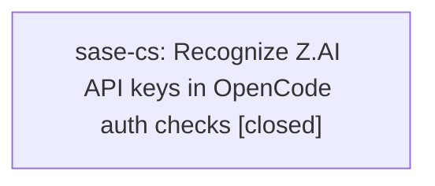

# Bead: sase-cs — Recognize Z.AI API keys in OpenCode auth checks

[Bead Pages](../README.md) / sase-cs

**Status:** ✓ closed · **Resolution:** done · **Type:** ◆ task
**Owner:** `bryanbugyi34@gmail.com` · **Created by:** [bbugyi200.athena.research.w.cdx](https://github.com/sase-org/sase--agents/blob/main/agents/bbugyi200.athena.research.w.cdx/README.md) · **Assignee:** `sase-cs`
**Created:** 2026-07-31 20:22:50 UTC · **Closed:** 2026-07-31 20:39:03 UTC

## Description

The current OpenCode provider's llm_auth_evidence recognizes several API-key environment variables but omits ZHIPU_API_KEY. OpenCode's current native Z.AI and Z.AI Coding Plan catalogs use ZHIPU_API_KEY, so a headless environment-variable configuration can work while sase doctor -C llm.auth reports no auth evidence. Add ZHIPU_API_KEY to the OpenCode auth evidence list and cover it with the existing provider/doctor tests and docs where appropriate.

## Notes

[2026-07-31T20:39:03Z · sase-cs] Added ZHIPU_API_KEY to OpenCodeProvider.llm_auth_evidence(), updated docs/agent_providers.md, added test in tests/test_llm_provider_opencode.py, and verified all tests pass.

## Lineage

## Agents

| Agent | Bead | Commits |
|---|---|---:|
| [bbugyi200.athena.sase-cs](https://github.com/sase-org/sase--agents/blob/main/agents/bbugyi200.athena.sase-cs/README.md) | [sase-cs](README.md) | 1 |

## Commits

| Repo | Commit | Subject | Bead | Committed (UTC) |
|---|---|---|---|---|
| sase | [`bc359cc`](https://github.com/sase-org/sase/commit/bc359cca664cc00070ab4f9bbc2959e9668761e9) | feat(opencode): recognize ZHIPU\_API\_KEY in OpenCode auth checks | [sase-cs](README.md) | 2026-07-31 20:39:58 |
