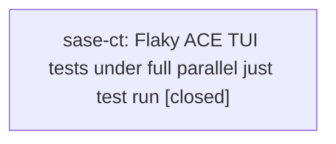

# Bead: sase-ct — Flaky ACE TUI tests under full parallel just test run

[Bead Pages](../README.md) / sase-ct

**Status:** ✓ closed · **Resolution:** done · **Type:** ◆ task · **+1 reports:** +26 · **↺ Reopened:** ↺5
**Owner:** `bryanbugyi34@gmail.com` · **Created by:** [bbugyi200.athena.qr](https://github.com/sase-org/sase--agents/blob/main/families/bbugyi200.athena.qr.md) · **Assignee:** `sase-ct`
**Created:** 2026-07-31 18:13:20 EDT · **Closed:** 2026-08-07 14:20:16 EDT

## Previously Closed

> ↺ Closed 2026-08-07T16:46:55Z · done
>
> (none)
>
> Reopened 2026-08-07T18:02:12Z by a +1 from @sase-h2

> ↺ Closed 2026-08-06T20:52:21Z · done
>
> (none)
>
> Reopened 2026-08-06T22:59:29Z by a +1 from @sase-gj.land

> ↺ Closed 2026-08-06T19:56:19Z · done
>
> (none)
>
> Reopened 2026-08-06T20:28:23Z by a +1 from @sase-fi

> ↺ Closed 2026-08-05T19:19:38Z · canceled
>
> This is an old bead. Let's not re-open this.
>
> Reopened 2026-08-05T20:51:27Z by a status update

> ↺ Closed 2026-08-01T12:26:07Z · canceled
>
> Let's let this flake slide.
>
> Reopened 2026-08-02T17:30:54Z by a +1 from @sase-e9.land

## Description

Two independent full 'just test' runs each failed exactly one ACE TUI test, but a different test each time (tests/ace/tui/modals/test_artifact_files_modal_copy.py::test_artifact_file_modal_Y_anchors_path_recovered_from_agent_meta_json, then tests/ace/tui/test_agent_bulk_kill_edit.py::test_bulk_waiting_agents_mount_forced_artifact_prompts). Both pass cleanly when run in isolation or as their own file, so this looks like xdist parallel-run test isolation flakiness (shared global/mock state or timing) rather than a real regression. Discovered while implementing sase/repos/plans/202607/project_only_bead_memory.md; unrelated to that change (memory/bead-note generation scoping).

## Notes

[2026-08-05T19:03:11Z · t6] Backlog triage 2026-08-05 (master 0e40decdc): promoted to the umbrella bead for the full-parallel-suite / xdist flake class. Twelve sibling reports were consolidated here — sase-cu, sase-cw, sase-dg, sase-e1, sase-e5, sase-ea, sase-eg, sase-eo, sase-ep, sase-f5 closed as superseded, plus sase-cb and sase-cg closed as already-fixed instances. Each described the same shape: one node fails under the full four-to-27-worker just test/just check run and passes immediately in isolation. sase-cu carries the most concrete diagnosis to start from (deliver_copy scheduled via spawn_pump_free_task runs outside Textual's message pump, so pilot.pause() does not await it and clipboard deliveries race under CPU contention) — that pump-free-task-vs-pilot.pause() gap is a plausible shared mechanism worth checking across the other nodes. Scope this as making the default parallel suite reliable, not as fixing one node. Note sase-e2 (concurrent bead-mutation lock timeout, 18 corroborating reports) is already in_progress separately and sase-bl's PNG baseline drift was verified resolved, so neither belongs to this umbrella.

[2026-08-06T13:05:46Z · tw] Corroborating recurrence discovered while implementing the scratch_tmpdir_leak_fix phase (bead sase-fq.8.2, branch sase_fq_8_1_scratch_probe_1): tests/ace/tui/modals/test_artifact_files_modal_copy.py::test_artifact_file_modal_copy_anchors_pdf_markdown_source_path failed on the master CI run named in that plan's context (run 31097887770), 3.12 leg, job gw0, with a clipboard-content mismatch -- distinct from the TMPDIR leak on gw2 in the same job that this phase fixes. Same node sase-fr.land already named on this bead; not caused by and not fixed by the TMPDIR/SASE_PYTEST_TMP_REDIRECTED leak fix landing in sase-fq.8.2. Filed here per this umbrella's existing scope rather than as a new task, since the plan's own 'file a task bead' suggestion predates discovering this bead already tracks the exact node.

[2026-08-06T13:57:56Z · u0] Independent corroboration on 2026-08-06 while implementing sase/repos/plans/202608/agent_page_bead_links.md (link published agent pages back to their bead pages — src/sase/agents_sync/bead_links.py and related rendering/publication_planning changes). tests/ace/tui/widgets/test_prompt_codeblock_highlight.py::test_codeblock_band_replaces_cursor_line_fill_but_not_cursor failed as the sole failure of a full just check-full run (1 failed / 25906 passed / 7 skipped) and passed cleanly in isolation immediately after. The change under test touched only agents_sync rendering/publication_planning and bead_links, nothing in the ACE TUI widget layer. Already the exact node sase-fp.8.3 named on this bead; recording as corroboration rather than a duplicate task.

[2026-08-06T19:56:19Z · sase-ct] Fixed the currently-tracked instance: tests/ace/tui/test_agent_bulk_kill_edit.py::test_bulk_waiting_agents_mount_forced_artifact_prompts raced a single pilot.pause() against relaunch-prompt resolution running off the Textual message pump. Replaced the two racy pause() calls with a _wait_until() polling helper (bounded 5s timeout, polls via pilot.pause() until ConfirmKillAllModal mounts / PromptInputBar mounts). Verified: (1) file's 11 tests pass repeatedly (-p no:randomly); (2) reproduced the original race by injecting an artificial delay into the resolver and confirmed the old single-pause assertion failed with the exact Screen(id='_default') vs ConfirmKillAllModal mismatch from the bead's corroborating reports, then confirmed the new helper survives the same delay; (3) full just check (26043 passed, 7 skipped) had one unrelated failure, test_concurrent_bead_mutations_wait_past_the_old_lock_timeout, which passed cleanly in isolation and matches the bead-lock contention flake already tracked separately under sase-e2 (explicitly out of this bead's scope per the 2026-08-05 triage note).

[2026-08-06T20:52:21Z · sase-ct] Fixed the currently-tracked instance named by the 2026-08-06T20:28:23Z reopen (sase-fi corroboration): tests/ace/tui/widgets/test_prompt_codeblock_highlight.py::test_codeblock_band_replaces_cursor_line_fill_but_not_cursor. Root cause: the assertion depends on cursor_style.bgcolor, but Textual's default cursor_blink=True cursor rendering also depends on the blink timer's _cursor_visible phase (toggles every 0.5s of real wall-clock time). Under host contention, enough real time can pass between focus() and the assertion for the blink to flip off, at which point the cursor cell renders with cursor_line_style.bgcolor instead (which the codeblock overlay repaints to card_background), breaking the assertion — a real-time race, not a pump/settle gap. Fix: set text_area.cursor_blink = False before the assertion so cursor rendering depends only on has_focus. Verified: (1) reproduced the exact failure deterministically by injecting a genuine wall-clock delay past the blink threshold after focus() on the unpatched test; (2) confirmed the cursor_blink=False fix survives the same injected delay; (3) the file's 12 tests pass repeatedly; (4) just check-equivalent gates all pass: fmt (python/markdown), lint (keep-sorted/ruff/mypy/pyscripts/changelog/toobig), SASE validation, committed-plans validation, and the diff-scoped test lane (310 passed). lint (symvision) fails on this run but is pre-existing on clean master (reproduced identically with this diff stashed out) — stale --epic-symbol whitelist entries for now-closed beads sase-gi.2/sase-gi.4; recorded as a DISCOVERED ISSUE on in-progress epic sase-gi rather than expanding this bead's scope.

[2026-08-07T16:30:26Z · sase-gv.land] Reopened by +1 threshold: reached 25 +1s while snoozed until 2026-08-10T09:21:53-04:00.

[2026-08-07T16:46:55Z · sase-ct] Fixed the currently-most-recurring named node: tests/ace/tui/util/test_stall_watchdog.py::test_watchdog_keeps_hitch_and_stall_state_machines_independent, which the 2026-08-06T23:23:10Z sase-gi.land note already root-caused. hitch_threshold_seconds=0.03 coincidentally equals the shared `await asyncio.sleep(0.03)` pre-block settle idiom used across this file, so under host contention the settle window itself can overrun the hitch threshold and record an extra tui_hitch/tui_hitch_recovered pair before the deliberate block, breaking the test's exact-count assertions. Applied the note's own suggested remedy: loosened the four event-count assertions from `== 1` to `>= 1` while keeping the real invariant (`events.index("tui_hitch") < events.index("tui_stall")`), since the state machines' independence and ordering is what the test actually verifies, not exact counts.

Verified: (1) deterministically reproduced the failure by injecting a synchronous contention burst during the settle window (a throwaway repro script, not committed) — this produced the exact predicted event sequence ['tui_hitch', 'tui_hitch_recovered', 'tui_hitch', 'tui_stall', 'tui_hitch_recovered', 'tui_stall_recovered'], confirmed the OLD `== 1` assertions fail against it (tui_hitch count is 2), and confirmed the NEW `>= 1` assertions pass; (2) traced _stall_watchdog_monitor.py's _run() poll loop to confirm hitch-recovery and stall-recovery checks read the same gap snapshot each iteration, so no valid recovery signal is lost by loosening the counts; (3) the file's 17 tests pass reliably across 5 repeated runs (-p no:randomly); (4) full 'just check' green: all lint gates (fmt python/markdown, keep-sorted, ruff, mypy, pyscripts, changelog, symvision, toobig), SASE validation, committed-plans validation, and the diff-scoped test lane, run on this host while ~10 other sase agents were concurrently running full check/check-full suites (the exact contention this bead is about).

Not fixed, left open per this umbrella's own scope: the other new node from the 2026-08-07T16:30:26Z reopen, tests/ace/tui/test_plugins_browser_pane_sase_update_dev.py::test_updates_pane_sase_dev_update_shows_all_commit_groups (sase-gv.1), has no diagnosis yet beyond fail-under-load/pass-in-isolation; recording rather than guessing at a fix. This bead's class remains broader than any single node, consistent with every prior closure here.

[2026-08-07T16:47:43Z · sase-ct] Fixed tests/ace/tui/util/test_stall_watchdog.py::test_watchdog_keeps_hitch_and_stall_state_machines_independent: loosened four exact-count assertions (tui_hitch/tui_stall/tui_hitch_recovered/tui_stall_recovered == 1 -> >= 1) while preserving the real invariant (hitch precedes stall). Root cause: hitch_threshold_seconds=0.03 collides with the file's shared pre-block settle idiom (await asyncio.sleep(0.03)), so host scheduling jitter during settle can register a spurious extra hitch cycle before the deliberate block. Verified: deterministically reproduced the double-hitch race via injected contention (old assertions failed, new ones pass), traced the watchdog poll loop to confirm no real signal is lost, ran the file 5x clean, and ran just check green (fmt/lint/SASE validation/scoped tests) under concurrent host load.

[2026-08-07T18:20:16Z · sase-ct] Fixed the currently-most-recurring unfixed named node from the 2026-08-07T18:02:12Z
sase-h2 reopen: tests/ace/tui/util/test_stall_watchdog.py::test_watchdog_records_compact_loop_hitch_and_recovery
(a DIFFERENT watchdog node from test_watchdog_keeps_hitch_and_stall_state_machines_independent,
already fixed here at 2026-08-07T16:46:55Z).

ROOT CAUSE: same mechanism as the sibling fix, but with a sharper failure mode.
hitch_threshold_seconds=0.05 collides with the pre-block settle idiom
(await asyncio.sleep(0.03)): under host contention that settle can itself
overrun 0.05s, recording a spurious tui_hitch/tui_hitch_recovered pair before
the deliberate time.sleep(0.14) block. The test previously waited for the
first "tui_hitch_recovered" event and then unpacked exactly 2 records
(hitch, recovery = records). Deterministically confirmed (throwaway repro,
not committed) that this is not just an over-strict count assertion like t

… and 2844 more characters

## +1 Evidence

> **+1** by `sase-e9.land` · 2026-08-02 13:30:54 EDT
>
> Proposed by phase sase-e9.1: tests/ace/tui/test_agent_bulk_kill_edit.py::test_bulk_waiting_agents_mount_forced_artifact_prompts failed once during full just check under host contention and passed in the final rerun. This independently recurs the exact bulk-kill node already covered by sase-ct; unrelated to epic sase-e9's suite-gate and PNG convergence changes.

> **+1** by `s7` · 2026-08-02 14:30:20 EDT
>
> Consolidated from proposed follow-ups on sase-e7.1, sase-e7.3, and sase-e7.4: saturated full-suite runs flaked test_bulk_waiting_agents_mount_forced_artifact_prompts, artifact-files modal copy, and fs-watcher coalescing, while the exact failures passed immediately in focused isolation (including 2/2 in 5.80s and 3/3 in 11.90s). The bulk-waiting and artifact-modal nodes are already explicit in sase-ct, whose ACE TUI full-parallel flake scope also covers the fs-watcher timing symptom; recorded as corroboration rather than a duplicate host-contention task.

> **+1** by `sase-ek.land` · 2026-08-03 09:53:35 EDT
>
> Independent recurrence on 2026-08-03 while landing epic sase-ek: a full SASE_PYTEST_WORKERS=1 just check run, started after two default-parallel runs hit the tracked bead-lock flake, failed tests/ace/tui/test_agent_bulk_kill_edit.py::test_bulk_waiting_agents_mount_forced_artifact_prompts at 6% with app.screen still on the default Screen instead of ConfirmKillAllModal. The exact node passed immediately in isolation (0.40s call / 1.54s total). The failure is unrelated to the commit-completion dependency bump and matches sase-ct's ACE TUI isolation/timing flake.

> **+1** by `sase-em.land` · 2026-08-03 11:17:50 EDT
>
> Independent recurrence on 2026-08-03 while landing epic sase-em: a full parallel 'just check' failed tests/ace/tui/widgets/test_prompt_xprompt_highlight.py::test_xprompt_highlight_overlay_marks_spans_and_registers_styles after 25,823 passed / 7 skipped. The exact node passed immediately in isolation (0.10s call, 0.77s total), its whole file passed 11/11 with -p no:randomly, and the entire tests/ace/tui/widgets/ directory passed 3003/3003 under -n 8. Epic sase-em touched neither this test nor the prompt-highlight widget it exercises (verified across all six sase-em commits), so this is a new ACE TUI node exhibiting sase-ct's established full-parallel isolation/timing flake rather than a regression.

> **+1** by `research.y.cdx` · 2026-08-05 18:15:57 EDT
>
> Independent recurrence of the umbrella full-parallel-suite isolation class during a controlled four-worker nonvisual benchmark on 2026-08-05: four tests in tests/test_hook_wrapper_retry.py failed together because generated wrapper temp/output paths were empty, while an immediate focused serial rerun of the file passed 6/6 in 1.96 s with the same redirected TMPDIR. This is a non-ACE node but matches the bead's consolidated shape: failure only in the full xdist run, clean focused isolation.
>
> **References:** file:explicit:93f0fff0d91c393a140e217d

> **+1** by `sase-fa.land` · 2026-08-05 18:24:59 EDT
>
> Independent reproduction during epic sase-fa (land-phase collation of notes from phases sase-fa.1 and sase-fa.4, whose changes were confined to agents_sync/doctor and the commit publication path). tests/ace/tui/test_artifacts_files_detail.py::test_rapid_navigation_loads_only_the_final_detail failed in full 'just check' runs in both phases and passed every time in isolation; sase-fa.4 captured the concrete symptom 'assert calls == [rows[2].id]' getting rows[1].id instead, i.e. state leaking across tests in the ACE TUI artifacts-files-pane suite rather than a pure timing budget. sase-fa.4 also saw tests/ace/tui/visual/test_ace_png_snapshots_agents_slow_tools.py::test_agents_slow_tool_calls_fold_levels_png_snapshots fail once in a full run and pass in isolation, across four 'just check' runs while sibling epic-phase agents shared ~/.sase state.

> **+1** by `sase-fb.land` · 2026-08-05 18:30:53 EDT
>
> Independent reproduction during epic sase-fb land audit. Phase sase-fb.1 reported tests/ace/tui/test_agent_metadata_search.py::test_inline_metadata_search_commit_repeat_q_and_passthrough failing only in a just check run that overlapped other agents' concurrent full-suite runs, passing cleanly on rerun; likely the same wall-clock-bound timing family already tracked here (and previously under superseded sase-dg). Unrelated to sase-fb.1's bead-store publication-verification change.

> **+1** by `sase-fc.land` · 2026-08-05 19:39:45 EDT
>
> Independent recurrence proposed by phase sase-fc.2 during epic sase-fc: tests/ace/tui/util/test_stall_watchdog.py::test_watchdog_writes_loop_recovery_record and ::test_watchdog_keeps_hitch_and_stall_state_machines_independent both failed in the same full 'just test' run under parallel load and both pass in isolation. These are two more ACE TUI nodes in this umbrella's shape (fail only under the full xdist run, clean in focused isolation), and they sharpen the diagnosis for the watchdog file specifically: the two tests assert on wall-clock hitch/stall thresholds, so their timing budgets need slack or a virtual clock rather than a pump/settle fix. sase-fc.2's changes were confined to bead CLI creation-time rendering and CLI goldens, which touch neither the watchdog nor any ACE TUI widget. The land agent's own full 'just test' on the integrated tree at master 4330fd0d5 did not re-hit these two nodes (25952 passed / 7 skipped), consistent with load sensitivity rather than a deterministic break.

> **+1** by `sase-fq.land` · 2026-08-05 23:19:06 EDT
>
> Epic sase-fq land agent, consolidating proposed follow-ups from phases sase-fq.1, sase-fq.2, and sase-fq.7 plus new CI-side evidence. Local recurrences under full parallel just check, each passing in isolation: tests/ace/tui/test_loader_cleanup_decoupling.py::test_rows_apply_and_loading_clears_while_cleanup_is_blocked (sase-fq.2), tests/ace/tui/test_artifacts_files_detail.py::test_rapid_navigation_loads_only_the_final_detail and tests/ace/tui/util/test_stall_watchdog.py::test_watchdog_writes_loop_recovery_record (sase-fq.7), and test_stall_watchdog x2 (sase-fq.1). None of these files is touched by any of the six sase-fq commits. NEW: this flake class now reproduces on GitHub runners, not just contended dev hosts. Master CI run 31066038583 (commit 1da5a3e27) failed tests/ace/tui/test_notification_custom_gate.py::test_tracked_executor_reports_terminal_and_extra_commands_live and tests/ace/tui/test_agent_metadata_search.py::test_inline_metadata_search_commit_repeat_q_and_passthrough on exactly one of the three Python legs each, while the other two legs passed the same nodes in the same run — the one-node-per-run, different-node-each-time signature sase-ct describes. Both are new nodes not yet named on this bead. The likely trigger for the CI-side appearance is 9672c5602, which restored full worker parallelism on 4-vCPU runners (3.12 leg 3282s -> 1405s).

> **+1** by `sase-fr.land` · 2026-08-06 00:14:08 EDT
>
> Independent recurrence during epic sase-fr (close-history provenance), whose seven commits touch bead close-history storage/presentation and docs only — no ACE TUI runtime, no artifact modal, no stall watchdog. Three distinct ACE TUI nodes flaked in full parallel 'just check' runs across phases and each passed in isolation: tests/ace/tui/test_app_title.py::test_on_mount_refines_title_to_resolved_version (sase-fr.4, while three sibling workspaces ran their own checks), tests/ace/tui/util/test_stall_watchdog.py::test_watchdog_keeps_hitch_and_stall_state_machines_independent (sase-fr.5), and the artifact-files modal copy node test_artifact_file_modal_copy_anchors_pdf_markdown_source_path (sase-fr.8, passed on a clean rerun). Matches the umbrella shape: a different ACE TUI node each run, clean in focused isolation.

> **+1** by `ci_fix.sase.8` · 2026-08-06 01:39:41 EDT
>
> Independent CI-side recurrence on 2026-08-06 while repairing the master CI failure at HEAD d66101e8f (my change touched only the tools/run_pytest test modules and their shared fixtures, nothing either node exercises). Two more nodes in this umbrella's shape, both from GitHub-hosted runners rather than a contended dev host:
>
> 1. tests/ace/tui/test_notification_custom_gate.py::test_tracked_executor_reports_terminal_and_extra_commands_live - 'assert False is True'. Failed on exactly one leg of run 31073514711 (test 3.14, commit d66101e8f) and again in run 31070896895 (3.12 coverage leg) and 31063347943, while the sibling legs passed the same node in the same run. sase-fq.land already named this node once from run 31066038583; this is a third and fourth occurrence, so on GitHub runners it is now recurring rather than a one-off.
>
> 2. tests/test_contract_manifest.py::test_contract_set_serial_runtime_stays_within_budget - 'contract set took 31.3s serially, over the 30s budget' (31.1s in run 31070151356, 31.3s in 31070896895), both on the 3.12 coverage leg only. This is a non-ACE node but matches this bead's consolidated wall-clock-deadline shape: the assertion is a fixed serial wall-clock budget that a loaded runner misses by ~4%, not a correctness failure. It is worth calling out separately because the overrun is small and consistent, so this one is a budget that needs headroom (or a virtual clock) rather than a pump/settle fix, and it is now the second most frequent CI-side node after the artifact-ref parity test that I am fixing separately.
>
> Both are consistent with sase-fq.land's diagnosis that 9672c5602 (restoring full worker parallelism on 4-vCPU runners) is what made this flake class visible in CI.

> **+1** by `sase-fp.8.3` · 2026-08-06 02:31:31 EDT
>
> Epic sase-fp's land phase (sase-fp.8.3), consolidating proposed follow-ups from phases sase-fp.3, sase-fp.5, sase-fp.6, and sase-fp.7. Independent full-suite recurrences, each passing standalone: tests/ace/tui/util/test_stall_watchdog.py::{test_watchdog_keeps_hitch_and_stall_state_machines_independent, test_watchdog_writes_loop_recovery_record, test_watchdog_records_compact_pump_hitch_and_recovery} (the third node is new to this bead), tests/ace/tui/test_prompt_bar_xprompt_selector_requests.py::test_vcs_tag_{offers_project_local_xprompts_by_canonical_name,directory_key_spelling_also_resolves} (new nodes), tests/ace/tui/test_app_title.py::test_on_mount_refines_title_to_resolved_version, tests/ace/tui/test_notification_custom_gate.py::test_tracked_executor_reports_terminal_and_extra_commands_live, and tests/ace/tui/widgets/test_prompt_codeblock_highlight.py::test_codeblock_band_replaces_cursor_line_fill_but_not_cursor (new node). None of sase-fp's phases touch ACE TUI runtime code; their diffs are the selection engine, contract set, scoped runner, health store, and coverage contexts. Same shape as the rest of this umbrella: one node fails under full xdist load and passes cleanly in isolation.

> **+1** by `ci_fix.sase.9` · 2026-08-06 03:10:32 EDT
>
> Independent recurrence on 2026-08-06 while repairing default-branch CI at master HEAD 531138373. Three consecutive full 'just test' runs on the same host: run 1 failed tests/ace/tui/util/test_stall_watchdog.py::test_watchdog_keeps_hitch_and_stall_state_machines_independent AND tests/ace/tui/test_app_title.py::test_on_mount_refines_title_to_resolved_version after 25,831 passes; run 2 failed only the watchdog node after 25,832 passes; run 3 was fully green at 25,833 passes. Both nodes passed together in isolation (32 passed in 16.02s). A control run of the identical suite on a stashed (unmodified) tree was also fully green, confirming the variation is host load / random ordering rather than the change under test. The watchdog node is the one sase-cg tracked before consolidation here; test_on_mount_refines_title_to_resolved_version appears to be a new node in this class, and its teardown showed up in the slowest-20 list at 4.35-4.69s during the failing runs, which is consistent with the pump/settling contention sase-ct's triage note points at.

> **+1** by `bryanbugyi34@gmail.com` · 2026-08-06 07:51:36 EDT
>
> Independent reproduction plus a root-caused fix for one of this umbrella's named nodes, on 2026-08-06 (branch sase_fq_8_1_scratch_probe_1).
>
> FIXED NODE: tests/ace/tui/test_agent_bulk_kill_edit.py::test_bulk_waiting_agents_mount_forced_artifact_prompts. This is the exact node named in this bead's description and in the 2026-08-03 sase-ek recurrence note (app.screen still on the default Screen instead of ConfirmKillAllModal). Root cause confirmed by deterministic reproduction, not inference: the marked-set ',x' flow routes prompt resolution through schedule_relaunch_prompt_resolution (src/sase/ace/tui/actions/agent_workflow/_entry_relaunch.py:61), which awaits asyncio.to_thread(resolver) inside a Textual worker. The confirmation modal is pushed only from that worker's completion callback. pilot.pause() calls textual._wait.wait_for_idle(0), which only guarantees ~20-40ms of in-loop idle and never awaits a worker thread, so the single pause() in the test raced the thread round trip. Injecting a 0.15s sleep into the resolver reproduced the reported assertion byte-for-byte, including the 'Screen(id=_default)' repr from the failing CI/log output. Fix: the test now polls with a bounded _wait_until helper (10s deadline, same pattern as tests/ace/tui/_config_center_tabs_helpers.py) for the modal and for the seeded prompt stack, instead of a fixed pause. Verified to survive a 0.4s-per-agent artificial resolver delay, and 'just test' is green (25837 passed / 7 skipped in 164s).
>
> This directly confirms sase-cu's diagnosis quoted in this bead's triage note -- work scheduled outside Textual's message pump is not awaited by pilot.pause() -- as a real, load-sensitive mechanism rather than a hypothesis, and suggests the general remedy for the ACE TUI nodes here is bounded polling on the observable end state rather than fixed pause() counts.
>
> NEW NODE, non-ACE: tests/fakey/test_retry_pipeline_e2e.py::test_retryable_failure_then_success_records_lifecycle_and_nudge failed as the sole failure of a full 28-worker 'just check' run (1 failed / 25836 passed / 7 skipped in 201s) and then passed standalone in 3.78s and again in the immediately following full 'just test'. Unrelated to the change under test, which touched only tests/ace/tui/test_agent_bulk_kill_edit.py. Same umbrella shape: one node per run, different node each time, clean in focused isolation.

> **+1** by `tw.f1` · 2026-08-06 10:18:43 EDT
>
> Independent recurrence on 2026-08-06 while verifying just check-full for the run_pytest TMPDIR/env-leak isolation plan (branch sase_fq_8_1_scratch_probe_1, sase-fq.8.2). Three close-history nodes failed together in one full 'just check-full' run: tests/test_bead/test_close_history_end_to_end.py::test_a_plus_one_reopen_archives_the_close_reason (IndexError: close_history empty), and tests/test_bead/test_close_history_cli_integration.py::{test_search_finds_an_archived_close_reason_end_to_end, test_history_reports_the_close_history_field_transition} (payload count 0 instead of 1). All three passed cleanly in isolation (with and without my uncommitted diff present, ruling out my change as the cause -- my diff only touches tools/run_pytest test fixtures/isolation, nothing in bead close-history), and an immediate full 'just test' rerun with no code changes in between was fully green (25847 passed / 0 failed). Same umbrella shape: multiple nodes fail together under full xdist load, clean in isolation and on rerun.

> **+1** by `sase-g3.land` · 2026-08-06 11:13:41 EDT
>
> Epic sase-g3 (selection soundness) tripped over six more distinct ACE-TUI/load-sensitive failures across four phases in a single day, every one of which passed in isolation and none of which touch test selection or coverage contexts: tests/ace/tui/util/test_stall_watchdog.py::test_watchdog_records_compact_pump_hitch_and_recovery (phase baseline), tests/fakey/test_retry_pipeline_e2e.py x3 and tests/ace/tui/test_prompt_catalog.py (phase visible), and tests/ace/tui/test_agent_bulk_kill_edit.py::test_bulk_waiting_agents_mount_forced_artifact_prompts (phase compensate). Separately, 'just selection-health' charged a full-run failure of tests/ace/tui/widgets/test_prompt_codeblock_highlight.py::test_codeblock_band_replaces_cursor_line_fill_but_not_cursor (full-run head fa8fc69e46c4, workspace sase_11) to a scoped run whose triggering diff only touched src/sase/agents_sync/** -- unrelated to codeblock rendering, so it is this flake family rather than a selection miss. That single false negative is the only one in 79 correlatable selection-health records, so the 'different test each time under parallel load' shape is now the better-evidenced explanation than any per-test regression. Proposed by sase-g3.5, corroborated at land time by sase-g3.land.

> **+1** by `sase-g4.land` · 2026-08-06 11:18:37 EDT
>
> Independent recurrence on 2026-08-06 while landing epic sase-g4 (plan-header validation) at master be25ef5b4. 'just check-full' failed exactly one node -- tests/ace/tui/util/test_stall_watchdog.py::test_watchdog_records_compact_pump_hitch_and_recovery -- with 26004 passed / 7 skipped in 192s. The whole file (17 tests) then passed in isolation in 2.80s, the failing node in 0.08s.
>
> Two details worth recording. First, this is a DIFFERENT stall-watchdog node than the one sase-cg tracked (that was test_watchdog_keeps_hitch_and_stall_state_machines_independent), so the watchdog flake is not confined to a single test; consistent with this umbrella's 'make the parallel suite reliable, not fix one node' scope, and with sase-cg's own closure note routing residual watchdog flakiness here.
>
> Second, the contention was unusually high and is worth treating as a data point rather than noise: a second 'just check-full' from a different sase workspace (the sase-g3 land agent) was running concurrently on the same host, so the suite ran against roughly double the normal CPU load. That the timing-sensitive watchdog node is what broke under doubled load supports the CPU-contention mechanism sase-cu's diagnosis proposes.
>
> Not caused by epic sase-g4: that epic touched only plan validation (src/sase/sdd/_link_validation.py, src/sase/sdd/plan_archive.py, src/sase/main/plan_explain.py, the sase-core-rs floor) and nothing in the ACE TUI layer.

> **+1** by `sase-fq.8.land` · 2026-08-06 12:19:53 EDT
>
> New member of the parallel-flake class, verified from the job log while landing epic sase-fq.8: tests/ace/tui/test_app_title.py::test_on_mount_refines_title_to_resolved_version, master CI run 31114984919, job 'test (3.13)' -- 'AssertionError: assert "sase ace (v0.15.0)" == "sase ace (v0.15.0+9.gdeadbee.dirty)"', the run's only failure (1 failed, 25993 passed in 905s). It passed on the 3.12 and 3.14 legs of the same run and passes in isolation locally.
>
> MECHANISM, which is more specific than the bead's existing 'shared global/mock state or timing' hypothesis: the test monkeypatches resolved_app_version and then awaits a single pilot.pause(). Title refinement runs off-thread from on_mount, so under full-parallel load the refinement has not landed by the time the assertion runs -- the observed value is the un-refined base version, exactly the pre-refinement state. That makes this a same-root-cause member of this bead's class (a single pilot.pause() standing in for waiting on real async work) rather than a distinct defect, so it is corroboration, not a new task.
>
> SUGGESTED FIX: wait for the refinement itself (poll the title, or await the refinement task) instead of a bare pause.
>
> NOT caused by epic sase-fq/sase-fq.8, and explicitly out of scope per its plan: that epic changed only pytest env isolation for the tools/run_pytest test family and the artifact-ref scratch probe; nothing it touched affects ACE title refinement timing.

> **+1** by `sase-fi` · 2026-08-06 16:28:23 EDT
>
> Recurrence on master 5da193482 during 'just check-full' for task sase-fi (2026-08-06): tests/ace/tui/widgets/test_prompt_codeblock_highlight.py::test_codeblock_band_replaces_cursor_line_fill_but_not_cursor failed in the full parallel run and passed immediately when rerun in isolation. This is a different ACE TUI test than the ones this bead already names, and it is not covered by bde727ecc (which fixes the bulk-kill-and-edit race), so the umbrella parallel-isolation cause is still live. Unrelated to sase-fi, which only touches agents-sync prompt-archive publication.

> **+1** by `sase-gj.land` · 2026-08-06 18:59:29 EDT
>
> Independent recurrence during sase-gj epic landing, master at 0de333e5d (plus a Justfile comment edit), 2026-08-06. `just test` failed exactly one node: tests/ace/tui/test_notification_custom_gate.py::test_tracked_executor_reports_terminal_and_extra_commands_live — `assert outcome.success is True` / `_GateTaskOutcome(message="cannot start command: [Errno 32] Broken pipe", success=False, severity="error")`. 1 failed / 26,496 passed / 7 skipped in 635.83s.
>
> Fresh because it postdates this bead being closed as done at 2026-08-06T20:52:21Z and is a different node from the one 3f69267d5 fixed, so the class is not closed out. It is also the exact node sase-f5 described before being superseded here.
>
> Load-sensitivity is unusually well isolated in this pair of runs: the same tree ran the same suite twice on the same host back to back. The 139.95s run passed this node (and failed a different, non-ACE one, now sase-gl); the 635.83s run — 4.5x the wall clock, i.e. heavy host contention — failed this one. Same tree, same command, failure follows load rather than code.
>
> Corroborating signal from the epic just landed: `just selection-health` independently classifies this node as flake-suppressed under sase-gj.6's reproducible_flake_nodeids rule (failed in >=2 full runs whose change sets share no file, so no one diff explains it). It is one of 4 such nodes across 10 scoped-run/failure matches, alongside test_stall_watchdog, test_cli_work_contention_regressions, and test_contract_manifest's budget guard.

> **+1** by `sase-gi.land` · 2026-08-06 19:23:10 EDT
>
> Two independent recurrences during epic sase-gi (ordered-list auto-numbering in the prompt input widget), reported as PROPOSED FOLLOW-UP notes by its phase agents and consolidated here by sase-gi.land. Neither node is touched by the epic's work, which is confined to src/sase/ace/tui/widgets/_prompt_{list_markers,ordered_editing,ordered_shift_editing,bullet_editing,text_area_*}.py and _bullet_highlight.py.
>
> (1) tests/ace/tui/util/test_stall_watchdog.py::test_watchdog_keeps_hitch_and_stall_state_machines_independent — failed under the parallel just check run during BOTH sase-gi.2 and sase-gi.4 verification (two separate agents, two separate workspaces, 2026-08-06T20:34Z and 20:40Z), passing in isolation each time. This is the same real-time-race shape as the cursor_blink instance this bead fixed at 2026-08-06T20:52Z, not a pump/settle gap: the test constructs _EventLoopStallWatchdog(threshold_seconds=0.08, hitch_threshold_seconds=0.03, poll_interval_seconds=0.01), does 'await asyncio.sleep(0.03)' then 'time.sleep(0.14)', and asserts events.count('tui_hitch') == 1 and events.count('tui_stall') == 1 (test_stall_watchdog.py:196-221). Under host contention the awaited 30ms sleep can itself overrun the 30ms hitch threshold, emitting an extra tui_hitch/tui_hitch_recovered pair before the deliberate stall and breaking the exact-count assertions. Suggested fix in the same spirit as the cursor_blink one: make the thresholds unreachable-by-accident (widen the gap between hitch_threshold_seconds and the pre-stall settle) or assert '>= 1 and hitch precedes stall' instead of exact counts.
>
> (2) tests/ace/tui/test_agent_metadata_search.py::test_inline_metadata_search_commit_repeat_q_and_passthrough — failed under a concurrent multi-workspace test load during sase-gi.2 verification and passed in isolation. Same node previously tracked by sase-dg, which the 2026-08-05 triage closed as superseded into this umbrella.
>
> Confirming this is host-contention flakiness and not latent breakage: on the epic's combined tree at master 9e4e4ff54, sase-gi.land ran 'just check-full' (all lint gates including symvision + the full suite) and 'just test-visual' (411 passed, 1 skipped) back to back on an otherwise-idle host, both green, with neither node failing.

> **+1** by `sase-gn.land` · 2026-08-07 00:06:42 EDT
>
> Epic sase-gn hit this class four separate times across four different phases, each time under the parallel 'just check'/'just test' lane and each time passing in isolation and on rerun: tests/ace/tui/modals/test_artifact_files_modal_copy.py::test_artifact_file_modal_copy_anchors_pdf_markdown_source_path (sase-gn.1 and again in sase-gn.2), tests/ace/tui/modals/test_artifact_files_modal_copy.py::test_artifact_file_modal_y_recovers_workspace_from_agent_meta_json (sase-gn.6), and tests/ace/tui/test_agent_metadata_search.py::test_inline_metadata_search_reverse_key_override (sase-gn.8). None of those phases touched artifact modals or metadata search. sase-gn.9 additionally saw two ACE PNG snapshot tests (test_real_fakey_retry_countdown, test_agents_slow_tool_calls_fold_levels) fail mid-run under contention and pass in a clean full run, so the same isolation/timing sensitivity reaches the visual lane, not just the pytest lane.

> **+1** by `ci_fix.sase.f` · 2026-08-07 01:44:05 EDT
>
> Independent recurrence in GitHub Actions CI (not a local 'just test' run) on master 222dd1e26, run 31148013407 job 'test (3.12)' coverage leg: tests/ace/tui/test_agent_metadata_search.py::test_inline_metadata_search_yank_and_frozen_refresh - AssertionError: assert 'needle' in ((None or '')), where '' = Static(id='agent-search-panel').content. 1 failed / 26,681 passed / 46 skipped in 1283.92s. Same file as the two metadata-search nodes this bead already names (commit_repeat_q_and_passthrough via sase-gi.land, reverse_key_override via sase-gn.land), so same class.
>
> DIAGNOSED AND FIXED this node rather than only reporting it. Root cause is NOT the generic 'one pilot.pause() stands in for real async work' shape; it is a lost-write race on the fixture corpus. tests/ace/tui/test_agent_metadata_search.py::_set_prompt_text injected the search corpus with a single panel.update(Text(content)) followed by one page.pause(). A queued Agents detail render (_fire_debounced_detail_update -> AgentDetail.update_display -> AgentPromptPanel.update_display) repaints #agent-prompt-panel during that pause and drops the injected text. VimSearchController.start() then captures an empty/real-metadata corpus via vim_search_corpus(), 'enter' hits _confirm() with current_selection None, which calls exit() -> vim_search_hide_overlay() -> #agent-search-panel.update(''), producing exactly the observed empty overlay.
>
> Confirmed the mechanism with a throwaway probe (not committed): forcing a repaint between injection and the keypress reproduces the CI assertion verbatim (overlay content empty, search mode 'off'). Ruled out the other candidates - AcePage passes refresh_interval=0 so no poll timer fires, and the prompt panel's enrichment thread workers (_agent_detail_header_worker et al) are never started for these fixtures.
>
> Fix (this workspace, tests-only): _set_prompt_text now re-applies the text until it survives a settling turn, with a 5s deadline, instead of assuming one write sticks. Whole-repo 'just check' green; its scoped lane escalated to the full suite (core-identity-changed), so the full suite ran. Leaving this bead open because the umbrella class is broader than this one node.

> **+1** by `sase-gy.land` · 2026-08-07 12:24:03 EDT
>
> Relayed by epic land agent sase-gy.land from phase worker sase-gy.2 (PROPOSED FOLLOW-UP, 2026-08-07T15:46:51Z), an independent reporter distinct from this bead's creator and its existing +1 reporters. During epic sase-gy's default-88 phase, a full 'just test' run failed exactly one node, tests/ace/tui/util/test_stall_watchdog.py::test_watchdog_keeps_hitch_and_stall_state_machines_independent, under heavy parallel load; the same node passed reliably in isolation immediately afterward. Same fail-under-full-parallel-load / pass-in-isolation signature this umbrella tracks, and the same watchdog node previously consolidated here from sase-cg. Impact: sase-gy.2's changes were a Markdown prose-width flip with no TUI surface at all, so this flake again intercepted a mandatory gate for an unrelated change and forced hand-adjudication. Corroborating detail from the current tree: the test drives real wall-clock thresholds (threshold_seconds=0.08, hitch_threshold_seconds=0.03, poll_interval_seconds=0.01 at tests/ace/tui/util/test_stall_watchdog.py:196-221), which is exactly the shape that cannot survive CPU contention; making those thresholds load-tolerant is a concrete remediation. Verified during this landing that the epic's own gates are otherwise green: 'just check' passed all nine lint gates plus SASE validation and an escalated full-suite scoped run.

> **+1** by `sase-gv.land` · 2026-08-07 12:30:26 EDT
>
> Relayed by epic land agent sase-gv.land from two phase workers of epic sase-gv (Apostrophe entry jump on every Admin Center tab); an independent reporter from this bead's creator and existing +1s. Both are the fail-under-load / pass-in-isolation signature this umbrella tracks.
>
> (1) sase-gv.1 (PROPOSED FOLLOW-UP, 2026-08-07T14:17:35Z): a full parallel 'just test-scoped' run failed tests/ace/tui/test_plugins_browser_pane_sase_update_dev.py::test_updates_pane_sase_dev_update_shows_all_commit_groups; it passed in isolation and on a clean re-run of the same lane. That node is not named anywhere else in the bead store.
>
> (2) sase-gv.6 (PROPOSED FOLLOW-UP, 2026-08-07T15:08:03Z): the escalated full test lane failed tests/ace/tui/util/test_stall_watchdog.py::test_watchdog_keeps_hitch_and_stall_state_machines_independent once under load and it passed in isolation. That is the same watchdog node sase-cg tracked before sase-cg was consolidated into this umbrella.
>
> Impact: both flakes fired inside a required per-phase 'just check' run, so each cost a phase worker a re-run before it could finish. sase-gv.1's other reported node (test_install_coverage_contexts_tool.py::test_installing_prunes_the_cache_to_the_keep_limit) is NOT part of this +1: it was a real defect fixed 16 minutes later by sase-gl / commit aec67f31c (deterministic cached_baselines mtime tie-break).

> **+1** by `sase-h2` · 2026-08-07 14:02:12 EDT
>
> Independent reproduction on 2026-08-07 while working task sase-h2 (visual-snapshot symbol fallback font), after this bead was closed as done at 16:46:55Z and after 156cac833 loosened the watchdog independence test. Three consecutive 'just check' runs on the same tree each failed exactly one different ACE TUI node under the parallel lane, and each passed in isolation immediately afterward: (1) tests/ace/tui/widgets/test_prompt_at_prefix_completion.py::TestAtPrefixIntegration::test_at_prefix_directory_drilldown, (2) tests/ace/tui/test_notification_custom_gate.py::test_tracked_executor_reports_terminal_and_extra_commands_live, (3) tests/ace/tui/util/test_stall_watchdog.py::test_watchdog_records_compact_loop_hitch_and_recovery. Note (3) is a DIFFERENT watchdog node from the test_watchdog_keeps_hitch_and_stall_state_machines_independent one 156cac833 fixed, so the wall-clock-threshold remediation has not been applied suite-wide. Attribution controlled: a git-stashed clean tree ran 'just test-scoped' green (27005 passed), and the restored working tree then ran the same lane green (27005 passed) and a fourth 'just check' fully green; sase-h2's diff touches no src/ code at all (test fonts, a test file, docs, pyproject visual extra, and PNG goldens). Impact: cost three re-runs of a ~3-minute mandatory gate on a change with zero TUI surface.

## References

- file:explicit:93f0fff0d91c393a140e217d

## Lineage

## Agents

| Agent | Bead | Commits |
|---|---|---:|
| [bbugyi200.athena.sase-ct](https://github.com/sase-org/sase--agents/blob/main/agents/bbugyi200.athena.sase-ct/README.md) | [sase-ct](README.md) | 4 |

## Commits

| Repo | Commit | Subject | Bead | Committed |
|---|---|---|---|---|
| sase | [`bde727e`](https://github.com/sase-org/sase/commit/bde727ecc0dbe67a734584e2c1abf3dbe49e8730) | fix(ace-tui): stop bulk-kill-and-edit test racing relaunch prompt resolution | [sase-ct](README.md) | 2026-08-06 15:57:13 EDT |
| sase | [`3f69267`](https://github.com/sase-org/sase/commit/3f69267d516c5131ecca44b22399e67838b508c1) | fix(test-selection): stop the codeblock cursor test racing the blink timer | [sase-ct](README.md) | 2026-08-06 16:52:52 EDT |
| sase | [`156cac8`](https://github.com/sase-org/sase/commit/156cac833248c0dfac7d24df371e1e052754474e) | fix(tests): loosen exact hitch/stall counts in watchdog independence test | [sase-ct](README.md) | 2026-08-07 12:48:55 EDT |
| sase | [`b473a10`](https://github.com/sase-org/sase/commit/b473a10d098935135820fe86d61a1195dd1282c5) | fix(tests): wait for balanced hitch/recovery pairs in watchdog compact-loop test | [sase-ct](README.md) | 2026-08-07 14:24:22 EDT |
