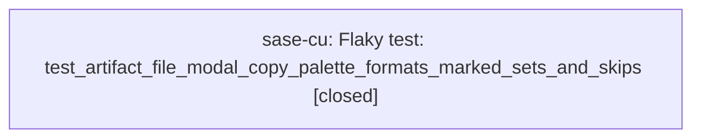

# Bead: sase-cu — Flaky test: test\_artifact\_file\_modal\_copy\_palette\_formats\_marked\_sets\_and\_skips

[Bead Pages](../README.md) / sase-cu

**Status:** ✓ closed · **Resolution:** done · **Type:** ◆ task
**Owner:** `bryanbugyi34@gmail.com` · **Created by:** [bbugyi200.athena.ci\_fix.sase.2](https://github.com/sase-org/sase--agents/blob/main/agents/bbugyi200.athena.ci_fix.sase.2/README.md) · **Assignee:** `sase-cu`
**Created:** 2026-07-31 22:58:13 UTC · **Closed:** 2026-07-31 23:29:24 UTC

## Description

Observed as FAILED during a full 'just check' parallel run (tests/ace/tui/modals/test_artifact_files_modal_copy.py::test_artifact_file_modal_copy_palette_formats_marked_sets_and_skips), but passes reliably in isolation and on a subsequent full-suite rerun. Likely test-order/parallelism state leakage (clipboard or marked-set state bleeding across tests) rather than a real regression. Discovered while fixing the published-core-minimum-smoke CI failure (unrelated: that fix only touched pyproject.toml's sase-core-rs floor and its accompanying test). Worth investigating for shared/global state (e.g. clipboard mock, marked-set singleton) that isn't reset between tests under xdist.

## Notes

[2026-07-31T23:29:24Z · sase-cu] Root cause: deliver_copy() is scheduled via spawn_pump_free_task as a free-standing asyncio task (asyncio.to_thread for value resolution + system-clipboard delivery), running outside Textual's message pump. pilot.pause() only waits for the app's message pump to go CPU-idle; it doesn't guarantee a pump-free task has finished, especially under xdist's CPU contention during a full-suite run. The flaky test presses 5 palette keys in a loop, asserting on ordered `copied[0..4]` contents, without draining `_pump_free_clipboard_tasks` between iterations — so under contention, two clipboard-delivery tasks race and can complete out of order, breaking the ordered assertions. Test #1 in the same file already had a `_drain_clipboard_tasks` helper for exactly this purpose; the flaky test just wasn't using it.

Fix: added `await _drain_clipboard_tasks(pilot.app)` after each `pilot.press("%", key)` / `pilot.pause()` iteration in test_artifact_file_modal_copy_palette_formats_marked_sets_and_skips (tests/ace/tui/modals/test_artifact_files_modal_copy.py).

Verified:
- Targeted test passes standalone and under `-n 4` parallel workers, 5/5 runs.
- Full `tests/ace/tui/modals/test_artifact_files_modal_copy.py` file: 13/13 passed.
- Ran full `just test` three times back-to-back to stress-test under real xdist contention: the fixed test passed all 3 times. The 3 runs did surface other pre-existing, unrelated flakiness (a temp-leak-guard failure, two xprompt-selector test failures, one PNG-snapshot failure) — none touching the clipboard-modal file — filed as separate follow-up task beads sase-cv, sase-cw, sase-cx rather than expanding this bead's scope.
- `just check` (fmt/lint/mypy/symvision/etc., prior to the test stage) passed cleanly.

## Lineage

## Agents

| Agent | Bead | Commits |
|---|---|---:|
| [bbugyi200.athena.sase-cu](https://github.com/sase-org/sase--agents/blob/main/agents/bbugyi200.athena.sase-cu/README.md) | [sase-cu](README.md) | 1 |

## Commits

| Repo | Commit | Subject | Bead | Committed (UTC) |
|---|---|---|---|---|
| sase | [`bba5aa1`](https://github.com/sase-org/sase/commit/bba5aa19dc5dc0a27426e8bd09a9a41fa1edc8df) | fix(tests): drain clipboard tasks between palette key presses | [sase-cu](README.md) | 2026-07-31 23:30:15 |
