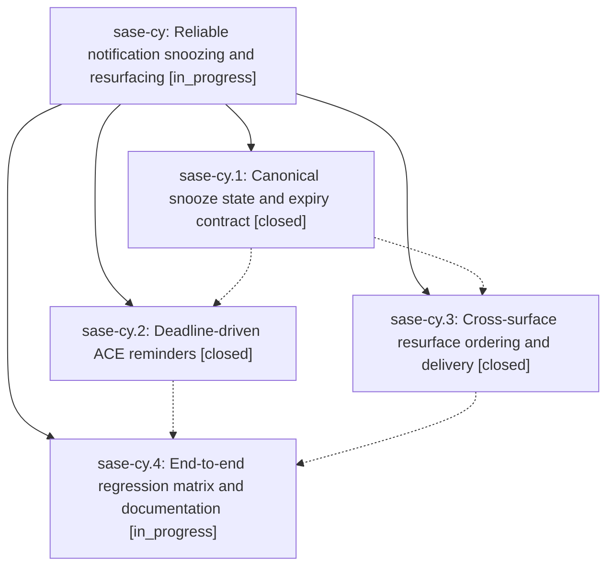

# Bead: sase-cy — Reliable notification snoozing and resurfacing

[Bead Pages](../README.md) / sase-cy

**Status:** ◐ in_progress · **Type:** ▸ plan · **Tier:** epic
**Owner:** `bryanbugyi34@gmail.com` · **Created by:** [bbugyi200.athena.qu](https://github.com/sase-org/sase--agents/blob/main/agents/bbugyi200.athena.qu/README.md) · **Assignee:** `sase-cy.land`
**Created:** 2026-08-01 10:45:48 UTC
**Plan:** [202608/reliable\_notification\_snoozing.md](https://github.com/sase-org/sase--plans/blob/main/202608/reliable_notification_snoozing.md)

## Description

Snoozed notifications use one durable time contract, resurface as visible unread activity at the requested deadline, and are delivered and ordered consistently across ACE, CLI, mobile gateway, and Telegram consumers.

## Phases

| Bead | Title | Status | Size | Agents | Commits |
|---|---|---|---|---:|---:|
| [sase-cy.1](sase-cy.1.md) | Canonical snooze state and expiry contract | ✓ closed | medium | 1 | 2 |
| [sase-cy.2](sase-cy.2.md) | Deadline-driven ACE reminders | ✓ closed | medium | 1 | 1 |
| [sase-cy.3](sase-cy.3.md) | Cross-surface resurface ordering and delivery | ✓ closed | medium | 1 | 1 |
| [sase-cy.4](sase-cy.4.md) | End-to-end regression matrix and documentation | ◐ in_progress | small | 1 | 0 |

## Lineage

## Agents

| Agent | Bead | Commits |
|---|---|---:|
| [bbugyi200.athena.sase-cy.1](https://github.com/sase-org/sase--agents/blob/main/agents/bbugyi200.athena.sase-cy.1/README.md) | [sase-cy.1](sase-cy.1.md) | 2 |
| [bbugyi200.athena.sase-cy.2](https://github.com/sase-org/sase--agents/blob/main/agents/bbugyi200.athena.sase-cy.2/README.md) | [sase-cy.2](sase-cy.2.md) | 1 |
| [bbugyi200.athena.sase-cy.3](https://github.com/sase-org/sase--agents/blob/main/agents/bbugyi200.athena.sase-cy.3/README.md) | [sase-cy.3](sase-cy.3.md) | 1 |
| [bbugyi200.athena.sase-cy.4](https://github.com/sase-org/sase--agents/blob/main/agents/bbugyi200.athena.sase-cy.4/README.md) | [sase-cy.4](sase-cy.4.md) | 0 |
| [bbugyi200.athena.sase-cy.land](https://github.com/sase-org/sase--agents/blob/main/agents/bbugyi200.athena.sase-cy.land/README.md) | [sase-cy](README.md) | 0 |

## Commits

| Repo | Commit | Subject | Bead | Committed (UTC) |
|---|---|---|---|---|
| sase-core | [`sase-core@a856b66`](https://github.com/sase-org/sase-core/commit/a856b6650ddade77956ed06ca706de5d5bde1438) | feat(notifications): define canonical snooze expiry state | [sase-cy.1](sase-cy.1.md) | 2026-08-01 11:18:36 |
| sase | [`09517a0`](https://github.com/sase-org/sase/commit/09517a0fb011f0922e132d34591c2ec380911c6d) | feat(notifications): expose canonical snooze snapshots | [sase-cy.1](sase-cy.1.md) | 2026-08-01 11:19:33 |
| sase | [`459ef97`](https://github.com/sase-org/sase/commit/459ef9786dd1ff5ef39ea4eb6f556ccf8db3ceae) | feat(notifications): order projections by resurface activity | [sase-cy.3](sase-cy.3.md) | 2026-08-01 12:01:55 |
| sase | [`38c57e1`](https://github.com/sase-org/sase/commit/38c57e178101114294aee51a8563e23ed9dbceec) | feat(ace): schedule snooze reminders by deadline | [sase-cy.2](sase-cy.2.md) | 2026-08-01 12:22:52 |
