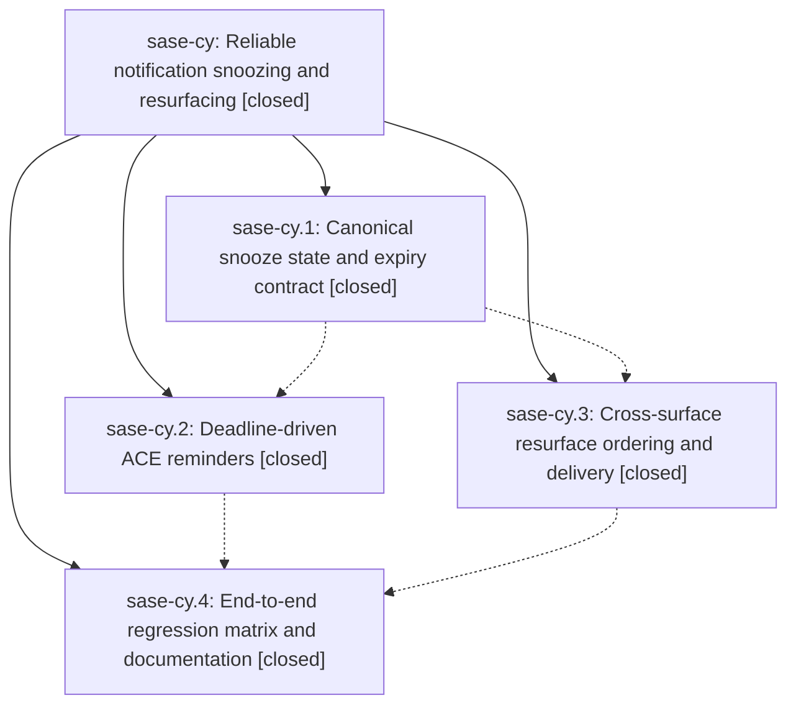

# Bead: sase-cy — Reliable notification snoozing and resurfacing

[Bead Pages](../README.md) / sase-cy

**Status:** ✓ closed · **Resolution:** done · **Type:** ▸ plan · **Tier:** epic
**Owner:** `bryanbugyi34@gmail.com` · **Created by:** [bbugyi200.athena.qu](https://github.com/sase-org/sase--agents/blob/main/agents/bbugyi200.athena.qu/README.md) · **Assignee:** `sase-cy.land`
**Created:** 2026-08-01 10:45:48 UTC · **Closed:** 2026-08-01 13:49:35 UTC
**Plan:** [202608/reliable\_notification\_snoozing.md](https://github.com/sase-org/sase--plans/blob/main/202608/reliable_notification_snoozing.md)

## Description

Snoozed notifications use one durable time contract, resurface as visible unread activity at the requested deadline, and are delivered and ordered consistently across ACE, CLI, mobile gateway, and Telegram consumers.

## Notes

[2026-08-01T13:49:35Z · sase-cy.land] Verified all phase children remain closed and source history contains the epic commits 09517a0f, 459ef978, 38c57e17, and 7163200f, plus linked core commits a856b66/64d4d4c and Telegram commits c9c9af6/33ada2a. Rechecked current master overlap since the first epic commit: later gate presentation, notification panels, and Admin Center selection commits are present and integrated. Fixed the landing dependency defect by raising pyproject.toml to sase-core-rs>=0.17.5,<0.18.0 and regenerating uv.lock so clean resolution no longer permits 0.17.4; the lock now resolves 0.17.7. Proved the published minimum by installing sase-core-rs==0.17.5 into the main venv, confirming version 0.17.5, and passing 43 focused facade/catalog/mobile tests plus all 69 notification_store tests including the snooze E2E matrix, then restored linked core 0.17.7. Final verification passed: main notification/ACE/CLI/mobile/sort/E2E matrix 268 passed; main just install && just check passed; linked sase-core cargo fmt --check, cargo clippy --workspace --all-targets -- -D warnings, and cargo test --workspace passed; linked sase-telegram standalone check reproduced the known old-published-sase adapter mismatch, and after installing current main/core its just check passed with 516 tests including all four snooze-resurface E2E tests. Follow-ups reconciled without duplicates: strict SDD fixtures are done in sase-d0/58948eb9; suite-gate contention is sase-cf canceled after non-reproduction and did not recur in the final main check; OpenCode temp leak remains tracked by in-progress sase-d5; Config Center populated snapshot was tracked by sase-d8, reproduced at 14,495 changed pixels, then this lander accepted the single deterministic golden to unblock just check; Telegram stale editable install did not merit a new task because current main/core environment exercises the E2E tests; d7 already carried a delegated canceled close and now has the evidence note for the dependency-floor correction.

[2026-08-01T13:51:33Z · sase-cy.land] Post-close finalization: just symvision passed clean with no stale sase-cy whitelist or unused-symbol changes. Updated the durable epic plan 202608/reliable_notification_snoozing.md frontmatter to status: done. Final worktree check: main changes are pyproject.toml, uv.lock, tests/test_sase_core_rs_telemetry_smoke_tool.py, and the Config Center populated PNG golden; plans change is only 202608/reliable_notification_snoozing.md; linked sase-core and sase-telegram worktrees are clean.

## Phases

| Bead | Title | Status | Size | Agents | Commits |
|---|---|---|---|---:|---:|
| [sase-cy.1](sase-cy.1.md) | Canonical snooze state and expiry contract | ✓ closed | medium | 1 | 2 |
| [sase-cy.2](sase-cy.2.md) | Deadline-driven ACE reminders | ✓ closed | medium | 1 | 1 |
| [sase-cy.3](sase-cy.3.md) | Cross-surface resurface ordering and delivery | ✓ closed | medium | 1 | 3 |
| [sase-cy.4](sase-cy.4.md) | End-to-end regression matrix and documentation | ✓ closed | small | 1 | 2 |

## Lineage

## Agents

| Agent | Bead | Commits |
|---|---|---:|
| [bbugyi200.athena.sase-cy.1](https://github.com/sase-org/sase--agents/blob/main/agents/bbugyi200.athena.sase-cy.1/README.md) | [sase-cy.1](sase-cy.1.md) | 2 |
| [bbugyi200.athena.sase-cy.2](https://github.com/sase-org/sase--agents/blob/main/agents/bbugyi200.athena.sase-cy.2/README.md) | [sase-cy.2](sase-cy.2.md) | 1 |
| [bbugyi200.athena.sase-cy.3](https://github.com/sase-org/sase--agents/blob/main/agents/bbugyi200.athena.sase-cy.3/README.md) | [sase-cy.3](sase-cy.3.md) | 3 |
| [bbugyi200.athena.sase-cy.4](https://github.com/sase-org/sase--agents/blob/main/agents/bbugyi200.athena.sase-cy.4/README.md) | [sase-cy.4](sase-cy.4.md) | 2 |
| [bbugyi200.athena.sase-cy.land](https://github.com/sase-org/sase--agents/blob/main/families/bbugyi200.athena.sase-cy.land.md) | [sase-cy](README.md) | 2 |

## Commits

| Repo | Commit | Subject | Bead | Committed (UTC) |
|---|---|---|---|---|
| sase-core | [`sase-core@a856b66`](https://github.com/sase-org/sase-core/commit/a856b6650ddade77956ed06ca706de5d5bde1438) | feat(notifications): define canonical snooze expiry state | [sase-cy.1](sase-cy.1.md) | 2026-08-01 11:18:36 |
| sase | [`09517a0`](https://github.com/sase-org/sase/commit/09517a0fb011f0922e132d34591c2ec380911c6d) | feat(notifications): expose canonical snooze snapshots | [sase-cy.1](sase-cy.1.md) | 2026-08-01 11:19:33 |
| sase-core | [`sase-core@64d4d4c`](https://github.com/sase-org/sase-core/commit/64d4d4cf796166c13b15aa755f1861d3ae4953d5) | feat(notifications): add mobile activity cursors | [sase-cy.3](sase-cy.3.md) | 2026-08-01 11:54:37 |
| sase-telegram | [`sase-telegram@c9c9af6`](https://github.com/sase-org/sase-telegram/commit/c9c9af6daca4595599635a953be1e200b5cda1b7) | feat(notifications): deliver resurfaced notifications | [sase-cy.3](sase-cy.3.md) | 2026-08-01 11:59:09 |
| sase | [`459ef97`](https://github.com/sase-org/sase/commit/459ef9786dd1ff5ef39ea4eb6f556ccf8db3ceae) | feat(notifications): order projections by resurface activity | [sase-cy.3](sase-cy.3.md) | 2026-08-01 12:01:55 |
| sase | [`38c57e1`](https://github.com/sase-org/sase/commit/38c57e178101114294aee51a8563e23ed9dbceec) | feat(ace): schedule snooze reminders by deadline | [sase-cy.2](sase-cy.2.md) | 2026-08-01 12:22:52 |
| sase | [`7163200`](https://github.com/sase-org/sase/commit/7163200f5cd8c9793f58db6753609b66cae3ab74) | test: add snooze resurface regression matrix and document guarantees | [sase-cy.4](sase-cy.4.md) | 2026-08-01 12:55:55 |
| sase-telegram | [`sase-telegram@33ada2a`](https://github.com/sase-org/sase-telegram/commit/33ada2abf1f8d40acd6d5e109b4d8edae589a533) | test: cover snooze resurface delivery end to end | [sase-cy.4](sase-cy.4.md) | 2026-08-01 12:57:10 |
| sase | [`9cf08e7`](https://github.com/sase-org/sase/commit/9cf08e739663dcc62d91e5794bcaebfb6fe7d274) | build(deps): require core 0.17.5 for snoozing | [sase-cy](README.md) | 2026-08-01 13:54:28 |
| sase--plans | [`sase--plans@8282e77`](https://github.com/sase-org/sase--plans/commit/8282e77005db62dff42886e1e3c3a5b7a5cc17b7) | docs: mark notification snoozing plan done | [sase-cy](README.md) | 2026-08-01 13:55:54 |
