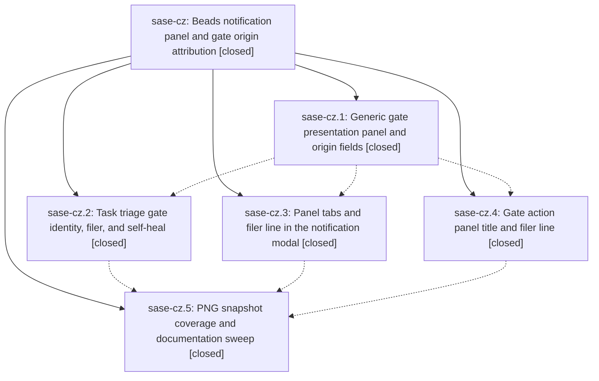

# Bead: sase-cz — Beads notification panel and gate origin attribution

[Bead Pages](../README.md) / sase-cz

**Status:** ✓ closed · **Resolution:** done · **Type:** ▸ plan · **Tier:** epic
**Owner:** `bryanbugyi34@gmail.com` · **Created by:** [bbugyi200.athena.qw](https://github.com/sase-org/sase--agents/blob/main/agents/bbugyi200.athena.qw/README.md) · **Assignee:** `sase-cz.land`
**Created:** 2026-08-01 11:03:38 UTC · **Closed:** 2026-08-01 13:35:21 UTC
**Plan:** [202608/bead\_notification\_panel.md](https://github.com/sase-org/sase--plans/blob/main/202608/bead_notification_panel.md)

## Description

Ready task beads arrive as compact `[bead]` rows in their own `Beads` notification tab, any SASE gate can declare the notification tab it lands in and the agent it was filed on behalf of, and the filing agent is visible in both the notification detail pane and the gate action panel.

## Notes

[2026-08-01T13:35:21Z · sase-cz.land] Verified all five phase beads closed with done resolution and audited epic commits d02ab49e, 63a24a0, 661699f, 86a51e1, and 6a4bb9d against current source, documentation, tests, and the three PNG goldens. Confirmed generic panel and origin validation, protected action_data projection and CLI options; compact task-triage sender, note, Beads routing, filer attribution, strict preview, and pending-gate self-heal; modal panel precedence, ordering, labels, and filed-by metadata; adapter-derived gate titles and filer rendering; and visual coverage. Reviewed every non-epic commit since the first epic commit through dd862b767 and fast-forwarded five commits that landed during verification. The later snooze activity sort composes correctly after shared tab filtering, so resurfaced rows retain declared panels and sort by activity within them; no duplicate or conflicting implementation required an epic edit. The later sase-d5 commit also fixed the proposed agent-CLI temp leak. Verification: 278 focused feature tests passed, all 3 epic visual snapshots passed, 74 post-fast-forward notification, snooze, and temp-isolation tests passed, the epic plan validates with 0 warnings, and SASE validation passes. A full check passed every format, lint, Symvision, size, SASE, and committed-plan gate and reached 25,158 passed with only four unrelated visual failures: the Config Center drift already assigned to running agent qy.f0 and three retry E2E contention failures. Filed the latter proposed sase-cz.5 follow-up as ready task sase-dc. No new bead was filed for the repaired prompt link; August SDD fixtures fixed by sase-d0 and 58948eb9; slow-tools visual already covered by sase-cb, sase-cg, and sase-cx and passing now; suite-gate SIGKILL covered by sase-cf and passing now; generated sase_gate copies covered by sase-d2 with init-skills validation now green; opencode temp leak fixed by sase-d5 and fa0f427e; Config Center drift captured by sase-d8 and actively owned by qy.f0; or concurrent plan launch covered by sase-d1 and 2c23eb4 with the selector passing. No epic-scoped work remains.

## Phases

| Bead | Title | Status | Size | Agents | Commits |
|---|---|---|---|---:|---:|
| [sase-cz.1](sase-cz.1.md) | Generic gate presentation panel and origin fields | ✓ closed | medium | 1 | 1 |
| [sase-cz.2](sase-cz.2.md) | Task triage gate identity, filer, and self-heal | ✓ closed | medium | 1 | 1 |
| [sase-cz.3](sase-cz.3.md) | Panel tabs and filer line in the notification modal | ✓ closed | medium | 1 | 1 |
| [sase-cz.4](sase-cz.4.md) | Gate action panel title and filer line | ✓ closed | small | 1 | 1 |
| [sase-cz.5](sase-cz.5.md) | PNG snapshot coverage and documentation sweep | ✓ closed | small | 1 | 1 |

## Lineage

## Agents

| Agent | Bead | Commits |
|---|---|---:|
| [bbugyi200.athena.sase-cz.1](https://github.com/sase-org/sase--agents/blob/main/agents/bbugyi200.athena.sase-cz.1/README.md) | [sase-cz.1](sase-cz.1.md) | 1 |
| [bbugyi200.athena.sase-cz.2](https://github.com/sase-org/sase--agents/blob/main/agents/bbugyi200.athena.sase-cz.2/README.md) | [sase-cz.2](sase-cz.2.md) | 1 |
| [bbugyi200.athena.sase-cz.3](https://github.com/sase-org/sase--agents/blob/main/agents/bbugyi200.athena.sase-cz.3/README.md) | [sase-cz.3](sase-cz.3.md) | 1 |
| [bbugyi200.athena.sase-cz.4](https://github.com/sase-org/sase--agents/blob/main/agents/bbugyi200.athena.sase-cz.4/README.md) | [sase-cz.4](sase-cz.4.md) | 1 |
| [bbugyi200.athena.sase-cz.5](https://github.com/sase-org/sase--agents/blob/main/agents/bbugyi200.athena.sase-cz.5/README.md) | [sase-cz.5](sase-cz.5.md) | 1 |
| [bbugyi200.athena.sase-cz.land](https://github.com/sase-org/sase--agents/blob/main/agents/bbugyi200.athena.sase-cz.land/README.md) | [sase-cz](README.md) | 1 |

## Commits

| Repo | Commit | Subject | Bead | Committed (UTC) |
|---|---|---|---|---|
| sase | [`d02ab49`](https://github.com/sase-org/sase/commit/d02ab49e58e81a1860c2f11f83c5a61c76c94e2a) | feat(gates): add generic presentation metadata | [sase-cz.1](sase-cz.1.md) | 2026-08-01 11:25:51 |
| sase | [`63a24a0`](https://github.com/sase-org/sase/commit/63a24a025223680adeceac91397ab58313e0fb10) | feat: improve task triage gate presentation | [sase-cz.2](sase-cz.2.md) | 2026-08-01 12:05:51 |
| sase | [`86a51e1`](https://github.com/sase-org/sase/commit/86a51e1d5b2825c402b3d699d3acc51d7e5e41a2) | feat(gates): title gate review modal from adapter and show filer | [sase-cz.4](sase-cz.4.md) | 2026-08-01 12:06:09 |
| sase | [`661699f`](https://github.com/sase-org/sase/commit/661699f387a830d107f02a45558e121bdfff494c) | feat(tui): route notifications through declared panels | [sase-cz.3](sase-cz.3.md) | 2026-08-01 12:07:23 |
| sase | [`6a4bb9d`](https://github.com/sase-org/sase/commit/6a4bb9d5bbe242603e6c5cdf6b53cdd3aab0e1d5) | test: add bead notification PNG snapshots | [sase-cz.5](sase-cz.5.md) | 2026-08-01 12:49:04 |
| sase--plans | [`sase--plans@f845cd2`](https://github.com/sase-org/sase--plans/commit/f845cd2bbb0562ddbeedbac83a901ce6a8065092) | chore(plans): mark bead notification panel epic done | [sase-cz](README.md) | 2026-08-01 13:38:21 |
