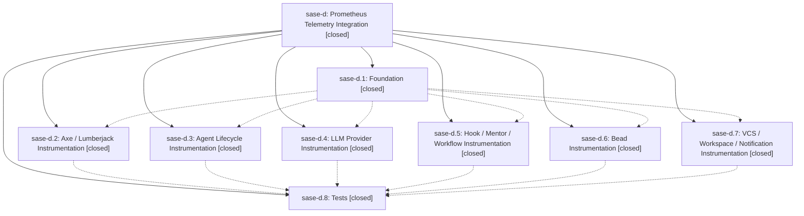

# Bead: sase-d — Prometheus Telemetry Integration

[Bead Pages](../README.md) / sase-d

**Status:** ✓ closed · **Resolution:** (unrecorded) · **Type:** plan · **Tier:** epic
**Owner:** `bryanbugyi34@gmail.com`
**Created:** 2026-04-08 02:23:50 UTC · **Closed:** 2026-04-08 03:18:43 UTC
**Plan:** [202604/prometheus\_telemetry\_1.md](https://github.com/sase-org/sase--plans/blob/main/202604/prometheus_telemetry_1.md)

## Phases

| Bead | Title | Status | Size | Agents | Commits |
|---|---|---|---|---:|---:|
| [sase-d.1](sase-d.1.md) | Foundation | ✓ closed | small | 0 | 1 |
| [sase-d.2](sase-d.2.md) | Axe / Lumberjack Instrumentation | ✓ closed | small | 0 | 1 |
| [sase-d.3](sase-d.3.md) | Agent Lifecycle Instrumentation | ✓ closed | small | 0 | 1 |
| [sase-d.4](sase-d.4.md) | LLM Provider Instrumentation | ✓ closed | small | 0 | 1 |
| [sase-d.5](sase-d.5.md) | Hook / Mentor / Workflow Instrumentation | ✓ closed | small | 0 | 1 |
| [sase-d.6](sase-d.6.md) | Bead Instrumentation | ✓ closed | small | 0 | 1 |
| [sase-d.7](sase-d.7.md) | VCS / Workspace / Notification Instrumentation | ✓ closed | small | 0 | 1 |
| [sase-d.8](sase-d.8.md) | Tests | ✓ closed | small | 0 | 1 |

## Lineage

## Commits

| Commit | Subject | Bead | Committed (UTC) |
|---|---|---|---|
| [`bf8db7c`](https://github.com/sase-org/sase/commit/bf8db7c5567a4e753db804084d4e267638fe608e) | feat: Add Prometheus telemetry foundation package (sase-d.1) | [sase-d.1](sase-d.1.md) | 2026-04-08 02:39:55 |
| [`453330b`](https://github.com/sase-org/sase/commit/453330be4c6c0e7a31eabb8fb1c7806ff3cd8297) | feat: Wire Prometheus telemetry into axe daemon (sase-d.2) | [sase-d.2](sase-d.2.md) | 2026-04-08 02:49:56 |
| [`d78cb34`](https://github.com/sase-org/sase/commit/d78cb340a161f68a85e6232ba76cf19ebd2c8367) | feat: Wire Prometheus telemetry into LLM provider pipeline (sase-d.4) | [sase-d.4](sase-d.4.md) | 2026-04-08 02:59:17 |
| [`b42a79d`](https://github.com/sase-org/sase/commit/b42a79d142645e1b650355854944b0090cdce133) | feat: Wire Prometheus telemetry into agent lifecycle (sase-d.3) | [sase-d.3](sase-d.3.md) | 2026-04-08 03:00:39 |
| [`8e6c992`](https://github.com/sase-org/sase/commit/8e6c992603fa5c68556bf377202babb7fa78ae99) | feat: Wire Prometheus telemetry into bead CRUD operations (sase-d.6) | [sase-d.6](sase-d.6.md) | 2026-04-08 03:04:54 |
| [`0044cc0`](https://github.com/sase-org/sase/commit/0044cc0975ee8f2a27bdce6b7c149dfffdaae9a1) | feat: Wire Prometheus telemetry into hooks, mentors, and workflows (sase-d.5) | [sase-d.5](sase-d.5.md) | 2026-04-08 03:06:15 |
| [`49f6b0c`](https://github.com/sase-org/sase/commit/49f6b0cb441b28c212d49d4add51f3033c9658f2) | feat: Wire Prometheus telemetry into VCS, workspace, and notification subsystems (sase-d.7) | [sase-d.7](sase-d.7.md) | 2026-04-08 03:08:54 |
| [`9eae098`](https://github.com/sase-org/sase/commit/9eae0982333d492c6769f85c3128c29e54d8551e) | feat: Add integration tests for Prometheus telemetry instrumentation (sase-d.8) | [sase-d.8](sase-d.8.md) | 2026-04-08 03:16:00 |
