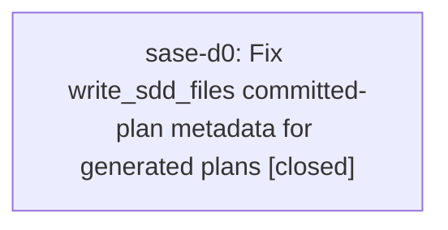

# Bead: sase-d0 — Fix write\_sdd\_files committed-plan metadata for generated plans

[Bead Pages](../README.md) / sase-d0

**Status:** ✓ closed · **Resolution:** done · **Type:** ◆ task
**Owner:** `bryanbugyi34@gmail.com` · **Created by:** [bbugyi200.athena.qv](https://github.com/sase-org/sase--agents/blob/main/families/bbugyi200.athena.qv.md) · **Assignee:** `sase-d0`
**Created:** 2026-08-01 11:16:23 UTC · **Closed:** 2026-08-01 12:47:33 UTC

## Description

Current master d462e97bb reproduces two tests/test_sdd_file_writes.py failures: tests/test_sdd_file_writes.py::test_write_sdd_files_supports_flat_sidecar_plans_root and tests/test_sdd_file_writes.py::test_write_sdd_files_rebases_seeded_parent_section. Both fail because write_sdd_files emits committed tale plan frontmatter without required title and goal fields, raising _CommittedPlanValidationError with required-missing title and required-missing goal. Verified with uv run pytest on both exact nodes and again during just test, which reported those same two failures. No existing open task was found by searches for title goal or committed-plan.

## Notes

[2026-08-01T12:47:33Z · sase-d0] Updated both date-sensitive write_sdd_files fixtures to use deterministic 202608 destinations and complete authored tale metadata (tier, title, goal), while preserving the existing strict rejection of incomplete cutover plans. Verified both exact regression nodes pass, tests/test_sdd_file_writes.py passes 14/14, and just check passes formatting, Ruff, mypy, pyscripts, changelog, Symvision, size, SASE, and committed-plan validation; its full suite passed 25,121 tests with only the distinct deterministic Config Center PNG drift filed as ready task sase-d8. Also filed ready task sase-d7 for the stale sase-core-rs dependency floor found during verification; the already-tracked sase-d1 concurrency flake did not recur in the final run.

[2026-08-01T12:49:06Z · sase-d0] Verified deterministic August 2026 metadata fixtures, 14/14 SDD writer tests passing, and the full check gate with the unrelated Config Center snapshot drift tracked in sase-d8.

## Lineage

## Agents

| Agent | Bead | Commits |
|---|---|---:|
| [bbugyi200.athena.sase-d0](https://github.com/sase-org/sase--agents/blob/main/agents/bbugyi200.athena.sase-d0/README.md) | [sase-d0](README.md) | 1 |

## Commits

| Repo | Commit | Subject | Bead | Committed (UTC) |
|---|---|---|---|---|
| sase | [`58948eb`](https://github.com/sase-org/sase/commit/58948eb9c45c0eba8dfed3c59a28d108a95402b1) | test: stabilize committed plan metadata fixtures | [sase-d0](README.md) | 2026-08-01 12:49:48 |
