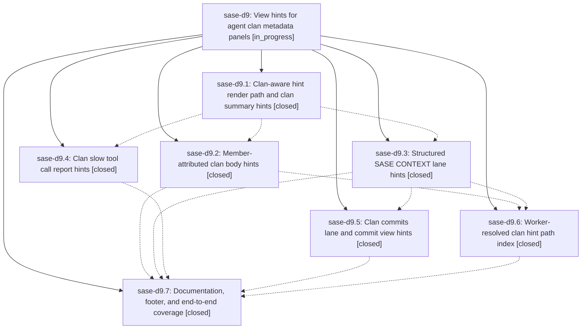

# Bead: sase-d9 — View hints for agent clan metadata panels

[Bead Pages](../README.md) / sase-d9

**Status:** ◐ in_progress · **Type:** ▸ plan · **Tier:** epic
**Owner:** `bryanbugyi34@gmail.com` · **Created by:** [bbugyi200.athena.r3](https://github.com/sase-org/sase--agents/blob/main/agents/bbugyi200.athena.r3/README.md) · **Assignee:** `sase-d9.land`
**Created:** 2026-08-01 12:34:54 UTC
**Plan:** [202608/clan\_summary\_view\_hints.md](https://github.com/sase-org/sase--plans/blob/main/202608/clan_summary_view_hints.md)

## Description

Pressing `v` on a selected agent clan container annotates the clan metadata document in place — clan summary paths, member-attributed bodies, SASE CONTEXT entries, slow tool calls, and member commits all receive `[N]` hints that resolve to correct targets — instead of destroying the clan document and reporting "No files or commits found".

## Phases

| Bead | Title | Status | Size | Agents | Commits |
|---|---|---|---|---:|---:|
| [sase-d9.1](sase-d9.1.md) | Clan-aware hint render path and clan summary hints | ✓ closed | medium | 1 | 1 |
| [sase-d9.2](sase-d9.2.md) | Member-attributed clan body hints | ✓ closed | medium | 1 | 1 |
| [sase-d9.3](sase-d9.3.md) | Structured SASE CONTEXT lane hints | ✓ closed | medium | 1 | 1 |
| [sase-d9.4](sase-d9.4.md) | Clan slow tool call report hints | ✓ closed | small | 1 | 1 |
| [sase-d9.5](sase-d9.5.md) | Clan commits lane and commit view hints | ✓ closed | medium | 1 | 1 |
| [sase-d9.6](sase-d9.6.md) | Worker-resolved clan hint path index | ✓ closed | medium | 1 | 1 |
| [sase-d9.7](sase-d9.7.md) | Documentation, footer, and end-to-end coverage | ✓ closed | small | 1 | 1 |

## Lineage

## Agents

| Agent | Bead | Commits |
|---|---|---:|
| [bbugyi200.athena.sase-d9.1](https://github.com/sase-org/sase--agents/blob/main/agents/bbugyi200.athena.sase-d9.1/README.md) | [sase-d9.1](sase-d9.1.md) | 1 |
| [bbugyi200.athena.sase-d9.2](https://github.com/sase-org/sase--agents/blob/main/agents/bbugyi200.athena.sase-d9.2/README.md) | [sase-d9.2](sase-d9.2.md) | 1 |
| [bbugyi200.athena.sase-d9.3](https://github.com/sase-org/sase--agents/blob/main/agents/bbugyi200.athena.sase-d9.3/README.md) | [sase-d9.3](sase-d9.3.md) | 1 |
| [bbugyi200.athena.sase-d9.4](https://github.com/sase-org/sase--agents/blob/main/agents/bbugyi200.athena.sase-d9.4/README.md) | [sase-d9.4](sase-d9.4.md) | 1 |
| [bbugyi200.athena.sase-d9.5](https://github.com/sase-org/sase--agents/blob/main/agents/bbugyi200.athena.sase-d9.5/README.md) | [sase-d9.5](sase-d9.5.md) | 1 |
| [bbugyi200.athena.sase-d9.6](https://github.com/sase-org/sase--agents/blob/main/agents/bbugyi200.athena.sase-d9.6/README.md) | [sase-d9.6](sase-d9.6.md) | 1 |
| [bbugyi200.athena.sase-d9.7](https://github.com/sase-org/sase--agents/blob/main/agents/bbugyi200.athena.sase-d9.7/README.md) | [sase-d9.7](sase-d9.7.md) | 1 |
| [bbugyi200.athena.sase-d9.land](https://github.com/sase-org/sase--agents/blob/main/agents/bbugyi200.athena.sase-d9.land/README.md) | [sase-d9](README.md) | 0 |

## Commits

| Repo | Commit | Subject | Bead | Committed (UTC) |
|---|---|---|---|---|
| sase | [`dd862b7`](https://github.com/sase-org/sase/commit/dd862b7670deba99fd70f41d0a9d0cb567a22ad7) | feat(tui): add file hints to clan summaries | [sase-d9.1](sase-d9.1.md) | 2026-08-01 13:08:31 |
| sase | [`ac7a3b4`](https://github.com/sase-org/sase/commit/ac7a3b4c4a25133b21dd8f6b27caaf60c774a05f) | feat(tui): add file hints to clan member bodies | [sase-d9.2](sase-d9.2.md) | 2026-08-01 13:49:08 |
| sase | [`6a1afad`](https://github.com/sase-org/sase/commit/6a1afad8a7f2cc35b76821ca18f382385fe80f4d) | feat(tui): add clan slow tool report hints | [sase-d9.4](sase-d9.4.md) | 2026-08-01 13:50:34 |
| sase | [`cffd22b`](https://github.com/sase-org/sase/commit/cffd22be5fdb6da60f0306798e259a1f3f8fdac8) | feat(tui): add structured clan context hints | [sase-d9.3](sase-d9.3.md) | 2026-08-01 13:57:32 |
| sase | [`d1f55ce`](https://github.com/sase-org/sase/commit/d1f55cec31a7ce1a97ec0030c8e7c9853cfe4be6) | feat(tui): resolve clan hint paths off-thread | [sase-d9.6](sase-d9.6.md) | 2026-08-01 14:20:59 |
| sase | [`1b29a74`](https://github.com/sase-org/sase/commit/1b29a74183de99e9e50cec95b1287e7188511939) | feat(ace): add clan commit context lane | [sase-d9.5](sase-d9.5.md) | 2026-08-01 14:29:20 |
| sase | [`624db9a`](https://github.com/sase-org/sase/commit/624db9a9f7baf4545451cd460a026684198a34f1) | docs(ace): document clan view hints and cover the clan \`v\` flow | [sase-d9.7](sase-d9.7.md) | 2026-08-01 15:15:01 |
