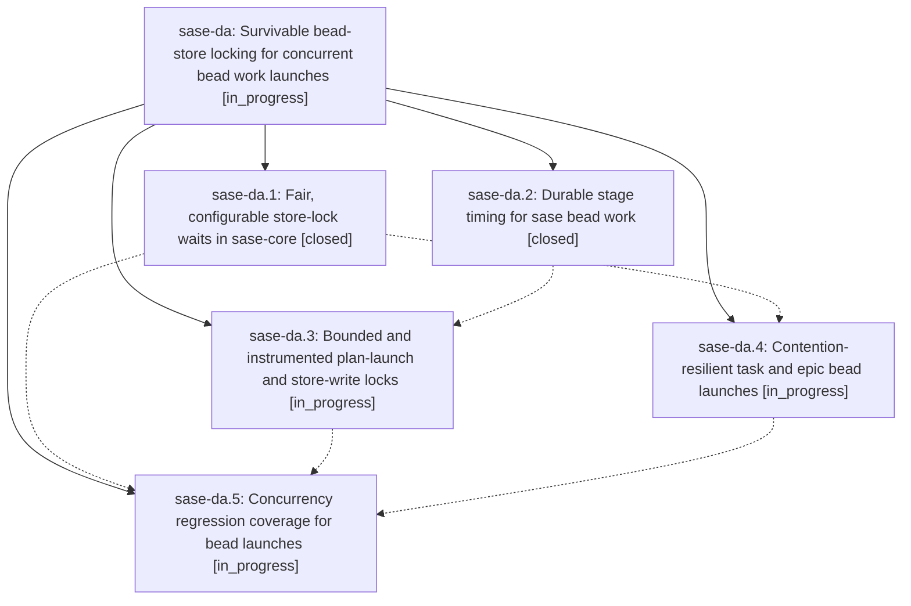

# Bead: sase-da — Survivable bead-store locking for concurrent bead work launches

[Bead Pages](../README.md) / sase-da

**Status:** ◐ in_progress · **Type:** ▸ plan · **Tier:** epic
**Owner:** `bryanbugyi34@gmail.com` · **Created by:** [bbugyi200.athena.r5](https://github.com/sase-org/sase--agents/blob/main/agents/bbugyi200.athena.r5/README.md) · **Assignee:** `sase-da.land`
**Created:** 2026-08-01 13:03:43 UTC
**Plan:** [202608/bead\_store\_lock\_contention.md](https://github.com/sase-org/sase--plans/blob/main/202608/bead_store_lock_contention.md)

## Description

Task-bead worker launches succeed while an epic launch (or any other bead writer) is in flight, and an epic launch that blocks on a lock reports what it is waiting for instead of stalling silently for minutes.

## Phases

| Bead | Title | Status | Size | Agents | Commits |
|---|---|---|---|---:|---:|
| [sase-da.1](sase-da.1.md) | Fair, configurable store-lock waits in sase-core | ✓ closed | medium | 1 | 1 |
| [sase-da.2](sase-da.2.md) | Durable stage timing for sase bead work | ✓ closed | medium | 1 | 0 |
| [sase-da.3](sase-da.3.md) | Bounded and instrumented plan-launch and store-write locks | ◐ in_progress | medium | 1 | 0 |
| [sase-da.4](sase-da.4.md) | Contention-resilient task and epic bead launches | ◐ in_progress | small | 1 | 0 |
| [sase-da.5](sase-da.5.md) | Concurrency regression coverage for bead launches | ◐ in_progress | small | 1 | 0 |

## Lineage

## Agents

| Agent | Bead | Commits |
|---|---|---:|
| [bbugyi200.athena.sase-da.1](https://github.com/sase-org/sase--agents/blob/main/agents/bbugyi200.athena.sase-da.1/README.md) | [sase-da.1](sase-da.1.md) | 1 |
| [bbugyi200.athena.sase-da.2](https://github.com/sase-org/sase--agents/blob/main/agents/bbugyi200.athena.sase-da.2/README.md) | [sase-da.2](sase-da.2.md) | 0 |
| [bbugyi200.athena.sase-da.3](https://github.com/sase-org/sase--agents/blob/main/agents/bbugyi200.athena.sase-da.3/README.md) | [sase-da.3](sase-da.3.md) | 0 |
| [bbugyi200.athena.sase-da.4](https://github.com/sase-org/sase--agents/blob/main/agents/bbugyi200.athena.sase-da.4/README.md) | [sase-da.4](sase-da.4.md) | 0 |
| [bbugyi200.athena.sase-da.5](https://github.com/sase-org/sase--agents/blob/main/agents/bbugyi200.athena.sase-da.5/README.md) | [sase-da.5](sase-da.5.md) | 0 |
| [bbugyi200.athena.sase-da.land](https://github.com/sase-org/sase--agents/blob/main/agents/bbugyi200.athena.sase-da.land/README.md) | [sase-da](README.md) | 0 |

## Commits

| Repo | Commit | Subject | Bead | Committed (UTC) |
|---|---|---|---|---|
| sase-core | [`sase-core@f8105c4`](https://github.com/sase-org/sase-core/commit/f8105c473f22054dc916c48cf9b8c499bece9432) | fix(core): make store lock waits contention resilient | [sase-da.1](sase-da.1.md) | 2026-08-01 13:59:55 |
