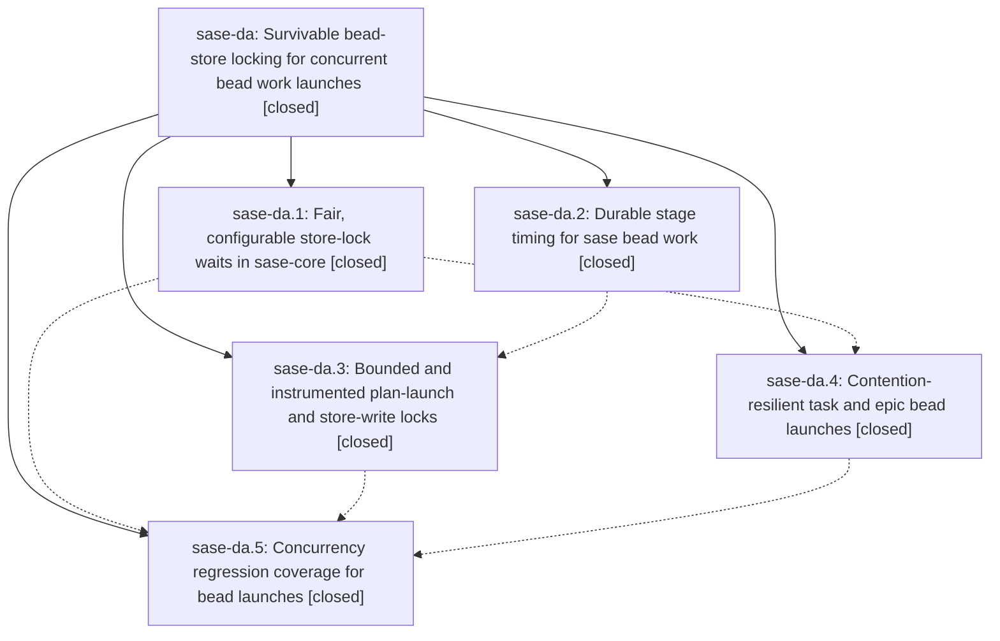

# Bead: sase-da — Survivable bead-store locking for concurrent bead work launches

[Bead Pages](../README.md) / sase-da

**Status:** ✓ closed · **Resolution:** done · **Type:** ▸ plan · **Tier:** epic
**Owner:** `bryanbugyi34@gmail.com` · **Created by:** [bbugyi200.athena.r5](https://github.com/sase-org/sase--agents/blob/main/agents/bbugyi200.athena.r5/README.md) · **Assignee:** `sase-da.land`
**Created:** 2026-08-01 13:03:43 UTC · **Closed:** 2026-08-01 14:58:02 UTC
**Plan:** [202608/bead\_store\_lock\_contention.md](https://github.com/sase-org/sase--plans/blob/main/202608/bead_store_lock_contention.md)

## Description

Task-bead worker launches succeed while an epic launch (or any other bead writer) is in flight, and an epic launch that blocks on a lock reports what it is waiting for instead of stalling silently for minutes.

## Notes

[2026-08-01T14:58:02Z · sase-da.land] Land audit verified all five child beads and every note against source and commits. Phase commits are core f8105c473 (shared capped-backoff locks, 600s/120s env-overridable bounds, holder metadata, lock_timeout compatibility, lock_wait_ms, doctor coverage), main ecc1e901b (holder ignores), cb6efd7de (durable bead_work timing and plan-to-epic stages), 70c85e012 (bounded holder-naming plan-launch lock plus durable store-write waits), 09c1d0d6b (narrow retryable preclaims with task/epic rollback), and 11e7396d4 (real concurrent mutation and overlapping task/epic launch regressions). Independently passed cargo fmt, clippy -D warnings, the complete sase-core workspace and doc tests, 60 focused Python phase/ignore tests, and the Config Center visual snapshot. Audited every non-epic main commit from the first epic commit cb6efd7de through 11e7396d4 and current origin/master, plus the core history after f8105c473: launch/lock code has no duplicate or conflict; the only relevant overlap was the interleaved 9cf08e739 Config Center golden update, which resolves the stale-snapshot reports. The published core dependency floor remains release-sequenced: release-plz owns versions and the lock fix is post-v0.17.7 source, so no premature unpublished floor was introduced. Follow-ups: filed sase-dg for the parallel-only metadata-search commit-repeat flake proposed by sase-da.4; did not duplicate the pyscripts closer-dir proposals from sase-da.4/.5 because active task sase-de already owns the independently reproduced failure; did not file the Config Center proposals from sase-da.1/.2 because sase-da.3 retracted them after the upstream golden update and the land audit visual rerun passes.

## Phases

| Bead | Title | Status | Size | Agents | Commits |
|---|---|---|---|---:|---:|
| [sase-da.1](sase-da.1.md) | Fair, configurable store-lock waits in sase-core | ✓ closed | medium | 1 | 2 |
| [sase-da.2](sase-da.2.md) | Durable stage timing for sase bead work | ✓ closed | medium | 1 | 1 |
| [sase-da.3](sase-da.3.md) | Bounded and instrumented plan-launch and store-write locks | ✓ closed | medium | 1 | 1 |
| [sase-da.4](sase-da.4.md) | Contention-resilient task and epic bead launches | ✓ closed | small | 1 | 1 |
| [sase-da.5](sase-da.5.md) | Concurrency regression coverage for bead launches | ✓ closed | small | 1 | 1 |

## Lineage

## Agents

| Agent | Bead | Commits |
|---|---|---:|
| [bbugyi200.athena.sase-da.1](https://github.com/sase-org/sase--agents/blob/main/agents/bbugyi200.athena.sase-da.1/README.md) | [sase-da.1](sase-da.1.md) | 2 |
| [bbugyi200.athena.sase-da.2](https://github.com/sase-org/sase--agents/blob/main/agents/bbugyi200.athena.sase-da.2/README.md) | [sase-da.2](sase-da.2.md) | 1 |
| [bbugyi200.athena.sase-da.3](https://github.com/sase-org/sase--agents/blob/main/agents/bbugyi200.athena.sase-da.3/README.md) | [sase-da.3](sase-da.3.md) | 1 |
| [bbugyi200.athena.sase-da.4](https://github.com/sase-org/sase--agents/blob/main/agents/bbugyi200.athena.sase-da.4/README.md) | [sase-da.4](sase-da.4.md) | 1 |
| [bbugyi200.athena.sase-da.5](https://github.com/sase-org/sase--agents/blob/main/agents/bbugyi200.athena.sase-da.5/README.md) | [sase-da.5](sase-da.5.md) | 1 |
| [bbugyi200.athena.sase-da.land](https://github.com/sase-org/sase--agents/blob/main/agents/bbugyi200.athena.sase-da.land/README.md) | [sase-da](README.md) | 1 |

## Commits

| Repo | Commit | Subject | Bead | Committed (UTC) |
|---|---|---|---|---|
| sase | [`cb6efd7`](https://github.com/sase-org/sase/commit/cb6efd7de3380634387b10c30d08ffdfe7bd288c) | feat(bead): persist bead work launch timing | [sase-da.2](sase-da.2.md) | 2026-08-01 13:40:30 |
| sase-core | [`sase-core@f8105c4`](https://github.com/sase-org/sase-core/commit/f8105c473f22054dc916c48cf9b8c499bece9432) | fix(core): make store lock waits contention resilient | [sase-da.1](sase-da.1.md) | 2026-08-01 13:59:55 |
| sase | [`ecc1e90`](https://github.com/sase-org/sase/commit/ecc1e901bd49142fcf91a80fa50dcff789752d7c) | fix: ignore bead mutation holder metadata | [sase-da.1](sase-da.1.md) | 2026-08-01 14:00:41 |
| sase | [`70c85e0`](https://github.com/sase-org/sase/commit/70c85e0125f2c3023588568ddc873cc5aa6ed877) | feat: bound and instrument bead store locks | [sase-da.3](sase-da.3.md) | 2026-08-01 14:06:17 |
| sase | [`09c1d0d`](https://github.com/sase-org/sase/commit/09c1d0d6b793cc278a644bdbde4aa05c08c58148) | feat(bead): retry bead-work preclaims on store-lock contention | [sase-da.4](sase-da.4.md) | 2026-08-01 14:25:33 |
| sase | [`11e7396`](https://github.com/sase-org/sase/commit/11e7396d42a45cd7b040cab1891cded814083c0c) | test: cover contended bead work launches | [sase-da.5](sase-da.5.md) | 2026-08-01 14:40:36 |
| sase--plans | [`sase--plans@5c14c3d`](https://github.com/sase-org/sase--plans/commit/5c14c3d2a18fc76c35fe0919c0b8f21dfc0487d7) | docs: mark bead-store lock epic plan done | [sase-da](README.md) | 2026-08-01 15:00:26 |
