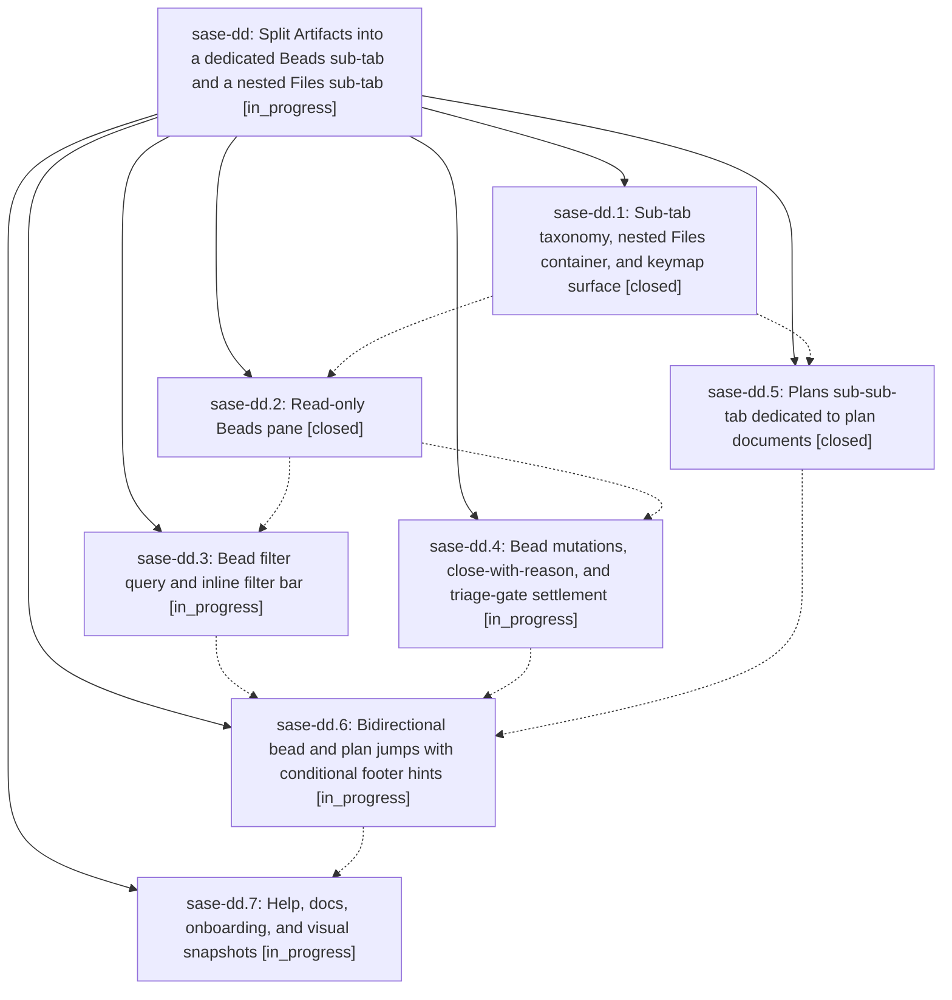

# Bead: sase-dd — Split Artifacts into a dedicated Beads sub-tab and a nested Files sub-tab

[Bead Pages](../README.md) / sase-dd

**Status:** ◐ in_progress · **Type:** ▸ plan · **Tier:** epic
**Owner:** `bryanbugyi34@gmail.com` · **Created by:** [bbugyi200.athena.r7](https://github.com/sase-org/sase--agents/blob/main/agents/bbugyi200.athena.r7/README.md) · **Assignee:** `sase-dd.land`
**Created:** 2026-08-01 13:52:32 UTC
**Plan:** [202608/artifacts\_beads\_and\_files\_subtabs.md](https://github.com/sase-org/sase--plans/blob/main/202608/artifacts_beads_and_files_subtabs.md)

## Description

The Artifacts tab exposes a bead-only Beads sub-tab with full task-bead triage, and a Files sub-tab whose Plans, Chats, and Other sub-sub-tabs cycle with ( and ), with Plans dedicated to plan documents and bidirectional jumps between a plan file and the bead that links it.

## Phases

| Bead | Title | Status | Size | Agents | Commits |
|---|---|---|---|---:|---:|
| [sase-dd.1](sase-dd.1.md) | Sub-tab taxonomy, nested Files container, and keymap surface | ✓ closed | medium | 1 | 1 |
| [sase-dd.2](sase-dd.2.md) | Read-only Beads pane | ✓ closed | medium | 1 | 1 |
| [sase-dd.3](sase-dd.3.md) | Bead filter query and inline filter bar | ◐ in_progress | small | 1 | 0 |
| [sase-dd.4](sase-dd.4.md) | Bead mutations, close-with-reason, and triage-gate settlement | ◐ in_progress | medium | 1 | 0 |
| [sase-dd.5](sase-dd.5.md) | Plans sub-sub-tab dedicated to plan documents | ✓ closed | medium | 1 | 1 |
| [sase-dd.6](sase-dd.6.md) | Bidirectional bead and plan jumps with conditional footer hints | ◐ in_progress | small | 1 | 0 |
| [sase-dd.7](sase-dd.7.md) | Help, docs, onboarding, and visual snapshots | ◐ in_progress | medium | 1 | 0 |

## Lineage

## Agents

| Agent | Bead | Commits |
|---|---|---:|
| [bbugyi200.athena.sase-dd.1](https://github.com/sase-org/sase--agents/blob/main/agents/bbugyi200.athena.sase-dd.1/README.md) | [sase-dd.1](sase-dd.1.md) | 1 |
| [bbugyi200.athena.sase-dd.2](https://github.com/sase-org/sase--agents/blob/main/agents/bbugyi200.athena.sase-dd.2/README.md) | [sase-dd.2](sase-dd.2.md) | 1 |
| [bbugyi200.athena.sase-dd.3](https://github.com/sase-org/sase--agents/blob/main/agents/bbugyi200.athena.sase-dd.3/README.md) | [sase-dd.3](sase-dd.3.md) | 0 |
| [bbugyi200.athena.sase-dd.4](https://github.com/sase-org/sase--agents/blob/main/agents/bbugyi200.athena.sase-dd.4/README.md) | [sase-dd.4](sase-dd.4.md) | 0 |
| [bbugyi200.athena.sase-dd.5](https://github.com/sase-org/sase--agents/blob/main/agents/bbugyi200.athena.sase-dd.5/README.md) | [sase-dd.5](sase-dd.5.md) | 1 |
| [bbugyi200.athena.sase-dd.6](https://github.com/sase-org/sase--agents/blob/main/agents/bbugyi200.athena.sase-dd.6/README.md) | [sase-dd.6](sase-dd.6.md) | 0 |
| [bbugyi200.athena.sase-dd.7](https://github.com/sase-org/sase--agents/blob/main/agents/bbugyi200.athena.sase-dd.7/README.md) | [sase-dd.7](sase-dd.7.md) | 0 |
| [bbugyi200.athena.sase-dd.land](https://github.com/sase-org/sase--agents/blob/main/agents/bbugyi200.athena.sase-dd.land/README.md) | [sase-dd](README.md) | 0 |

## Commits

| Repo | Commit | Subject | Bead | Committed (UTC) |
|---|---|---|---|---|
| sase | [`9f80b41`](https://github.com/sase-org/sase/commit/9f80b413627c3a2614bbea4b0a58c97be03546b3) | feat(tui): nest artifact file tabs | [sase-dd.1](sase-dd.1.md) | 2026-08-01 14:44:59 |
| sase | [`4d7b6fa`](https://github.com/sase-org/sase/commit/4d7b6fae40375402736182a4c8078a41826f96a9) | feat(tui): dedicate Plans pane to plan documents | [sase-dd.5](sase-dd.5.md) | 2026-08-01 15:32:03 |
| sase | [`2e1264e`](https://github.com/sase-org/sase/commit/2e1264eed3c42450b5dab0b3e303353291a839a3) | feat: add read-only Artifacts Beads pane | [sase-dd.2](sase-dd.2.md) | 2026-08-01 15:37:29 |
