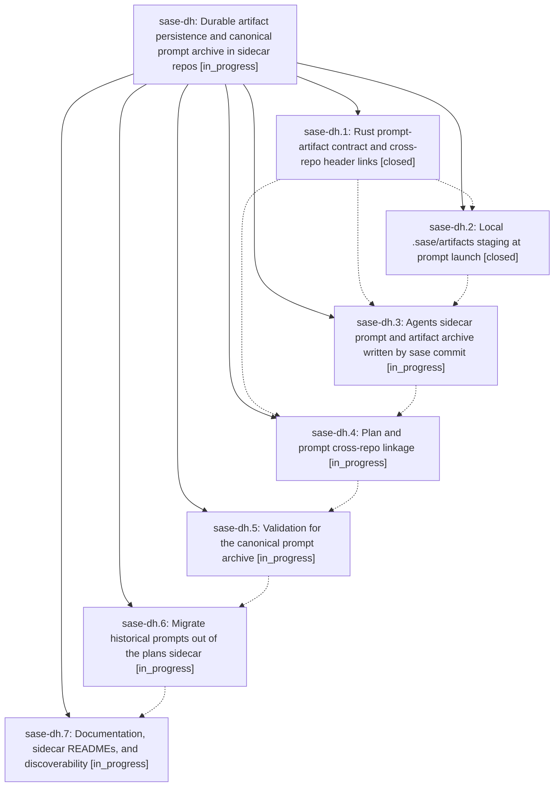

# Bead: sase-dh — Durable artifact persistence and canonical prompt archive in sidecar repos

[Bead Pages](../README.md) / sase-dh

**Status:** ◐ in_progress · **Type:** ▸ plan · **Tier:** epic
**Owner:** `bryanbugyi34@gmail.com` · **Created by:** [bbugyi200.athena.rh](https://github.com/sase-org/sase--agents/blob/main/agents/bbugyi200.athena.rh/README.md) · **Assignee:** `sase-dh.land`
**Created:** 2026-08-01 15:05:42 UTC
**Plan:** [202608/artifact\_persistence\_sidecars.md](https://github.com/sase-org/sase--plans/blob/main/202608/artifact_persistence_sidecars.md)

## Description

Every artifact a prompt references is captured locally at launch, content-addressed so different bytes never overwrite each other, and published beside the prompt when the agent commits. The `<project>--agents` sidecar becomes the single canonical home for prompt Markdown files, each one linking inline to its own archived artifacts and cross-linking to its plan when it has one, with `sase validate` proving the whole graph.

## Phases

| Bead | Title | Status | Size | Agents | Commits |
|---|---|---|---|---:|---:|
| [sase-dh.1](sase-dh.1.md) | Rust prompt-artifact contract and cross-repo header links | ✓ closed | medium | 1 | 2 |
| [sase-dh.2](sase-dh.2.md) | Local .sase/artifacts staging at prompt launch | ✓ closed | medium | 1 | 1 |
| [sase-dh.3](sase-dh.3.md) | Agents sidecar prompt and artifact archive written by sase commit | ◐ in_progress | medium | 1 | 0 |
| [sase-dh.4](sase-dh.4.md) | Plan and prompt cross-repo linkage | ◐ in_progress | medium | 1 | 0 |
| [sase-dh.5](sase-dh.5.md) | Validation for the canonical prompt archive | ◐ in_progress | medium | 1 | 0 |
| [sase-dh.6](sase-dh.6.md) | Migrate historical prompts out of the plans sidecar | ◐ in_progress | medium | 1 | 0 |
| [sase-dh.7](sase-dh.7.md) | Documentation, sidecar READMEs, and discoverability | ◐ in_progress | small | 1 | 0 |

## Lineage

## Agents

| Agent | Bead | Commits |
|---|---|---:|
| [bbugyi200.athena.sase-dh.1](https://github.com/sase-org/sase--agents/blob/main/agents/bbugyi200.athena.sase-dh.1/README.md) | [sase-dh.1](sase-dh.1.md) | 2 |
| [bbugyi200.athena.sase-dh.2](https://github.com/sase-org/sase--agents/blob/main/agents/bbugyi200.athena.sase-dh.2/README.md) | [sase-dh.2](sase-dh.2.md) | 1 |
| [bbugyi200.athena.sase-dh.3](https://github.com/sase-org/sase--agents/blob/main/agents/bbugyi200.athena.sase-dh.3/README.md) | [sase-dh.3](sase-dh.3.md) | 0 |
| [bbugyi200.athena.sase-dh.4](https://github.com/sase-org/sase--agents/blob/main/agents/bbugyi200.athena.sase-dh.4/README.md) | [sase-dh.4](sase-dh.4.md) | 0 |
| [bbugyi200.athena.sase-dh.5](https://github.com/sase-org/sase--agents/blob/main/agents/bbugyi200.athena.sase-dh.5/README.md) | [sase-dh.5](sase-dh.5.md) | 0 |
| [bbugyi200.athena.sase-dh.6](https://github.com/sase-org/sase--agents/blob/main/agents/bbugyi200.athena.sase-dh.6/README.md) | [sase-dh.6](sase-dh.6.md) | 0 |
| [bbugyi200.athena.sase-dh.7](https://github.com/sase-org/sase--agents/blob/main/agents/bbugyi200.athena.sase-dh.7/README.md) | [sase-dh.7](sase-dh.7.md) | 0 |
| [bbugyi200.athena.sase-dh.land](https://github.com/sase-org/sase--agents/blob/main/agents/bbugyi200.athena.sase-dh.land/README.md) | [sase-dh](README.md) | 0 |

## Commits

| Repo | Commit | Subject | Bead | Committed (UTC) |
|---|---|---|---|---|
| sase-core | [`sase-core@f97c7f1`](https://github.com/sase-org/sase-core/commit/f97c7f141750f0080a72653db5d5470f2fd904d6) | feat: add prompt artifact contract | [sase-dh.1](sase-dh.1.md) | 2026-08-01 15:45:40 |
| sase | [`20f6735`](https://github.com/sase-org/sase/commit/20f673572dcf86d36c3ba4e460cf7e6f32137c84) | feat: support artifacts in plan headers | [sase-dh.1](sase-dh.1.md) | 2026-08-01 15:46:24 |
| sase | [`24432d9`](https://github.com/sase-org/sase/commit/24432d9d50246e39109dcb0468816f98dbd7635c) | feat(artifacts): stage prompt references for durable capture | [sase-dh.2](sase-dh.2.md) | 2026-08-01 16:24:55 |
