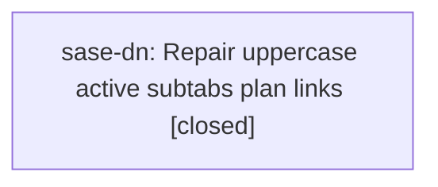

# Bead: sase-dn — Repair uppercase active subtabs plan links

[Bead Pages](../README.md) / sase-dn

**Status:** ✓ closed · **Resolution:** done · **Type:** ◆ task · **+1 reports:** +1
**Owner:** `bryanbugyi34@gmail.com` · **Created by:** [bbugyi200.athena.toobig-1c.split\_file.src.sase.ace.tui.modals.logs\_pane.0](https://github.com/sase-org/sase--agents/blob/main/agents/bbugyi200.athena.toobig-1c.split_file.src.sase.ace.tui.modals.logs_pane.0/README.md) · **Assignee:** `sase-dn`
**Created:** 2026-08-01 16:18:33 UTC · **Closed:** 2026-08-02 10:19:36 UTC

## Description

The required validation run during the Logs pane module split found two unrelated existing plan-link errors for 202607/uppercase_active_subtabs.md: its prompt reverse-link is missing, and its prompt artifact link has discontiguous or nested plan header bullets. Run the appropriate plan-link repair workflow and verify with sase validate.

## Notes

[2026-08-02T10:19:36Z · sase-dn] Updated 202607/uppercase_active_subtabs.md PROMPT header to the canonical agents-sidecar prompt URL and removed stale 202607/prompts/uppercase_active_subtabs.md from the plans sidecar. Verified sase plan links validate --json has zero uppercase_active_subtabs errors/warnings; ran sase validate, which still fails only on broader pre-existing plan-link validation owned by active epic sase-dh.

## +1 Evidence

> **+1** by `sase-dr.land` · 2026-08-01 20:22:55 UTC
>
> Land audit reran sase plan links validate --show-warnings after the prompt-archive migration; the broader plan-link validation still reports 202607/uppercase_active_subtabs.md with missing prompt target prompts/uppercase_active_subtabs.md (link-missing-target). The focused agents prompt archive validation for 202607 passes, so this corroborates the existing plans-sidecar link task instead of creating a new task.

## Lineage

## Agents

| Agent | Bead | Commits |
|---|---|---:|
| [bbugyi200.athena.sase-dn](https://github.com/sase-org/sase--agents/blob/main/agents/bbugyi200.athena.sase-dn/README.md) | [sase-dn](README.md) | 1 |

## Commits

| Repo | Commit | Subject | Bead | Committed (UTC) |
|---|---|---|---|---|
| sase--plans | [`sase--plans@ea19d30`](https://github.com/sase-org/sase--plans/commit/ea19d30b84fa4d9d5cbef1441649dbed801aaae6) | docs: repair uppercase active subtabs prompt link | [sase-dn](README.md) | 2026-08-02 10:21:20 |
