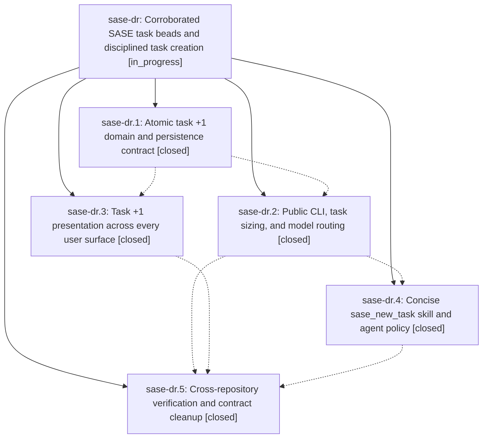

# Bead: sase-dr — Corroborated SASE task beads and disciplined task creation

[Bead Pages](../README.md) / sase-dr

**Status:** ◐ in_progress · **Type:** ▸ plan · **Tier:** epic
**Owner:** `bryanbugyi34@gmail.com` · **Created by:** [bbugyi200.athena.rl](https://github.com/sase-org/sase--agents/blob/main/agents/bbugyi200.athena.rl/README.md) · **Assignee:** `sase-dr.land`
**Created:** 2026-08-01 17:10:28 UTC
**Plan:** [202608/task\_bead\_plus\_one.md](https://github.com/sase-org/sase--plans/blob/main/202608/task_bead_plus_one.md)

## Description

Agents can record independently evidenced +1s on existing task beads, every new task has an intentional size and size-derived launch route, and concise generated guidance prevents duplicate tasks or tasks caused by active epics.

## Phases

| Bead | Title | Status | Size | Agents | Commits |
|---|---|---|---|---:|---:|
| [sase-dr.1](sase-dr.1.md) | Atomic task +1 domain and persistence contract | ✓ closed | medium | 1 | 2 |
| [sase-dr.2](sase-dr.2.md) | Public CLI, task sizing, and model routing | ✓ closed | medium | 1 | 1 |
| [sase-dr.3](sase-dr.3.md) | Task +1 presentation across every user surface | ✓ closed | medium | 1 | 2 |
| [sase-dr.4](sase-dr.4.md) | Concise sase\_new\_task skill and agent policy | ✓ closed | medium | 1 | 1 |
| [sase-dr.5](sase-dr.5.md) | Cross-repository verification and contract cleanup | ✓ closed | small | 1 | 2 |

## Lineage

## Agents

| Agent | Bead | Commits |
|---|---|---:|
| [bbugyi200.athena.sase-dr.1](https://github.com/sase-org/sase--agents/blob/main/agents/bbugyi200.athena.sase-dr.1/README.md) | [sase-dr.1](sase-dr.1.md) | 2 |
| [bbugyi200.athena.sase-dr.2](https://github.com/sase-org/sase--agents/blob/main/agents/bbugyi200.athena.sase-dr.2/README.md) | [sase-dr.2](sase-dr.2.md) | 1 |
| [bbugyi200.athena.sase-dr.3](https://github.com/sase-org/sase--agents/blob/main/agents/bbugyi200.athena.sase-dr.3/README.md) | [sase-dr.3](sase-dr.3.md) | 2 |
| [bbugyi200.athena.sase-dr.4](https://github.com/sase-org/sase--agents/blob/main/agents/bbugyi200.athena.sase-dr.4/README.md) | [sase-dr.4](sase-dr.4.md) | 1 |
| [bbugyi200.athena.sase-dr.5](https://github.com/sase-org/sase--agents/blob/main/agents/bbugyi200.athena.sase-dr.5/README.md) | [sase-dr.5](sase-dr.5.md) | 2 |
| [bbugyi200.athena.sase-dr.land](https://github.com/sase-org/sase--agents/blob/main/agents/bbugyi200.athena.sase-dr.land/README.md) | [sase-dr](README.md) | 0 |

## Commits

| Repo | Commit | Subject | Bead | Committed (UTC) |
|---|---|---|---|---|
| sase-core | [`sase-core@e101432`](https://github.com/sase-org/sase-core/commit/e101432e3df537a58a8581cbba5dfdff57c93239) | feat(beads): add atomic task evidence contract | [sase-dr.1](sase-dr.1.md) | 2026-08-01 17:57:39 |
| sase | [`c9aed8a`](https://github.com/sase-org/sase/commit/c9aed8a6fca8eeaca467f60234d5a74d05a84800) | feat(beads): integrate atomic task evidence contract | [sase-dr.1](sase-dr.1.md) | 2026-08-01 17:58:19 |
| sase | [`767852a`](https://github.com/sase-org/sase/commit/767852ac977c63beae5e2e994fac7db5f15142c1) | feat(beads)!: add task promotion and size-based routing | [sase-dr.2](sase-dr.2.md) | 2026-08-01 18:30:57 |
| sase | [`d63a86b`](https://github.com/sase-org/sase/commit/d63a86bfddc4558ddd91c69850f3d35b8ab86d6d) | feat(beads): present task corroboration across user surfaces | [sase-dr.3](sase-dr.3.md) | 2026-08-01 18:34:11 |
| sase | [`0f1f286`](https://github.com/sase-org/sase/commit/0f1f28699598bb86bed8de5ec2c42f2463c6ee21) | test(ace): refresh task triage presentation golden | [sase-dr.3](sase-dr.3.md) | 2026-08-01 18:37:09 |
| sase | [`2ec8613`](https://github.com/sase-org/sase/commit/2ec86131dcb38e9b6213723d08a7898b2165f1b5) | feat(beads): add disciplined task creation skill | [sase-dr.4](sase-dr.4.md) | 2026-08-01 18:58:41 |
| sase | [`c1efe9f`](https://github.com/sase-org/sase/commit/c1efe9f939d682405d29c226884100b9154aedfe) | fix: complete task bead contract cleanup | [sase-dr.5](sase-dr.5.md) | 2026-08-01 19:55:55 |
| sase--plans | [`sase--plans@8014060`](https://github.com/sase-org/sase--plans/commit/8014060f87da3544dfcb549d5d7b89e581758583) | docs: avoid reserved artifacts header in plan body | [sase-dr.5](sase-dr.5.md) | 2026-08-01 19:57:12 |
