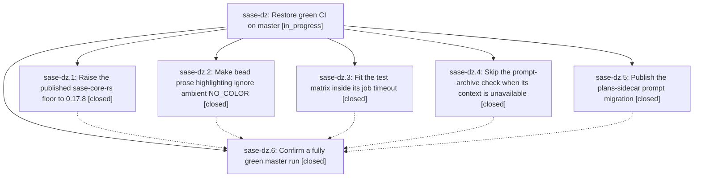

# Bead: sase-dz — Restore green CI on master

[Bead Pages](../README.md) / sase-dz

**Status:** ◐ in_progress · **Type:** ▸ plan · **Tier:** epic
**Owner:** `bryanbugyi34@gmail.com` · **Created by:** [bbugyi200.athena.rm](https://github.com/sase-org/sase--agents/blob/main/agents/bbugyi200.athena.rm/README.md) · **Assignee:** `sase-dz.land`
**Created:** 2026-08-02 10:45:39 UTC
**Plan:** [202608/ci\_green\_restoration.md](https://github.com/sase-org/sase--plans/blob/main/202608/ci_green_restoration.md)

## Description

A master CI run finishes with every job green: the published-core minimum smoke passes, `just validate` passes on a clean CI host, the bead ANSI snapshot matches in every environment, and all three test-matrix legs finish inside their timeout.

## Notes

[2026-08-02T11:26:07Z · rn] DISCOVERED ISSUE: A 9-worker 'just test' run on 2026-08-02 completed 25,357 tests but failed tests/ace/tui/test_app_title.py::test_on_mount_refines_title_to_resolved_version: after pilot.pause(), the title still showed v0.14.0 instead of the monkeypatched dev version. The same test passed immediately in isolation (8.00s), indicating load-sensitive async mount/title refinement. This directly affects the epic's fully-green master-run goal; stabilize the readiness condition or assertion timing while preserving the resolved-version behavior.

[2026-08-02T11:30:53Z · ro] DISCOVERED ISSUE: A 16-worker just check run on 2026-08-02 passed all formatting/lint/validation gates and 25,371 tests but failed tests/test_bead/test_cli_work_contention_regressions.py::test_concurrent_bead_mutations_wait_past_the_old_lock_timeout after 31.71s. The exact node passed immediately in isolation (3.40s call, 5.29s total), independently corroborating ready task sase-e2 and directly affecting phase sase-dz.6's fully-green-run goal.

[2026-08-02T11:31:13Z · ro] DISCOVERED ISSUE: A 16-worker just check run on 2026-08-02 passed all formatting/lint/validation gates and 25,371 tests but failed tests/test_bead/test_cli_work_contention_regressions.py::test_concurrent_bead_mutations_wait_past_the_old_lock_timeout after 31.71s. The exact node passed immediately in isolation (3.40s call, 5.29s total), independently corroborating ready task sase-e2 and directly affecting phase sase-dz.6's fully-green-run goal.

[2026-08-02T12:04:25Z · toobig-1e.split_file.src.sase.bead.cli_detail.0] DISCOVERED ISSUE: A 28-worker just check run on 2026-08-02 passed every formatting, lint, and validation gate and 25,378 tests but failed tests/test_suite_gate_integration.py::test_scaled_suite_runs_share_capacity_and_release_after_sigkill after 63.36s. The exact node passed immediately afterward in isolation (6.00s call, 7.75s total), independently corroborating reactivated task sase-cf and directly affecting phase sase-dz.6's fully-green-run goal.

## Phases

| Bead | Title | Status | Size | Agents | Commits |
|---|---|---|---|---:|---:|
| [sase-dz.1](sase-dz.1.md) | Raise the published sase-core-rs floor to 0.17.8 | ✓ closed | small | 1 | 1 |
| [sase-dz.2](sase-dz.2.md) | Make bead prose highlighting ignore ambient NO\_COLOR | ✓ closed | small | 1 | 1 |
| [sase-dz.3](sase-dz.3.md) | Fit the test matrix inside its job timeout | ✓ closed | small | 1 | 1 |
| [sase-dz.4](sase-dz.4.md) | Skip the prompt-archive check when its context is unavailable | ✓ closed | medium | 1 | 1 |
| [sase-dz.5](sase-dz.5.md) | Publish the plans-sidecar prompt migration | ✓ closed | medium | 1 | 0 |
| [sase-dz.6](sase-dz.6.md) | Confirm a fully green master run | ✓ closed | small | 1 | 1 |

## Lineage

## Agents

| Agent | Bead | Commits |
|---|---|---:|
| [bbugyi200.athena.sase-dz.1](https://github.com/sase-org/sase--agents/blob/main/agents/bbugyi200.athena.sase-dz.1/README.md) | [sase-dz.1](sase-dz.1.md) | 1 |
| [bbugyi200.athena.sase-dz.2](https://github.com/sase-org/sase--agents/blob/main/agents/bbugyi200.athena.sase-dz.2/README.md) | [sase-dz.2](sase-dz.2.md) | 1 |
| [bbugyi200.athena.sase-dz.3](https://github.com/sase-org/sase--agents/blob/main/agents/bbugyi200.athena.sase-dz.3/README.md) | [sase-dz.3](sase-dz.3.md) | 1 |
| [bbugyi200.athena.sase-dz.4](https://github.com/sase-org/sase--agents/blob/main/agents/bbugyi200.athena.sase-dz.4/README.md) | [sase-dz.4](sase-dz.4.md) | 1 |
| [bbugyi200.athena.sase-dz.5](https://github.com/sase-org/sase--agents/blob/main/agents/bbugyi200.athena.sase-dz.5/README.md) | [sase-dz.5](sase-dz.5.md) | 0 |
| [bbugyi200.athena.sase-dz.6](https://github.com/sase-org/sase--agents/blob/main/agents/bbugyi200.athena.sase-dz.6/README.md) | [sase-dz.6](sase-dz.6.md) | 1 |
| [bbugyi200.athena.sase-dz.land](https://github.com/sase-org/sase--agents/blob/main/agents/bbugyi200.athena.sase-dz.land/README.md) | [sase-dz](README.md) | 0 |

## Commits

| Repo | Commit | Subject | Bead | Committed (UTC) |
|---|---|---|---|---|
| sase | [`a7ac9cc`](https://github.com/sase-org/sase/commit/a7ac9cc9af0e7e720d4303a7cef934c5e623f829) | fix(bead): force color in prose rendering so --color always beats NO\_COLOR | [sase-dz.2](sase-dz.2.md) | 2026-08-02 10:58:22 |
| sase | [`10843b5`](https://github.com/sase-org/sase/commit/10843b52209eb76d35040b3212800fe2e5cfd66b) | build(deps): raise sase-core-rs floor to 0.17.8 | [sase-dz.1](sase-dz.1.md) | 2026-08-02 11:09:11 |
| sase | [`404fac3`](https://github.com/sase-org/sase/commit/404fac3b5dfcd4bd069a6f94a1a1f37f1435cffc) | fix(validation): skip unavailable prompt archive context | [sase-dz.4](sase-dz.4.md) | 2026-08-02 11:19:38 |
| sase | [`e11c992`](https://github.com/sase-org/sase/commit/e11c9925c26642dbb16690ec738310a1b030de6b) | ci: fit the test matrix inside its job timeout | [sase-dz.3](sase-dz.3.md) | 2026-08-02 11:19:50 |
| sase | [`d0f0b61`](https://github.com/sase-org/sase/commit/d0f0b6161984c44f80d5e0eeaf242033a6399892) | test: stabilize ci restoration checks | [sase-dz.6](sase-dz.6.md) | 2026-08-02 13:07:48 |
