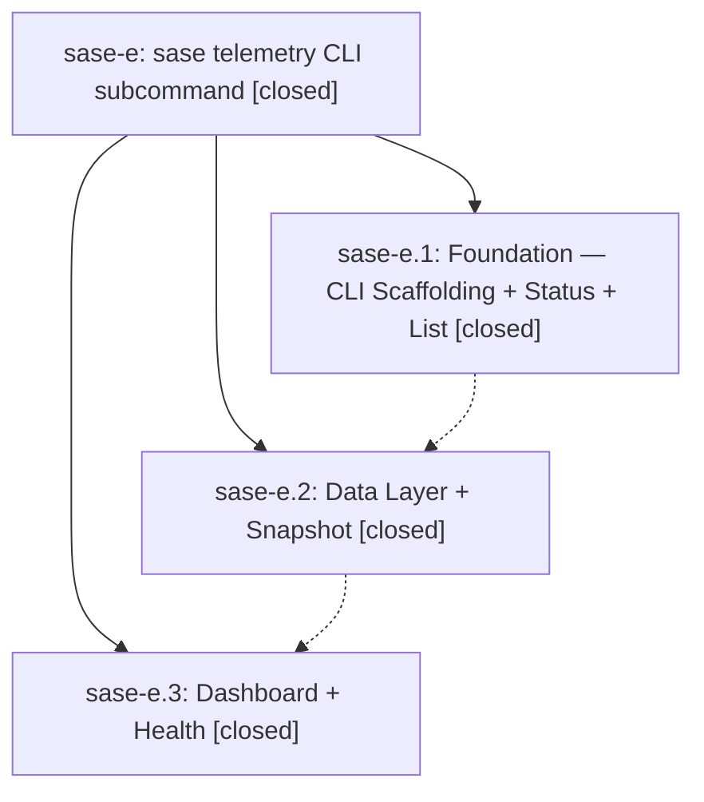

# Bead: sase-e — sase telemetry CLI subcommand

[Bead Pages](../README.md) / sase-e

**Status:** ✓ closed · **Resolution:** (unrecorded) · **Type:** plan · **Tier:** epic
**Owner:** `bryanbugyi34@gmail.com`
**Created:** 2026-04-08 03:41:29 UTC · **Closed:** 2026-04-08 04:21:40 UTC
**Plan:** [202604/telemetry\_cli.md](https://github.com/sase-org/sase--plans/blob/main/202604/telemetry_cli.md)

## Phases

| Bead | Title | Status | Size | Agents | Commits |
|---|---|---|---|---:|---:|
| [sase-e.1](sase-e.1.md) | Foundation — CLI Scaffolding + Status + List | ✓ closed | small | 0 | 1 |
| [sase-e.2](sase-e.2.md) | Data Layer + Snapshot | ✓ closed | small | 0 | 1 |
| [sase-e.3](sase-e.3.md) | Dashboard + Health | ✓ closed | small | 0 | 1 |

## Lineage

## Commits

| Commit | Subject | Bead | Committed (UTC) |
|---|---|---|---|
| [`fbbbf96`](https://github.com/sase-org/sase/commit/fbbbf96897e8fe8b8beb00a895efa373bfc7dccf) | feat: Add \`sase telemetry\` CLI with status and list subcommands (sase-e.1) | [sase-e.1](sase-e.1.md) | 2026-04-08 03:53:44 |
| [`6b7943c`](https://github.com/sase-org/sase/commit/6b7943c9fe5b51b57a2c6d835b1ecbb166fb6ffa) | feat: Add scrape client and snapshot subcommand for telemetry CLI (sase-e.2) | [sase-e.2](sase-e.2.md) | 2026-04-08 04:02:41 |
| [`4d0e973`](https://github.com/sase-org/sase/commit/4d0e97385d15c8012f5760507259c7d4cfc67e34) | feat: Add dashboard and health subcommands for telemetry CLI (sase-e.3) | [sase-e.3](sase-e.3.md) | 2026-04-08 04:18:37 |
