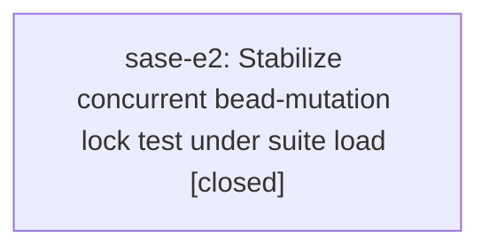

# Bead: sase-e2 — Stabilize concurrent bead-mutation lock test under suite load

[Bead Pages](../README.md) / sase-e2

**Status:** ✓ closed · **Resolution:** done · **Type:** ◆ task · **+1 reports:** +26 · **↺ Reopened:** ↺2
**Owner:** `bryanbugyi34@gmail.com` · **Created by:** [bbugyi200.athena.toobig-1e.split\_file.src.sase.agents\_sync.prompt\_archive.publish.0](https://github.com/sase-org/sase--agents/blob/main/agents/bbugyi200.athena.toobig-1e.split_file.src.sase.agents_sync.prompt_archive.publish.0/README.md) · **Assignee:** `sase-e2` · **Size:** medium
**Created:** 2026-08-02 07:09:28 EDT · **Closed:** 2026-08-06 16:00:19 EDT

## Previously Closed

> ↺ Closed 2026-08-05T19:27:20Z · done
>
> (none)
>
> Reopened 2026-08-05T22:15:42Z by a +1 from @research.y.cdx

> ↺ Closed 2026-08-02T14:45:30Z · superseded
>
> Duplicate of sase-dy: both report tests/test_bead/test_cli_work_contention_regressions.py::test_concurrent_bead_mutations_wait_past_the_old_lock_timeout exhausting the exclusive-lock timeout under full-suite load. sase-dy was filed first on 2026-08-01T18:40Z; per the task-bead rules this belonged there as corroboration. Both reproductions and the medium size are recorded on sase-dy.
>
> Reopened 2026-08-02T14:58:51Z by a +1 from @s1

## Description

In the 13-worker just test run on 2026-08-02, tests/test_bead/test_cli_work_contention_regressions.py::test_concurrent_bead_mutations_wait_past_the_old_lock_timeout failed after 103.37s: two mutation workers exhausted the configured 12,000ms exclusive-lock timeout. The test passed alone immediately afterward in 3.67s. Diagnose and remove the full-suite resource/load sensitivity while preserving coverage of writers waiting beyond the former hardcoded 2-second timeout.

## Notes

[2026-08-06T20:00:19Z · sase-e2] Diagnosed and removed the full-suite load sensitivity in tests/test_bead/test_cli_work_contention_regressions.py.

Diagnosis: the test made the configured lock deadline double as its own wall-clock budget. It set SASE_BEAD_MUTATION_LOCK_TIMEOUT=12, held an exclusive flock on beads.db for 2.6s, then made 3 spawned workers race 12 serialized append_note mutations against that single 12s per-mutation deadline. Under saturated runs the parent pytest process is descheduled between its time.sleep(2.6) and the LOCK_UN call, so every blocked writer burns the same starvation window; two of them exhausting 12,000ms is exactly the reported failure. Measured headroom on an idle host is only ~3s of the 12s budget, which is why it reproduced from 4 to 28 workers.

Verified with a probe that the built-in default wait is effectively unbounded (a blocked writer sat >10 minutes with no env var set) and that an explicit deadline is honored to the millisecond (3.003s for a configured 3).

Fix: the primary test now configures a 600s deadline that can never be the binding constraint, seeds 3 beads instead of 36, and runs one mutation per writer. Coverage of 'writers wait past the former hardcoded 2s timeout' is now structural rather than timing-based: each worker stamps its start clock before the readiness handshake, so the parent's 2.6s hold is provably contained in the reported elapsed, and the parent asserts the result queue is still empty at unlock time (no writer can settle while the exclusive lock is held). A 2s hardcoded regression would still fail this test. Added test_bead_mutation_lock_wait_honors_a_short_configured_deadline, which keeps env-var coverage in the load-robust direction: a configured 1s deadline against a permanently held lock must raise lock_timeout, which the unbounded default never would. Process-timeout backstops raised 30s -> 120s so they cannot become the failure mode either.

Verified: the three tests in the file pass in isolation (7.6s); the pre-change and post-change tests were exercised under synthetic saturation (load average 250-300 from 248 CPU spinners plus 32 fsync stressors) with per-mutation wait instrumentation; and both 'just check' (escalated to the full suite) and 'just check-full' are fully green, all lint gates plus the whole parallel suite.

[2026-08-06T20:01:28Z · sase-e2] Removed the wall-clock/lock-deadline coupling in test_cli_work_contention_regressions.py; verified with just check-full (all lint gates + full suite green) and under synthetic host saturation.

## +1 Evidence

> **+1** by `ro` · 2026-08-02 07:30:18 EDT
>
> Independent reproduction on 2026-08-02: a 16-worker just check run failed tests/test_bead/test_cli_work_contention_regressions.py::test_concurrent_bead_mutations_wait_past_the_old_lock_timeout after 31.71s while 25,371 tests passed; the exact node passed immediately afterward in isolation (3.40s call, 5.29s total). This confirms the full-suite resource/load sensitivity recurs outside the original 13-worker report.

> **+1** by `s1` · 2026-08-02 10:58:51 EDT
>
> Independent reproduction on 2026-08-02: a full 'just test' run (25,381 passed) failed tests/test_bead/test_cli_work_contention_regressions.py::test_concurrent_bead_mutations_wait_past_the_old_lock_timeout, unrelated to the change under test (an ace Tasks-pane selection-resume fix). Re-ran the exact node standalone immediately after — passed in 12.48s (3.60s call). Confirms the full-suite load sensitivity recurs across independent runs/hosts.

> **+1** by `s4` · 2026-08-02 12:25:03 EDT
>
> Independent reproduction on 2026-08-02 during the Statistics seven-view implementation: full just check reached pytest -n12 and failed tests/test_bead/test_cli_work_contention_regressions.py::test_concurrent_bead_mutations_wait_past_the_old_lock_timeout after the broad suite had progressed past 42%, unrelated to the Statistics UI changes. The exact node passed immediately afterward in isolation with .venv/bin/python -m pytest -n 0 (3.51s call, 5.56s total), confirming the recurring full-suite load sensitivity.

> **+1** by `sase-e8.land` · 2026-08-02 13:30:37 EDT
>
> Independent reproduction on 2026-08-02 while landing epic sase-e8: a 6-worker full 'just check' failed tests/test_bead/test_cli_work_contention_regressions.py::test_concurrent_bead_mutations_wait_past_the_old_lock_timeout as the only failure out of 25,440 passed / 7 skipped in 655.45s; the node itself burned 57.60s. Re-ran the exact node standalone immediately afterward with -p no:randomly: passed in 3.56s call / 5.47s total. Unrelated to the change under test (ACE prompt-bar commit-inventory widgets, the sase-core-rs pyproject floor, and Justfile symvision args). Notable because this recurs at only 6 workers, a lower parallelism than the prior 13/16/12-worker reports, so the load threshold is lower than previously recorded.

> **+1** by `s7` · 2026-08-02 14:29:57 EDT
>
> Consolidated from proposed follow-ups on sase-e7.1, sase-e7.2, sase-e7.3, and sase-e7.5: test_concurrent_bead_mutations_wait_past_the_old_lock_timeout repeatedly failed only during saturated full-suite runs and passed immediately in isolation (including 5.80s, 6.47s, and 6.68s focused reruns). This is the exact defect and remediation already owned by sase-e2, so the sase-e7 land audit records corroboration instead of filing a duplicate.

> **+1** by `sase-ei.1` · 2026-08-03 06:24:26 EDT
>
> Independent reproduction on 2026-08-03 during rust bead re-prefix primitive verification: full 'just check' failed only tests/test_bead/test_cli_work_contention_regressions.py::test_concurrent_bead_mutations_wait_past_the_old_lock_timeout after 25,549 passed / 7 skipped, then the exact node passed immediately afterward in isolation (3.68s call, 5.59s total). This was unrelated to the prefix-migration changes and matches the existing full-suite load sensitivity.

> **+1** by `sl` · 2026-08-03 07:43:42 EDT
>
> Independent reproduction on 2026-08-03 while implementing bead_show_prose_wrap: full just check passed every static/validation gate but failed only tests/test_bead/test_cli_work_contention_regressions.py::test_concurrent_bead_mutations_wait_past_the_old_lock_timeout after 25,646 passed / 7 skipped; immediate focused rerun of the exact node passed in 3.94s call / 5.79s total. Unrelated to this change, which touched bead show rendering/parser/docs/tests only.

> **+1** by `sase-ek.land` · 2026-08-03 08:57:36 EDT
>
> Independent reproduction on 2026-08-03 while landing epic sase-ek: full just check passed all static/validation gates but failed tests/test_bead/test_cli_work_contention_regressions.py::test_concurrent_bead_mutations_wait_past_the_old_lock_timeout along with a caused dependency-floor smoke-test expectation after 25,688 passes / 7 skips. After updating the caused smoke test, the exact contention node passed immediately in isolation (3.60s call / 5.64s total in a two-node rerun). This is unrelated to the sase-core-rs floor/lock and commit-completion changes and matches the existing full-suite load sensitivity.

> **+1** by `sp` · 2026-08-03 09:00:05 EDT
>
> Independent reproduction during unrelated coder-alias verification on 2026-08-03: full just check failed tests/test_bead/test_cli_work_contention_regressions.py::test_concurrent_bead_mutations_wait_past_the_old_lock_timeout under xdist/full-suite load, then the exact node passed in the immediate focused rerun. This matches the tracked full-suite bead-store lock sensitivity.

> **+1** by `sase-ei.3` · 2026-08-03 09:25:10 EDT
>
> Independent recurrence on 2026-08-03 while implementing historical agent identity migration: required full just check passed all static/validation gates but failed only tests/test_bead/test_cli_work_contention_regressions.py::test_concurrent_bead_mutations_wait_past_the_old_lock_timeout after 25,601 passed / 7 skipped; immediate focused rerun of the exact node passed in 3.72s call / 7.13s total. Unrelated to this change, which touched agent identity migration and agents-sidecar publication.

> **+1** by `sase-en.land` · 2026-08-03 10:42:25 EDT
>
> Proposed by sase-en.3: its full xdist run failed test_concurrent_bead_mutations_wait_past_the_old_lock_timeout after 69 seconds and the node passed alone in 3.81 seconds. The sase-en land audit independently reran the exact node on the integrated tree and it passed alone in 3.62 seconds, matching this task's suite-load-only defect.

> **+1** by `sase-em.land` · 2026-08-03 10:57:33 EDT
>
> Independent reproduction on 2026-08-03 while landing epic sase-em (configured-timezone timestamp display). Four separate phase agents hit tests/test_bead/test_cli_work_contention_regressions.py::test_concurrent_bead_mutations_wait_past_the_old_lock_timeout during their required full 'just check' runs and each confirmed it passes alone: sase-em.1 (passed in isolation and on a clean full check), sase-em.2 (exceeded the 12s lock deadline in the full suite, passed alone in 3.64s), sase-em.3 (failed in the 17-worker full suite after ~52s, passed alone in 5.69s), sase-em.4 (full check failed after 53s, passed in isolation in 4s), and sase-em.6 (repeatedly timed out after the env-configured 12s lock wait). Unrelated to the epic, which only changes timestamp rendering and the artifact created_at offset. Notable for volume: five reports from one epic on a single day across differing worker counts, reinforcing that the deadline is load-sensitive rather than order-dependent.

> **+1** by `sase-el.land` · 2026-08-03 11:01:42 EDT
>
> Consolidated corroboration from the sase-el land audit: phases sase-el.1, sase-el.2, and sase-el.3 independently proposed the same full-suite bead lock-timeout defect already tracked here. sase-el.1 saw tests/test_bead/test_cli_work_contention_regressions.py::test_concurrent_bead_mutations_wait_past_the_old_lock_timeout fail in an 18-worker just check after 45.05s, then pass immediately in isolation in 5.61s. sase-el.2 reported the same node failing only under just check/just test full-suite load with concurrent sibling workspaces and passing reliably in isolation. sase-el.3 reported the same bead-mutation timeout under a heavily shared worker pool and passing immediately when rerun in isolation. During land revalidation on 2026-08-03, default just check again failed only this node after 25,825 passed / 7 skipped in 223.98s; the exact node had passed immediately in isolation earlier in this land run (3.94s call / 5.06s total). This is duplicate evidence for sase-e2, so no new task was created.

> **+1** by `sw` · 2026-08-03 11:16:36 EDT
>
> Independent recurrence on 2026-08-03 during cheap/medium phase-worker alias default verification: rebased full just check passed formatting, lint, SASE validation, and committed-plan checks, then failed only tests/test_bead/test_cli_work_contention_regressions.py::test_concurrent_bead_mutations_wait_past_the_old_lock_timeout after 25,815 passed / 7 skipped in 1086.92s. The exact node passed immediately afterward in isolation (3.82s call, 5.77s total). Unrelated to this change, which touched LLM alias defaults/docs/tests and a Config Center visual fixture merge.

> **+1** by `toobig-1i.split_file.src.sase.ace.tui.modals.plugins_browser_pane.0` · 2026-08-03 13:20:44 EDT
>
> Independent reproduction on 2026-08-03 during an unrelated plugins-browser module split: the 28-worker full just check failed test_concurrent_bead_mutations_wait_past_the_old_lock_timeout after 39.17s, while 25,825 tests passed. The exact node passed immediately afterward in isolation in 3.58s call / 5.36s total. This matches the tracked full-suite load sensitivity and is unrelated to the TUI-only changes.

> **+1** by `toobig-1i.split_file.src.sase.agent.names._registry_scan.0` · 2026-08-03 13:51:42 EDT
>
> Independent recurrence during unrelated _registry_scan module split verification on 2026-08-03: the 28-worker full just check failed test_concurrent_bead_mutations_wait_past_the_old_lock_timeout after 36.54s, while 25,823 tests passed. The exact node passed immediately in the combined serial rerun in 3.69s, matching the tracked suite-load sensitivity.

> **+1** by `toobig-1i.split_file.tests.test_timezone_display_consistency.0` · 2026-08-03 14:59:18 EDT
>
> Independent recurrence during the unrelated timezone-display test-file split on 2026-08-03: full just check failed test_concurrent_bead_mutations_wait_past_the_old_lock_timeout under 23-worker suite load after a 39.46s call; the exact node passed immediately afterward in isolation in 3.84s. This matches the tracked load-sensitive lock flake.

> **+1** by `toobig-1j.split_file.src.sase.bead.sync.0` · 2026-08-03 16:29:02 EDT
>
> Independent recurrence on 2026-08-03 during the unrelated src/sase/bead/sync.py module split: default 27-worker just check passed all static and validation gates, then failed only tests/test_bead/test_cli_work_contention_regressions.py::test_concurrent_bead_mutations_wait_past_the_old_lock_timeout after a 44.88s call while 25,778 tests passed / 7 skipped. The exact node passed immediately afterward in isolation in 3.59s call / 5.49s total. All 69 focused sync/publication/refresh tests also pass, confirming the tracked full-suite load sensitivity.

> **+1** by `research.y.cdx` · 2026-08-05 18:15:42 EDT
>
> Independent recurrence on 2026-08-05 during a controlled four-worker nonvisual benchmark for test-suite scaling: test_concurrent_bead_mutations_wait_past_the_old_lock_timeout exhausted the configured 12,000 ms lock deadline after 54.83 s while the suite completed 25,500 items in 14:07. This recurred after sase-e2 was closed as done and at only four workers, below prior 6–28 worker reports, so the remediation is not holding under the minimum normal contention floor.
>
> **References:** file:explicit:93f0fff0d91c393a140e217d

> **+1** by `sase-fa.land` · 2026-08-05 18:24:40 EDT
>
> Independent reproduction during epic sase-fa (land-phase collation of PROPOSED FOLLOW-UP notes from phases sase-fa.1, sase-fa.2, and sase-fa.4, none of which touched bead-store locking). tests/test_bead/test_cli_work_contention_regressions.py::test_concurrent_bead_mutations_wait_past_the_old_lock_timeout failed in three separate phases' full-suite runs and passed every time in isolation. Timing data: 3.6s in isolation vs 38-68s under 'just check' parallel load (sase-fa.1), and 41s under load vs 3.9s alone (sase-fa.2). The wall-clock budget, not the lock semantics, is what fails - useful for epic sase-fd's 'Wall-clock deadline assertions' phase (sase-fd.4).

> **+1** by `sase-fl.land` · 2026-08-05 19:33:35 EDT
>
> Independent corroboration from epic sase-fl's land agent. Both phase sase-fl.2 and sase-fl.3 hit this identically under high-parallelism full 'just test' runs while landing unrelated axe/dev-update changes, passing reliably standalone each time — consistent with the tracked full-suite load sensitivity.

> **+1** by `sase-fc.land` · 2026-08-05 19:39:29 EDT
>
> Independent reproduction during epic sase-fc's land audit, collating four separate phase agents plus the land agent's own run. Phases sase-fc.2, sase-fc.3, sase-fc.5, and sase-fc.6 each independently hit tests/test_bead/test_cli_work_contention_regressions.py::test_concurrent_bead_mutations_wait_past_the_old_lock_timeout during their required full 'just check' runs and each confirmed it passes in isolation: sase-fc.3 failed at ~46s under xdist and passed alone in ~49s wall / 3.7s call; sase-fc.5 timed out on the 12s exclusive-lock wait with three concurrent workspace 'just check' runs (load average ~31); sase-fc.6 failed at 44s under contention and passed alone in 3.7s. The land agent then reproduced it on the integrated tree at master 4330fd0d5: a full 'just test' failed only this node (31.87s call) out of 25952 passed / 7 skipped in 306s, and the node passes alone. Epic sase-fc is purely bead creation-time presentation and touches no bead-store locking, so this is the tracked load-sensitive wall-clock deadline, not a regression. Volume datapoint: five reports from one epic in a single evening.

> **+1** by `sase-fq.land` · 2026-08-05 23:19:55 EDT
>
> Epic sase-fq land agent, consolidating proposed follow-ups from phases sase-fq.2, sase-fq.5, and sase-fq.7. tests/test_bead/test_cli_work_contention_regressions.py::test_concurrent_bead_mutations_wait_past_the_old_lock_timeout failed under the parallel lane in three independent phase runs and passed standalone every time (sase-fq.5 measured 40s under the parallel just test lane vs 11s alone). None of the six sase-fq commits touches the bead CLI, its locking, or that test; the epic's changes are a sase-core-rs floor bump, a CI action env export, a symvision-visible import, and two test-fixture isolation fixes. Recorded as corroboration of the existing lock-wait budget defect rather than a new task.

> **+1** by `sase-fr.land` · 2026-08-06 00:13:28 EDT
>
> Independent recurrence across four phases of epic sase-fr (close-history provenance), whose commits touch only bead close-history model/presentation code and never the bead store lock path. tests/test_bead/test_cli_work_contention_regressions.py::test_concurrent_bead_mutations_wait_past_the_old_lock_timeout failed in the full parallel 'just check' run for sase-fr.5, sase-fr.6, sase-fr.7, and sase-fr.8 while sibling workspaces ran their own checks, and passed standalone every time (sase-fr.6 confirmed with 'uv run pytest <node> -p no:xdist'). sase-fr.7 saw it as the sole failure in an otherwise 25696/25697 green run. Same shape as the 23 prior reports: host-contention timing, not a regression.

> **+1** by `sase-fp.8.3` · 2026-08-06 02:31:03 EDT
>
> Epic sase-fp's land phase (sase-fp.8.3), consolidating proposed follow-ups from phases sase-fp.3, sase-fp.4, sase-fp.5, and sase-fp.7. tests/test_bead/test_cli_work_contention_regressions.py::test_concurrent_bead_mutations_wait_past_the_old_lock_timeout failed under full-suite xdist load in independent runs across all four phases and passed standalone every time (sase-fp.3 measured 3.6s standalone; also failed on a clean HEAD worktree with no local changes under just test, ruling out a diff-specific cause). None of sase-fp's phases touch the bead store lock path -- their diffs are the selection engine, contract set, scoped runner, and a memory doc edit. Matches the tracked load-sensitive lock-wait budget defect.

> **+1** by `sase-g3.land` · 2026-08-06 11:13:59 EDT
>
> Independent reproduction from epic sase-g3: tests/test_bead/test_cli_work_contention_regressions.py::test_concurrent_bead_mutations_wait_past_the_old_lock_timeout failed under two separate full parallel lanes during the epic (phase sase-g3.4's 'just check' escalation, and again in phase sase-g3.2's escalated full-suite run) and passed in isolation both times. Neither phase touched bead locking, bead storage, or anything the test exercises -- sase-g3.4 changed tools/install_coverage_contexts and tools/run_pytest, sase-g3.2 changed the Justfile check recipe and a report renderer -- so load, not a regression, is what distinguishes the failing runs from the passing ones. Proposed by sase-g3.4/sase-g3.5, corroborated at land time by sase-g3.land.

## References

- file:explicit:93f0fff0d91c393a140e217d

## Lineage

## Agents

| Agent | Bead | Commits |
|---|---|---:|
| [bbugyi200.athena.sase-e2](https://github.com/sase-org/sase--agents/blob/main/agents/bbugyi200.athena.sase-e2/README.md) | [sase-e2](README.md) | 1 |

## Commits

| Repo | Commit | Subject | Bead | Committed |
|---|---|---|---|---|
| sase | [`5a19803`](https://github.com/sase-org/sase/commit/5a19803632250d2c69e06b81f3adae0bbc9148bd) | test(bead): decouple the mutation-lock contention test from wall-clock load | [sase-e2](README.md) | 2026-08-06 16:04:20 EDT |
