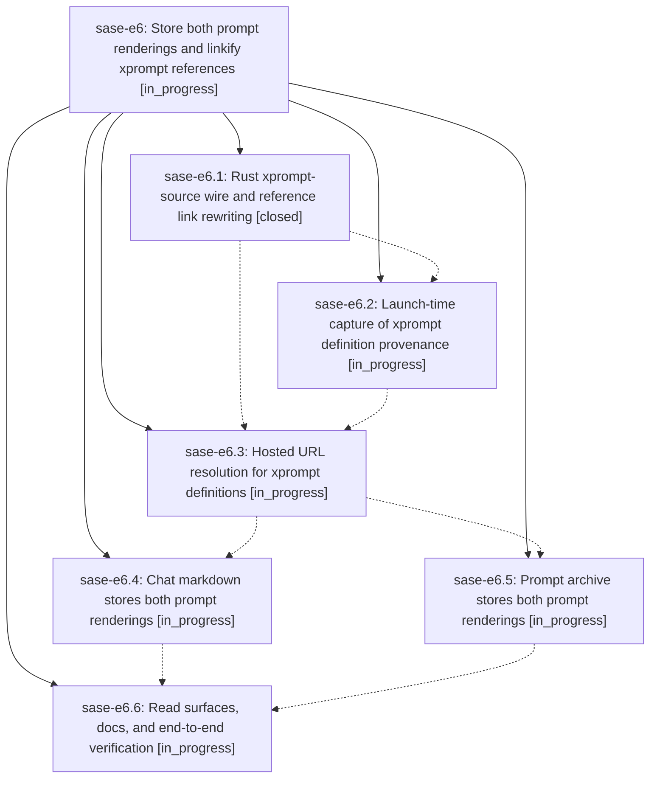

# Bead: sase-e6 — Store both prompt renderings and linkify xprompt references

[Bead Pages](../README.md) / sase-e6

**Status:** ◐ in_progress · **Type:** ▸ plan · **Tier:** epic
**Owner:** `bryanbugyi34@gmail.com` · **Created by:** [bbugyi200.athena.rs](https://github.com/sase-org/sase--agents/blob/main/agents/bbugyi200.athena.rs/README.md) · **Assignee:** `sase-e6.land`
**Created:** 2026-08-02 13:22:20 UTC
**Plan:** [202608/stored\_prompt\_duality.md](https://github.com/sase-org/sase--plans/blob/main/202608/stored_prompt_duality.md)

## Description

Every SASE agent chat markdown file and every published prompt archive entry stores both the unrendered XPrompt prompt and the rendered agent prompt, and every resolvable xprompt reference inside an unrendered prompt renders as a Markdown hyperlink to the hosted file that defines it, including chezmoi-managed definitions when `use_chezmoi: true`.

## Phases

| Bead | Title | Status | Size | Agents | Commits |
|---|---|---|---|---:|---:|
| [sase-e6.1](sase-e6.1.md) | Rust xprompt-source wire and reference link rewriting | ✓ closed | medium | 1 | 1 |
| [sase-e6.2](sase-e6.2.md) | Launch-time capture of xprompt definition provenance | ◐ in_progress | medium | 1 | 0 |
| [sase-e6.3](sase-e6.3.md) | Hosted URL resolution for xprompt definitions | ◐ in_progress | small | 1 | 0 |
| [sase-e6.4](sase-e6.4.md) | Chat markdown stores both prompt renderings | ◐ in_progress | medium | 1 | 0 |
| [sase-e6.5](sase-e6.5.md) | Prompt archive stores both prompt renderings | ◐ in_progress | medium | 1 | 0 |
| [sase-e6.6](sase-e6.6.md) | Read surfaces, docs, and end-to-end verification | ◐ in_progress | small | 1 | 0 |

## Lineage

## Agents

| Agent | Bead | Commits |
|---|---|---:|
| [bbugyi200.athena.sase-e6.1](https://github.com/sase-org/sase--agents/blob/main/agents/bbugyi200.athena.sase-e6.1/README.md) | [sase-e6.1](sase-e6.1.md) | 1 |
| [bbugyi200.athena.sase-e6.2](https://github.com/sase-org/sase--agents/blob/main/agents/bbugyi200.athena.sase-e6.2/README.md) | [sase-e6.2](sase-e6.2.md) | 0 |
| [bbugyi200.athena.sase-e6.3](https://github.com/sase-org/sase--agents/blob/main/agents/bbugyi200.athena.sase-e6.3/README.md) | [sase-e6.3](sase-e6.3.md) | 0 |
| [bbugyi200.athena.sase-e6.4](https://github.com/sase-org/sase--agents/blob/main/agents/bbugyi200.athena.sase-e6.4/README.md) | [sase-e6.4](sase-e6.4.md) | 0 |
| [bbugyi200.athena.sase-e6.5](https://github.com/sase-org/sase--agents/blob/main/agents/bbugyi200.athena.sase-e6.5/README.md) | [sase-e6.5](sase-e6.5.md) | 0 |
| [bbugyi200.athena.sase-e6.6](https://github.com/sase-org/sase--agents/blob/main/agents/bbugyi200.athena.sase-e6.6/README.md) | [sase-e6.6](sase-e6.6.md) | 0 |
| [bbugyi200.athena.sase-e6.land](https://github.com/sase-org/sase--agents/blob/main/agents/bbugyi200.athena.sase-e6.land/README.md) | [sase-e6](README.md) | 0 |

## Commits

| Repo | Commit | Subject | Bead | Committed (UTC) |
|---|---|---|---|---|
| sase-core | [`sase-core@4d83afb`](https://github.com/sase-org/sase-core/commit/4d83afbb71b45ac4a7bd2865a55204f593ee69e9) | feat(core): add xprompt provenance link rewriting | [sase-e6.1](sase-e6.1.md) | 2026-08-02 13:43:25 |
