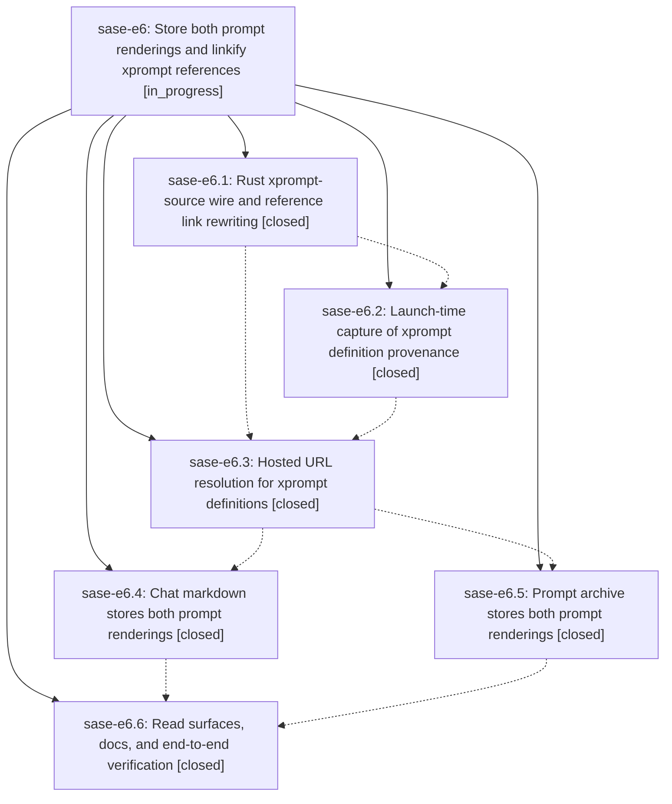

# Bead: sase-e6 — Store both prompt renderings and linkify xprompt references

[Bead Pages](../README.md) / sase-e6

**Status:** ◐ in_progress · **Type:** ▸ plan · **Tier:** epic
**Owner:** `bryanbugyi34@gmail.com` · **Created by:** `bbugyi200.athena.rs` · **Assignee:** `sase-e6.land`
**Created:** 2026-08-02 13:22:20 UTC
**Plan:** [202608/stored\_prompt\_duality.md](https://github.com/sase-org/sase--plans/blob/main/202608/stored_prompt_duality.md)

## Description

Every SASE agent chat markdown file and every published prompt archive entry stores both the unrendered XPrompt prompt and the rendered agent prompt, and every resolvable xprompt reference inside an unrendered prompt renders as a Markdown hyperlink to the hosted file that defines it, including chezmoi-managed definitions when `use_chezmoi: true`.

## Notes

[2026-08-02T16:39:00Z · sase-e7.land] DISCOVERED ISSUE: `just check` fails at the 'lint (symvision)' step on current master (reproduces with zero unrelated changes, verified via git stash while implementing sase-e7's canonical_search_body_integration plan): `--epic-symbol 'sase-e6(XpromptSourceRecord)': symbol 'XpromptSourceRecord' is already properly used. Remove this unnecessary --epic-symbol entry.` This whitelist entry was added by sase-e6.3 (Justfile _lint-symvision recipe, ~line 273) and Symvision now reports it as stale/unnecessary, blocking just check for every agent on master. Needs removal of that --epic-symbol entry (all call sites) plus a symvision rerun, likely as part of sase-e6.6 or the sase-e6 land agent's post-close Symvision cleanup.

[2026-08-02T17:00:20Z · sase-e8.land] DISCOVERED ISSUE (resolved by sase-e8 land agent): the Justfile symvision invocation still carried --epic-symbol 'sase-e6(XpromptSourceRecord)' after e6.4 (commit e6624e324) gave the symbol a real non-test consumer. Symvision hard-failed every 'just check' in this repo with "symbol 'XpromptSourceRecord' is already properly used. Remove this unnecessary --epic-symbol entry." I removed the stale entry while landing sase-e8; 'just symvision' is now clean with no epic-symbol entries. No action needed at sase-e6 close beyond re-checking if a later phase reintroduces one.

[2026-08-02T17:38:11Z · sase-e9.land] DISCOVERED ISSUE: Fresh reproduction from the sase-e9 land audit on master f55b79787 after just install: just check passes Python/Markdown formatting, keep-sorted, Ruff, mypy, pyscripts, and changelog, then Symvision rejects --epic-symbol 'sase-e6(XpromptSourceRecord)' because the symbol is already properly used. This confirms the stale entry remains on current master despite the earlier e6/e8 notes; remove it in the owning active epic before its close.

## Phases

| Bead | Title | Status | Size | Agents | Commits |
|---|---|---|---|---:|---:|
| [sase-e6.1](sase-e6.1.md) | Rust xprompt-source wire and reference link rewriting | ✓ closed | medium | 1 | 0 |
| [sase-e6.2](sase-e6.2.md) | Launch-time capture of xprompt definition provenance | ✓ closed | medium | 1 | 1 |
| [sase-e6.3](sase-e6.3.md) | Hosted URL resolution for xprompt definitions | ✓ closed | small | 1 | 1 |
| [sase-e6.4](sase-e6.4.md) | Chat markdown stores both prompt renderings | ✓ closed | medium | 1 | 1 |
| [sase-e6.5](sase-e6.5.md) | Prompt archive stores both prompt renderings | ✓ closed | medium | 1 | 1 |
| [sase-e6.6](sase-e6.6.md) | Read surfaces, docs, and end-to-end verification | ✓ closed | small | 1 | 1 |

## Lineage

## Agents

| Agent | Bead | Commits |
|---|---|---:|
| bbugyi200.athena.sase-e6.1 | [sase-e6.1](sase-e6.1.md) | 0 |
| [bbugyi200.athena.sase-e6.2](https://github.com/sase-org/sase--agents/blob/main/agents/bbugyi200.athena.sase-e6.2/README.md) | [sase-e6.2](sase-e6.2.md) | 1 |
| [bbugyi200.athena.sase-e6.3](https://github.com/sase-org/sase--agents/blob/main/agents/bbugyi200.athena.sase-e6.3/README.md) | [sase-e6.3](sase-e6.3.md) | 1 |
| [bbugyi200.athena.sase-e6.4](https://github.com/sase-org/sase--agents/blob/main/agents/bbugyi200.athena.sase-e6.4/README.md) | [sase-e6.4](sase-e6.4.md) | 1 |
| [bbugyi200.athena.sase-e6.5](https://github.com/sase-org/sase--agents/blob/main/agents/bbugyi200.athena.sase-e6.5/README.md) | [sase-e6.5](sase-e6.5.md) | 1 |
| bbugyi200.athena.sase-e6.6 | [sase-e6.6](sase-e6.6.md) | 1 |
| bbugyi200.athena.sase-e6.land | [sase-e6](README.md) | 0 |

## Commits

| Repo | Commit | Subject | Bead | Committed (UTC) |
|---|---|---|---|---|
| gh\_sase-org\_\_sase | [`cb90eaf`](https://github.com/sase-org/sase/commit/cb90eaf00a707a32fa7cea009e719df7cdd4cb43) | feat(xprompt): capture definition provenance at launch | [sase-e6.2](sase-e6.2.md) | 2026-08-02 14:33:02 |
| gh\_sase-org\_\_sase | [`e309358`](https://github.com/sase-org/sase/commit/e30935808ba50079c927c2c54130c4b155b9d0e1) | feat(xprompt): resolve hosted URLs for captured definition provenance | [sase-e6.3](sase-e6.3.md) | 2026-08-02 15:17:15 |
| gh\_sase-org\_\_sase | [`f578c0a`](https://github.com/sase-org/sase/commit/f578c0aa4e1cdd699ce9fb715ce59fcea89cb93e) | feat(prompt-archive): store rendered prompts and link xprompts | [sase-e6.5](sase-e6.5.md) | 2026-08-02 15:54:16 |
| gh\_sase-org\_\_sase | [`e6624e3`](https://github.com/sase-org/sase/commit/e6624e324e7857a1967757c8b22984ff7d49b4a8) | feat(history): store both prompt renderings in chats | [sase-e6.4](sase-e6.4.md) | 2026-08-02 16:09:29 |
| gh\_sase-org\_\_sase | [`e3ca2c1`](https://github.com/sase-org/sase/commit/e3ca2c11c53040a67e50010e683f270efc1c624a) | feat: expose stored prompt renderings | [sase-e6.6](sase-e6.6.md) | 2026-08-02 18:43:36 |
