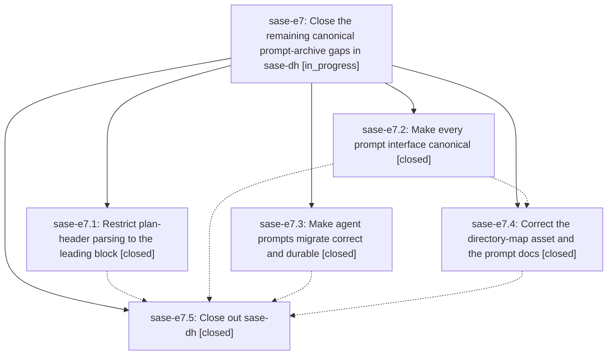

# Bead: sase-e7 — Close the remaining canonical prompt-archive gaps in sase-dh

[Bead Pages](../README.md) / sase-e7

**Status:** ◐ in_progress · **Type:** ▸ plan · **Tier:** epic
**Owner:** `bryanbugyi34@gmail.com` · **Created by:** [bbugyi200.athena.rt](https://github.com/sase-org/sase--agents/blob/main/agents/bbugyi200.athena.rt/README.md) · **Assignee:** `sase-e7.land`
**Created:** 2026-08-02 13:28:21 UTC
**Plan:** [202608/finish\_dh\_canonical\_archive.md](https://github.com/sase-org/sase--plans/blob/main/202608/finish_dh_canonical_archive.md)

## Description

The agents sidecar is the canonical and only home for prompt Markdown in practice as well as in principle: no supported command can write prompt Markdown into plans, prompt search reads the canonical archive, plan authors can write ordinary body bullets named after header labels, the migration command acts on the caller's own sidecar and publishes what it commits, the shipped docs and directory map match the implementation, and sase-dh is closed on verified evidence.

## Phases

| Bead | Title | Status | Size | Agents | Commits |
|---|---|---|---|---:|---:|
| [sase-e7.1](sase-e7.1.md) | Restrict plan-header parsing to the leading block | ✓ closed | medium | 1 | 3 |
| [sase-e7.2](sase-e7.2.md) | Make every prompt interface canonical | ✓ closed | medium | 1 | 1 |
| [sase-e7.3](sase-e7.3.md) | Make agent prompts migrate correct and durable | ✓ closed | medium | 1 | 1 |
| [sase-e7.4](sase-e7.4.md) | Correct the directory-map asset and the prompt docs | ✓ closed | small | 1 | 1 |
| [sase-e7.5](sase-e7.5.md) | Close out sase-dh | ✓ closed | medium | 1 | 1 |

## Lineage

## Agents

| Agent | Bead | Commits |
|---|---|---:|
| [bbugyi200.athena.sase-e7.1](https://github.com/sase-org/sase--agents/blob/main/agents/bbugyi200.athena.sase-e7.1/README.md) | [sase-e7.1](sase-e7.1.md) | 3 |
| [bbugyi200.athena.sase-e7.2](https://github.com/sase-org/sase--agents/blob/main/agents/bbugyi200.athena.sase-e7.2/README.md) | [sase-e7.2](sase-e7.2.md) | 1 |
| [bbugyi200.athena.sase-e7.3](https://github.com/sase-org/sase--agents/blob/main/agents/bbugyi200.athena.sase-e7.3/README.md) | [sase-e7.3](sase-e7.3.md) | 1 |
| [bbugyi200.athena.sase-e7.4](https://github.com/sase-org/sase--agents/blob/main/agents/bbugyi200.athena.sase-e7.4/README.md) | [sase-e7.4](sase-e7.4.md) | 1 |
| [bbugyi200.athena.sase-e7.5](https://github.com/sase-org/sase--agents/blob/main/agents/bbugyi200.athena.sase-e7.5/README.md) | [sase-e7.5](sase-e7.5.md) | 1 |
| [bbugyi200.athena.sase-e7.land](https://github.com/sase-org/sase--agents/blob/main/agents/bbugyi200.athena.sase-e7.land/README.md) | [sase-e7](README.md) | 0 |

## Commits

| Repo | Commit | Subject | Bead | Committed (UTC) |
|---|---|---|---|---|
| sase-core | [`sase-core@d7cfed8`](https://github.com/sase-org/sase-core/commit/d7cfed84d5d7ea0584baa326f5c25abaf94a9293) | fix(plan): restrict header parsing to leading block | [sase-e7.1](sase-e7.1.md) | 2026-08-02 13:41:33 |
| sase | [`53b1fc0`](https://github.com/sase-org/sase/commit/53b1fc0378c8e8b7441ce638abbc17e9af70b3fc) | feat(prompt)!: use the canonical prompt archive | [sase-e7.2](sase-e7.2.md) | 2026-08-02 14:13:30 |
| sase--plans | [`sase--plans@f3696ca`](https://github.com/sase-org/sase--plans/commit/f3696ca8bd9f8ee9b9dbe8dacaf7b8d17f867ea6) | docs: restore natural artifacts body label | [sase-e7.1](sase-e7.1.md) | 2026-08-02 14:17:58 |
| sase | [`7ba7ce6`](https://github.com/sase-org/sase/commit/7ba7ce664afec6308a65b998c47e6e72c444c8e2) | fix(prompts): make archive migration durable | [sase-e7.3](sase-e7.3.md) | 2026-08-02 14:24:00 |
| sase | [`af0a6b8`](https://github.com/sase-org/sase/commit/af0a6b818f6b53102d81b5623079f304b253c7f4) | docs: update prompt archive docs and plans map | [sase-e7.4](sase-e7.4.md) | 2026-08-02 14:51:55 |
| sase | [`ef467af`](https://github.com/sase-org/sase/commit/ef467af583d4d2c3a7ea41a78999cb3a02656030) | build(deps): require sase-core-rs 0.17.11 | [sase-e7.1](sase-e7.1.md) | 2026-08-02 14:56:51 |
| sase--plans | [`sase--plans@59a81b2`](https://github.com/sase-org/sase--plans/commit/59a81b26650fa29aea559621138e051957928537) | docs: mark prompt artifact archive plan done | [sase-e7.5](sase-e7.5.md) | 2026-08-02 15:32:12 |
