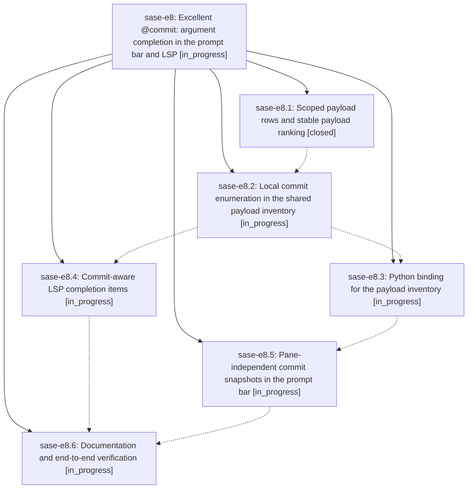

# Bead: sase-e8 — Excellent @commit: argument completion in the prompt bar and LSP

[Bead Pages](../README.md) / sase-e8

**Status:** ◐ in_progress · **Type:** ▸ plan · **Tier:** epic
**Owner:** `bryanbugyi34@gmail.com` · **Created by:** [bbugyi200.athena.ry](https://github.com/sase-org/sase--agents/blob/main/agents/bbugyi200.athena.ry/README.md) · **Assignee:** `sase-e8.land`
**Created:** 2026-08-02 14:03:48 UTC
**Plan:** [202608/commit\_ref\_completion.md](https://github.com/sase-org/sase--plans/blob/main/202608/commit_ref_completion.md)

## Description

Typing `@commit:` offers the project's recent revisions across every one of its repos — in the ACE prompt bar and in any LSP editor — ranked by relevance then recency, rendered as a short SHA plus the commit subject, and every row it offers resolves at launch.

## Phases

| Bead | Title | Status | Size | Agents | Commits |
|---|---|---|---|---:|---:|
| [sase-e8.1](sase-e8.1.md) | Scoped payload rows and stable payload ranking | ✓ closed | medium | 1 | 1 |
| [sase-e8.2](sase-e8.2.md) | Local commit enumeration in the shared payload inventory | ◐ in_progress | medium | 1 | 0 |
| [sase-e8.3](sase-e8.3.md) | Python binding for the payload inventory | ◐ in_progress | small | 1 | 0 |
| [sase-e8.4](sase-e8.4.md) | Commit-aware LSP completion items | ◐ in_progress | small | 1 | 0 |
| [sase-e8.5](sase-e8.5.md) | Pane-independent commit snapshots in the prompt bar | ◐ in_progress | medium | 1 | 0 |
| [sase-e8.6](sase-e8.6.md) | Documentation and end-to-end verification | ◐ in_progress | small | 1 | 0 |

## Lineage

## Agents

| Agent | Bead | Commits |
|---|---|---:|
| [bbugyi200.athena.sase-e8.1](https://github.com/sase-org/sase--agents/blob/main/agents/bbugyi200.athena.sase-e8.1/README.md) | [sase-e8.1](sase-e8.1.md) | 1 |
| [bbugyi200.athena.sase-e8.2](https://github.com/sase-org/sase--agents/blob/main/agents/bbugyi200.athena.sase-e8.2/README.md) | [sase-e8.2](sase-e8.2.md) | 0 |
| [bbugyi200.athena.sase-e8.3](https://github.com/sase-org/sase--agents/blob/main/agents/bbugyi200.athena.sase-e8.3/README.md) | [sase-e8.3](sase-e8.3.md) | 0 |
| [bbugyi200.athena.sase-e8.4](https://github.com/sase-org/sase--agents/blob/main/agents/bbugyi200.athena.sase-e8.4/README.md) | [sase-e8.4](sase-e8.4.md) | 0 |
| [bbugyi200.athena.sase-e8.5](https://github.com/sase-org/sase--agents/blob/main/agents/bbugyi200.athena.sase-e8.5/README.md) | [sase-e8.5](sase-e8.5.md) | 0 |
| [bbugyi200.athena.sase-e8.6](https://github.com/sase-org/sase--agents/blob/main/agents/bbugyi200.athena.sase-e8.6/README.md) | [sase-e8.6](sase-e8.6.md) | 0 |
| [bbugyi200.athena.sase-e8.land](https://github.com/sase-org/sase--agents/blob/main/agents/bbugyi200.athena.sase-e8.land/README.md) | [sase-e8](README.md) | 0 |

## Commits

| Repo | Commit | Subject | Bead | Committed (UTC) |
|---|---|---|---|---|
| sase-core | [`sase-core@c48c265`](https://github.com/sase-org/sase-core/commit/c48c26591d2dd5caaee743d9d4c83458a8684719) | feat(editor): support scoped at-reference payload ranking | [sase-e8.1](sase-e8.1.md) | 2026-08-02 14:25:22 |
