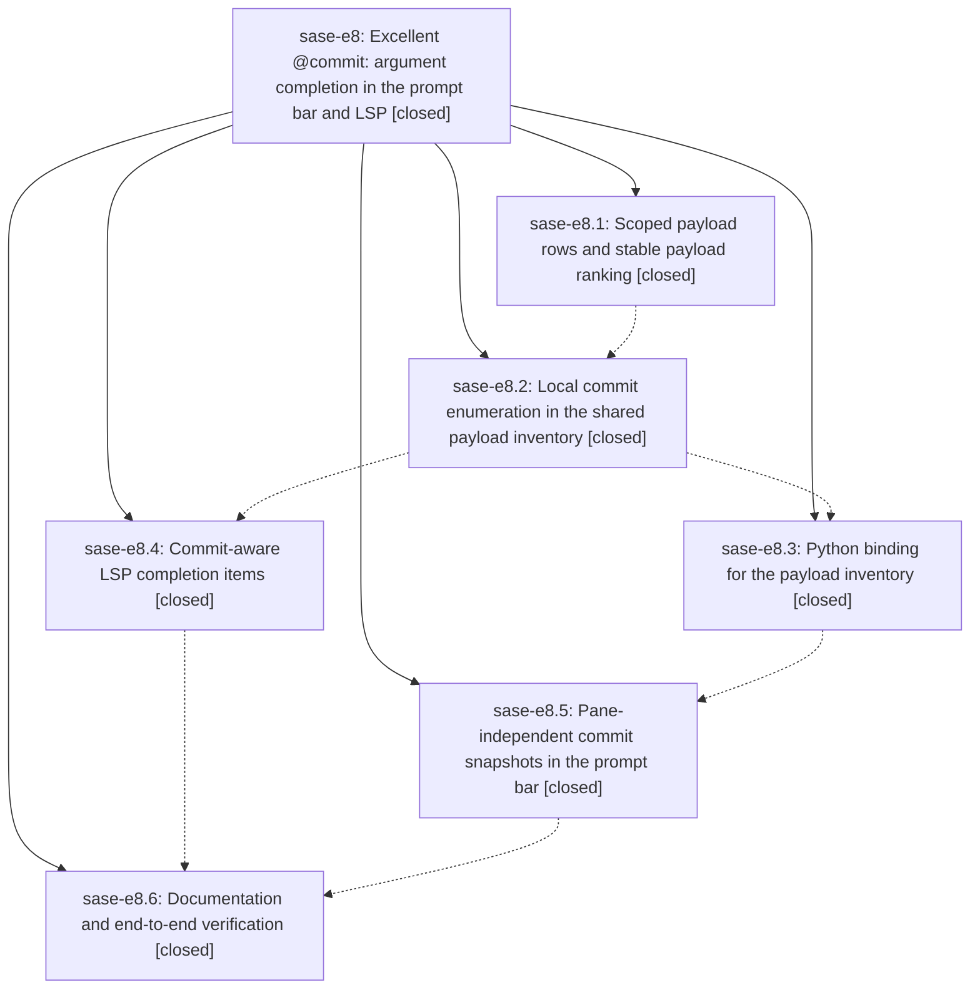

# Bead: sase-e8 — Excellent @commit: argument completion in the prompt bar and LSP

[Bead Pages](../README.md) / sase-e8

**Status:** ✓ closed · **Resolution:** done · **Type:** ▸ plan · **Tier:** epic
**Owner:** `bryanbugyi34@gmail.com` · **Created by:** [bbugyi200.athena.ry](https://github.com/sase-org/sase--agents/blob/main/agents/bbugyi200.athena.ry/README.md) · **Assignee:** `sase-e8.land`
**Created:** 2026-08-02 14:03:48 UTC · **Closed:** 2026-08-02 17:31:12 UTC
**Plan:** [202608/commit\_ref\_completion.md](https://github.com/sase-org/sase--plans/blob/main/202608/commit_ref_completion.md)

## Description

Typing `@commit:` offers the project's recent revisions across every one of its repos — in the ACE prompt bar and in any LSP editor — ranked by relevance then recency, rendered as a short SHA plus the commit subject, and every row it offers resolves at launch.

## Notes

[2026-08-02T17:31:12Z · sase-e8.land] Verified all six phases against real source and commits, not just their notes. sase-e8.1-.4 landed in the sase-core linked repo (c48c265, c66f0ff, d0e7630, 3e94424, released as v0.17.13): scoped scope/rank/body wire fields, qualified scope@title matching with correct highlight-run mapping, rank tiebreak after tier+score, bounded/timed git log enumeration with a 12-char SHA floor, the PyO3 artifact_ref_payload_inventory binding, and kind-aware LSP completion items. sase-e8.5/.6 landed here (6b7284ce4, dfab05f8c): pane-independent prompt commit snapshots, docs, and a cross-surface completion-resolution invariant test.

Integration fixed two defects the epic left behind. (1) prompt_commit_inventory.py imported artifact_ref_payload_inventory directly from sase_core_rs at module scope, bypassing require_rust_binding -- exactly what tools/check_sase_core_rs_bindings scans -- so the gate saw 248 bindings and not this one while pyproject.toml still allowed sase-core-rs>=0.17.11, a floor whose wheel lacks the binding; a published install at that floor would have failed importing the ACE prompt widgets. Routed the call through require_rust_binding (gate now sees 249) and raised the floor to >=0.17.13,<0.18.0 with uv.lock and the declared-minimum test, which also discharges sase-e8.3's deferred release ratchet. (2) The prompt-commit-inventory worker handler cleared its inflight marker on every Worker.StateChanged including PENDING/RUNNING, killing the loading row and per-project coalescing so keystrokes during a scan could fan out concurrent git log runs; it now clears only on terminal states, and the worker name is keyed by project so a finished worker cannot retire a live one. Added regression coverage that fails without the fix.

Also removed a stale --epic-symbol 'sase-e6(XpromptSourceRecord)' Justfile entry that was hard-failing just check repo-wide; noted on sase-e6.

Follow-ups: all three PROPOSED FOLLOW-UP entries handled. sase-e8.1's chat-rank proposal filed as sase-ec; sase-e8.6's bead-page commit-link proposal filed as sase-ed (URLs correct, labels wrong, predates this epic); sase-e8.3's release/ratchet proposal was completed here rather than deferred.

just check: fmt, keep-sorted, ruff, mypy, pyscripts, changelog, symvision, toobig, SASE validation and committed-plans all green; tests 25,440 passed / 7 skipped with one unrelated failure, test_concurrent_bead_mutations_wait_past_the_old_lock_timeout, a known full-suite load flake that passes in 3.56s isolated and was corroborated as the +4 report on in-progress task sase-e2.

## Phases

| Bead | Title | Status | Size | Agents | Commits |
|---|---|---|---|---:|---:|
| [sase-e8.1](sase-e8.1.md) | Scoped payload rows and stable payload ranking | ✓ closed | medium | 1 | 1 |
| [sase-e8.2](sase-e8.2.md) | Local commit enumeration in the shared payload inventory | ✓ closed | medium | 1 | 1 |
| [sase-e8.3](sase-e8.3.md) | Python binding for the payload inventory | ✓ closed | small | 1 | 1 |
| [sase-e8.4](sase-e8.4.md) | Commit-aware LSP completion items | ✓ closed | small | 1 | 1 |
| [sase-e8.5](sase-e8.5.md) | Pane-independent commit snapshots in the prompt bar | ✓ closed | medium | 1 | 1 |
| [sase-e8.6](sase-e8.6.md) | Documentation and end-to-end verification | ✓ closed | small | 1 | 1 |

## Lineage

## Agents

| Agent | Bead | Commits |
|---|---|---:|
| [bbugyi200.athena.sase-e8.1](https://github.com/sase-org/sase--agents/blob/main/agents/bbugyi200.athena.sase-e8.1/README.md) | [sase-e8.1](sase-e8.1.md) | 1 |
| [bbugyi200.athena.sase-e8.2](https://github.com/sase-org/sase--agents/blob/main/agents/bbugyi200.athena.sase-e8.2/README.md) | [sase-e8.2](sase-e8.2.md) | 1 |
| [bbugyi200.athena.sase-e8.3](https://github.com/sase-org/sase--agents/blob/main/agents/bbugyi200.athena.sase-e8.3/README.md) | [sase-e8.3](sase-e8.3.md) | 1 |
| [bbugyi200.athena.sase-e8.4](https://github.com/sase-org/sase--agents/blob/main/agents/bbugyi200.athena.sase-e8.4/README.md) | [sase-e8.4](sase-e8.4.md) | 1 |
| [bbugyi200.athena.sase-e8.5](https://github.com/sase-org/sase--agents/blob/main/agents/bbugyi200.athena.sase-e8.5/README.md) | [sase-e8.5](sase-e8.5.md) | 1 |
| [bbugyi200.athena.sase-e8.6](https://github.com/sase-org/sase--agents/blob/main/agents/bbugyi200.athena.sase-e8.6/README.md) | [sase-e8.6](sase-e8.6.md) | 1 |
| [bbugyi200.athena.sase-e8.land](https://github.com/sase-org/sase--agents/blob/main/agents/bbugyi200.athena.sase-e8.land/README.md) | [sase-e8](README.md) | 1 |

## Commits

| Repo | Commit | Subject | Bead | Committed (UTC) |
|---|---|---|---|---|
| sase-core | [`sase-core@c48c265`](https://github.com/sase-org/sase-core/commit/c48c26591d2dd5caaee743d9d4c83458a8684719) | feat(editor): support scoped at-reference payload ranking | [sase-e8.1](sase-e8.1.md) | 2026-08-02 14:25:22 |
| sase-core | [`sase-core@c66f0ff`](https://github.com/sase-org/sase-core/commit/c66f0ffda73e2f06a2ad0f4b4d5920da9d65a0a6) | feat(editor): enumerate local commit references | [sase-e8.2](sase-e8.2.md) | 2026-08-02 14:48:38 |
| sase-core | [`sase-core@d0e7630`](https://github.com/sase-org/sase-core/commit/d0e763057c1f0b375130004cc581e1fcdaada6e6) | feat(py): expose artifact ref payload inventory | [sase-e8.3](sase-e8.3.md) | 2026-08-02 15:07:10 |
| sase-core | [`sase-core@3e94424`](https://github.com/sase-org/sase-core/commit/3e944248031d305fcd8500576a7e15db72192f82) | feat(lsp): describe artifact payload rows by kind and render commit bodies | [sase-e8.4](sase-e8.4.md) | 2026-08-02 15:09:35 |
| sase | [`6b7284c`](https://github.com/sase-org/sase/commit/6b7284ce4d21a62c274bf016c9c6ef9ca4ece0f2) | feat(ace-tui): load prompt commit snapshots independently | [sase-e8.5](sase-e8.5.md) | 2026-08-02 16:02:30 |
| sase | [`dfab05f`](https://github.com/sase-org/sase/commit/dfab05f8c81d13b851aa8669ba06a80b2f3cf302) | docs: document commit reference completion | [sase-e8.6](sase-e8.6.md) | 2026-08-02 16:44:49 |
| sase | [`aab4899`](https://github.com/sase-org/sase/commit/aab489997eb1c745d34cfda0978089696aed1135) | fix(ace-tui): repair prompt commit inventory binding and worker lifecycle | [sase-e8](README.md) | 2026-08-02 17:34:28 |
