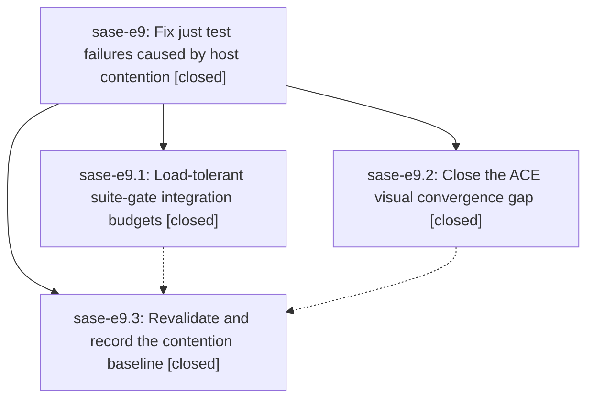

# Bead: sase-e9 — Fix just test failures caused by host contention

[Bead Pages](../README.md) / sase-e9

**Status:** ✓ closed · **Resolution:** done · **Type:** ▸ plan · **Tier:** epic
**Owner:** `bryanbugyi34@gmail.com` · **Created by:** [bbugyi200.athena.rw](https://github.com/sase-org/sase--agents/blob/main/agents/bbugyi200.athena.rw/README.md) · **Assignee:** `sase-e9.land`
**Created:** 2026-08-02 14:11:35 UTC · **Closed:** 2026-08-02 17:38:41 UTC
**Plan:** [202608/just\_test\_contention\_flakes.md](https://github.com/sase-org/sase--plans/blob/main/202608/just_test_contention_flakes.md)

## Description

`just test` stops failing on a busy host: the suite-gate integration test bounds child pytest lifecycles by observable progress instead of idle-host wall clocks, and ACE PNG snapshots can no longer capture a stable-but-unfinished frame.

## Notes

[2026-08-02T16:26:29Z · s4] DISCOVERED ISSUE: During the Statistics seven-view implementation on 2026-08-02, full just check failed under pytest -n12 on two load-sensitive nodes unrelated to the change: tests/test_bead/test_cli_work_contention_regressions.py::test_concurrent_bead_mutations_wait_past_the_old_lock_timeout and tests/ace/tui/visual/test_ace_png_snapshots_agents_slow_tools.py::test_agents_slow_tool_calls_fold_levels_png_snapshots. Both exact nodes passed immediately afterward in isolation with -n 0 (bead node 3.51s call / 5.56s total; slow-tools visual 4.26s call / 5.04s total). Evidence was also corroborated on duplicate tasks sase-e2 and sase-cb.

[2026-08-02T17:38:41Z · sase-e9.land] Land audit verified all three phases and every note. Phase e9.1 is implemented by abbeb36d9: startup-calibrated admission, child-exit, reap, and child-gate budgets preserve the idle floors, fix the child/test timeout inversion, retain return-code assertions, and add run/output/grant diagnostics. Phase e9.2 is implemented by adfa35043: visual fixtures disable Textual animations, convergence treats running and scheduled animator work as pending with diagnostics, focused coverage proves both behaviors, and the proposed retry-state timeout was resolved in-phase with the 60-second contention budget. Phase e9.3 is implemented by f55b79787: slow-tool section top-alignment and other semantic visual waits close the residual frame races, and the Justfile records the 2026-08-02 baseline of 405 passed, 1 skipped in 605.72 seconds under 26 workers on two CPUs. The slow-tools recurrence noted at 16:25Z predates that 17:24Z phase-3 commit and is addressed by its explicit alignment fix and later green harness. I reviewed all commits since the first epic commit; the intervening xprompt, approval serialization, prompt archive/history, model-default, prompt-completion, highlighting, and ACE keymap work neither duplicates nor conflicts with e9. The later visual/golden additions automatically receive e9.2's autouse animation and convergence protection and were included in e9.3's full harness. Fresh verification after just install: 14 suite-gate/visual-idle tests passed in 5.83 seconds; both reproduced slow-tools and fakey-retry PNG nodes passed in the normal 15-worker visual lane. Phase e9.3 also recorded green just test with 25,405 passed, 7 skipped and green just check. Fresh just check passed formatting, keep-sorted, Ruff, mypy, pyscripts, and changelog, then stopped only on the unrelated active e6 stale XpromptSourceRecord epic-symbol entry, now recorded on sase-e6. Follow-up outcomes: the fakey retry proposal was fixed in e9.2; the duplicate bead-lock proposals from e9.1/e9.2 and the epic note were corroborated on canonical medium task sase-dy, with duplicate sase-e2 already carrying other reports; the unrelated bulk-kill visual recurrence from e9.1 was corroborated on small task sase-ct, promoting it back to ready; the slow-tools proposal was resolved by e9.3. No proposal was declined and no new task was needed.

[2026-08-02T17:52:11Z · sase-e9.land] POST-CLOSE INTEGRATION ADDENDUM: origin/master advanced after the close by d26d6635f (rich xprompt show renderer) and aab489997 (prompt-commit inventory binding/worker lifecycle plus dependency floor). Reviewed both full diffs. Neither touches or duplicates e9's suite-gate or visual-convergence implementation; their Justfile changes only update xprompt/e6 Symvision exemptions. aab489997 canonically includes the same stale e6 exemption cleanup found by e9's post-close Symvision run, so the duplicate local hunk was dropped and master was fast-forwarded cleanly. On integrated HEAD aab489997, fresh just install and full just check pass, including Symvision, SASE validation, committed plans, and the complete test lane.

## Phases

| Bead | Title | Status | Size | Agents | Commits |
|---|---|---|---|---:|---:|
| [sase-e9.1](sase-e9.1.md) | Load-tolerant suite-gate integration budgets | ✓ closed | small | 1 | 1 |
| [sase-e9.2](sase-e9.2.md) | Close the ACE visual convergence gap | ✓ closed | medium | 1 | 1 |
| [sase-e9.3](sase-e9.3.md) | Revalidate and record the contention baseline | ✓ closed | small | 1 | 1 |

## Lineage

## Agents

| Agent | Bead | Commits |
|---|---|---:|
| [bbugyi200.athena.sase-e9.1](https://github.com/sase-org/sase--agents/blob/main/agents/bbugyi200.athena.sase-e9.1/README.md) | [sase-e9.1](sase-e9.1.md) | 1 |
| [bbugyi200.athena.sase-e9.2](https://github.com/sase-org/sase--agents/blob/main/agents/bbugyi200.athena.sase-e9.2/README.md) | [sase-e9.2](sase-e9.2.md) | 1 |
| [bbugyi200.athena.sase-e9.3](https://github.com/sase-org/sase--agents/blob/main/agents/bbugyi200.athena.sase-e9.3/README.md) | [sase-e9.3](sase-e9.3.md) | 1 |
| [bbugyi200.athena.sase-e9.land](https://github.com/sase-org/sase--agents/blob/main/agents/bbugyi200.athena.sase-e9.land/README.md) | [sase-e9](README.md) | 1 |

## Commits

| Repo | Commit | Subject | Bead | Committed (UTC) |
|---|---|---|---|---|
| sase | [`adfa350`](https://github.com/sase-org/sase/commit/adfa3504327d8251e8606bfb213ad53926145189) | test(visual): stabilize PNG convergence under contention | [sase-e9.2](sase-e9.2.md) | 2026-08-02 15:12:45 |
| sase | [`abbeb36`](https://github.com/sase-org/sase/commit/abbeb36d9033a6e5fa7e758930b6ad5ae3ccd5a2) | test: make suite-gate integration budgets load-tolerant | [sase-e9.1](sase-e9.1.md) | 2026-08-02 15:19:04 |
| sase | [`f55b797`](https://github.com/sase-org/sase/commit/f55b79787d72807b407c20246c55e3aae20329bd) | test: stabilize visual snapshots under contention | [sase-e9.3](sase-e9.3.md) | 2026-08-02 17:24:08 |
| sase--plans | [`sase--plans@f07bb02`](https://github.com/sase-org/sase--plans/commit/f07bb021c8be53a39325947059b41e2c16eae50d) | docs: mark just test contention epic complete | [sase-e9](README.md) | 2026-08-02 17:52:43 |
