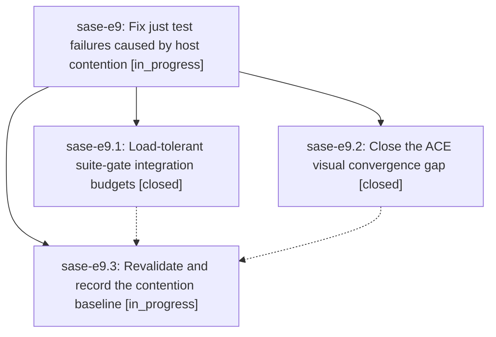

# Bead: sase-e9 — Fix just test failures caused by host contention

[Bead Pages](../README.md) / sase-e9

**Status:** ◐ in_progress · **Type:** ▸ plan · **Tier:** epic
**Owner:** `bryanbugyi34@gmail.com` · **Created by:** [bbugyi200.athena.rw](https://github.com/sase-org/sase--agents/blob/main/agents/bbugyi200.athena.rw/README.md) · **Assignee:** `sase-e9.land`
**Created:** 2026-08-02 14:11:35 UTC
**Plan:** [202608/just\_test\_contention\_flakes.md](https://github.com/sase-org/sase--plans/blob/main/202608/just_test_contention_flakes.md)

## Description

`just test` stops failing on a busy host: the suite-gate integration test bounds child pytest lifecycles by observable progress instead of idle-host wall clocks, and ACE PNG snapshots can no longer capture a stable-but-unfinished frame.

## Phases

| Bead | Title | Status | Size | Agents | Commits |
|---|---|---|---|---:|---:|
| [sase-e9.1](sase-e9.1.md) | Load-tolerant suite-gate integration budgets | ✓ closed | small | 1 | 1 |
| [sase-e9.2](sase-e9.2.md) | Close the ACE visual convergence gap | ✓ closed | medium | 1 | 1 |
| [sase-e9.3](sase-e9.3.md) | Revalidate and record the contention baseline | ◐ in_progress | small | 1 | 0 |

## Lineage

## Agents

| Agent | Bead | Commits |
|---|---|---:|
| [bbugyi200.athena.sase-e9.1](https://github.com/sase-org/sase--agents/blob/main/agents/bbugyi200.athena.sase-e9.1/README.md) | [sase-e9.1](sase-e9.1.md) | 1 |
| [bbugyi200.athena.sase-e9.2](https://github.com/sase-org/sase--agents/blob/main/agents/bbugyi200.athena.sase-e9.2/README.md) | [sase-e9.2](sase-e9.2.md) | 1 |
| [bbugyi200.athena.sase-e9.3](https://github.com/sase-org/sase--agents/blob/main/agents/bbugyi200.athena.sase-e9.3/README.md) | [sase-e9.3](sase-e9.3.md) | 0 |
| [bbugyi200.athena.sase-e9.land](https://github.com/sase-org/sase--agents/blob/main/agents/bbugyi200.athena.sase-e9.land/README.md) | [sase-e9](README.md) | 0 |

## Commits

| Repo | Commit | Subject | Bead | Committed (UTC) |
|---|---|---|---|---|
| sase | [`adfa350`](https://github.com/sase-org/sase/commit/adfa3504327d8251e8606bfb213ad53926145189) | test(visual): stabilize PNG convergence under contention | [sase-e9.2](sase-e9.2.md) | 2026-08-02 15:12:45 |
| sase | [`abbeb36`](https://github.com/sase-org/sase/commit/abbeb36d9033a6e5fa7e758930b6ad5ae3ccd5a2) | test: make suite-gate integration budgets load-tolerant | [sase-e9.1](sase-e9.1.md) | 2026-08-02 15:19:04 |
