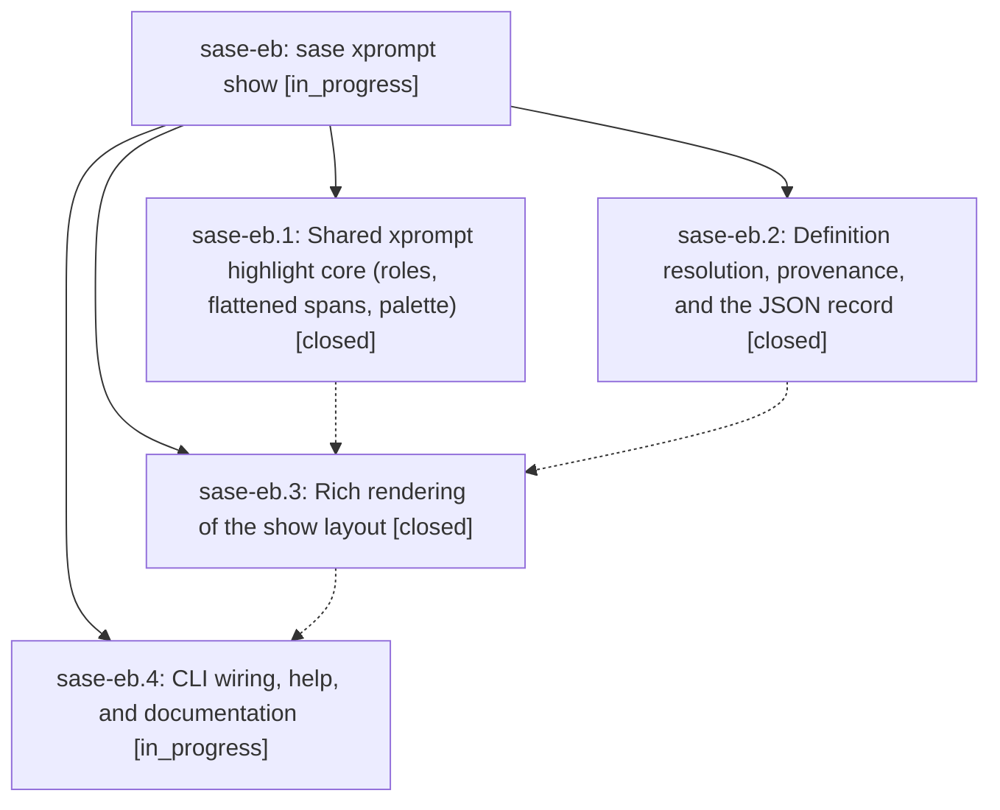

# Bead: sase-eb — sase xprompt show

[Bead Pages](../README.md) / sase-eb

**Status:** ◐ in_progress · **Type:** ▸ plan · **Tier:** epic
**Owner:** `bryanbugyi34@gmail.com` · **Created by:** [bbugyi200.athena.s3](https://github.com/sase-org/sase--agents/blob/main/agents/bbugyi200.athena.s3/README.md) · **Assignee:** `sase-eb.land`
**Created:** 2026-08-02 15:49:12 UTC
**Plan:** [202608/xprompt\_show.md](https://github.com/sase-org/sase--plans/blob/main/202608/xprompt_show.md)

## Description

`sase xprompt show <name>` renders any single xprompt or workflow definition — its declared properties, inputs, local helpers, body, and provenance — with the same xprompt syntax highlighting the ACE prompt input bar uses, plus byte-faithful `--format raw` and stable `--format json` modes.

## Phases

| Bead | Title | Status | Size | Agents | Commits |
|---|---|---|---|---:|---:|
| [sase-eb.1](sase-eb.1.md) | Shared xprompt highlight core (roles, flattened spans, palette) | ✓ closed | medium | 1 | 1 |
| [sase-eb.2](sase-eb.2.md) | Definition resolution, provenance, and the JSON record | ✓ closed | medium | 1 | 1 |
| [sase-eb.3](sase-eb.3.md) | Rich rendering of the show layout | ✓ closed | medium | 1 | 1 |
| [sase-eb.4](sase-eb.4.md) | CLI wiring, help, and documentation | ◐ in_progress | small | 1 | 0 |

## Lineage

## Agents

| Agent | Bead | Commits |
|---|---|---:|
| [bbugyi200.athena.sase-eb.1](https://github.com/sase-org/sase--agents/blob/main/agents/bbugyi200.athena.sase-eb.1/README.md) | [sase-eb.1](sase-eb.1.md) | 1 |
| [bbugyi200.athena.sase-eb.2](https://github.com/sase-org/sase--agents/blob/main/agents/bbugyi200.athena.sase-eb.2/README.md) | [sase-eb.2](sase-eb.2.md) | 1 |
| [bbugyi200.athena.sase-eb.3](https://github.com/sase-org/sase--agents/blob/main/agents/bbugyi200.athena.sase-eb.3/README.md) | [sase-eb.3](sase-eb.3.md) | 1 |
| [bbugyi200.athena.sase-eb.4](https://github.com/sase-org/sase--agents/blob/main/agents/bbugyi200.athena.sase-eb.4/README.md) | [sase-eb.4](sase-eb.4.md) | 0 |
| [bbugyi200.athena.sase-eb.land](https://github.com/sase-org/sase--agents/blob/main/agents/bbugyi200.athena.sase-eb.land/README.md) | [sase-eb](README.md) | 0 |

## Commits

| Repo | Commit | Subject | Bead | Committed (UTC) |
|---|---|---|---|---|
| sase | [`98f2af2`](https://github.com/sase-org/sase/commit/98f2af2fd7a012ca2a8f7093bb6ea3e8d31360d3) | feat(xprompt): add show definition resolver | [sase-eb.2](sase-eb.2.md) | 2026-08-02 16:55:19 |
| sase | [`eccca60`](https://github.com/sase-org/sase/commit/eccca60200fec18d23d3640202e6ac91b773444b) | feat(xprompt): add shared highlighting core | [sase-eb.1](sase-eb.1.md) | 2026-08-02 17:00:36 |
| sase | [`d26d663`](https://github.com/sase-org/sase/commit/d26d6635febfe1ace3a6d60d07cfe8ba76f5c4d7) | feat(xprompt): add rich show renderer | [sase-eb.3](sase-eb.3.md) | 2026-08-02 17:33:50 |
