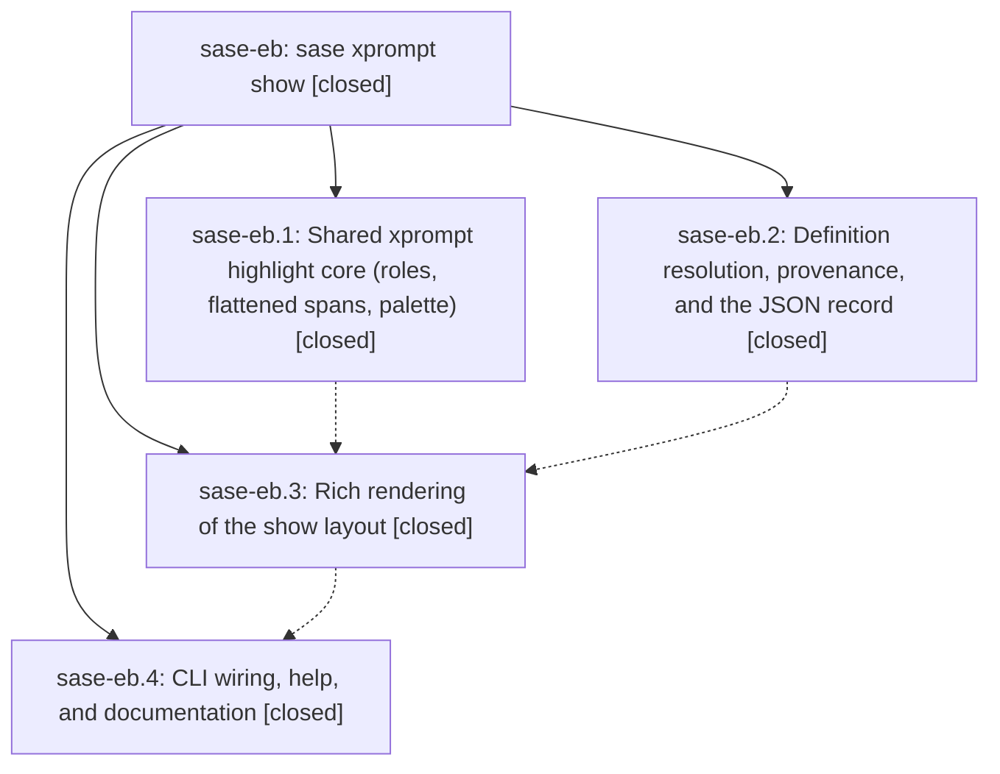

# Bead: sase-eb — sase xprompt show

[Bead Pages](../README.md) / sase-eb

**Status:** ✓ closed · **Resolution:** done · **Type:** ▸ plan · **Tier:** epic
**Owner:** `bryanbugyi34@gmail.com` · **Created by:** `bbugyi200.athena.s3` · **Assignee:** `sase-eb.land`
**Created:** 2026-08-02 15:49:12 UTC · **Closed:** 2026-08-02 18:25:48 UTC
**Plan:** [202608/xprompt\_show.md](https://github.com/sase-org/sase--plans/blob/main/202608/xprompt_show.md)

## Description

`sase xprompt show <name>` renders any single xprompt or workflow definition — its declared properties, inputs, local helpers, body, and provenance — with the same xprompt syntax highlighting the ACE prompt input bar uses, plus byte-faithful `--format raw` and stable `--format json` modes.

## Notes

[2026-08-02T18:25:48Z · sase-eb.land] Land audit verified all four closed phases and every child note against the current source and epic commits 98f2af2fd (resolver/model/provenance), eccca6020 (shared highlighting/theme), d26d6635f (Rich renderer), and c8211ae5c (CLI/help/docs/whitelist cleanup). Reviewed the full linked plan and confirmed workflow-first normalized lookup, schema-v1 JSON, exact raw extraction, provenance/references, scanner isolation and overlap precedence, shared Flexoki styles, Rich gutter/step rendering, parser/handler wiring, docs, and removal of all sase-eb Symvision exemptions. Focused show/highlight/parser/handler/swarm suites passed (76 tests); real show smokes passed for sase/reads, actstat, t, sase_plan, commit, and #!sync; t raw output matched src/sase/xprompts/t.md byte-for-byte and color always/never gating passed; final just check passed every lint, validation, Symvision, visual, and test stage. Integration audit reviewed every non-epic commit after the first epic commit: fa43d2f46 (ACE help keymap), f55b79787 (visual contention waits), aab489997 (prompt-commit/core floor and stale sase-e6 allowance removal), bcefbb8e4 (Statistics/runtime-tab removal), and 281cc7429 (0.15.0 release). Current code/docs already compose correctly; no integration edit was needed. Follow-ups: sase-eb.1's artifact-files copy-palette contention flake is not caused by this epic and has the identical pump-free clipboard ordering root as canonical task sase-cu; added sase-eb.land +1 evidence identifying the proposing bead and promoted sase-cu to READY. sase-eb.3's proposed stale sase-e6(XpromptSourceRecord) allowance removal was already completed by aab489997 and verified absent with clean Symvision, so no task was created. No other child note remained unresolved.

[2026-08-02T18:31:17Z · sase-eb.land] Supplemental post-close integration audit: origin/master advanced during landing with 09bedcef0 (fix(prompt): search canonical authored prompt text). Reviewed its prompt-search source, docs, and tests; it strips stored rendered/xprompt sections and normalizes linkified xprompt references only for archive/local search deduplication, so it neither duplicates nor conflicts with sase xprompt show and requires no integration edit. Fast-forwarded the workspace to 09bedcef0 and reran the complete just check successfully, including post-close Symvision and the full test suite.

[2026-08-02T18:32:29Z · sase-eb.land] Finalizer reconfirmation: sase-eb remains closed with resolution done after child, source, commit, interleaved-change, focused-test, full-check, and post-close Symvision verification; linked plan status is ready to commit as done.

## Phases

| Bead | Title | Status | Size | Agents | Commits |
|---|---|---|---|---:|---:|
| [sase-eb.1](sase-eb.1.md) | Shared xprompt highlight core (roles, flattened spans, palette) | ✓ closed | medium | 1 | 1 |
| [sase-eb.2](sase-eb.2.md) | Definition resolution, provenance, and the JSON record | ✓ closed | medium | 1 | 1 |
| [sase-eb.3](sase-eb.3.md) | Rich rendering of the show layout | ✓ closed | medium | 1 | 1 |
| [sase-eb.4](sase-eb.4.md) | CLI wiring, help, and documentation | ✓ closed | small | 1 | 1 |

## Lineage

## Agents

| Agent | Bead | Commits |
|---|---|---:|
| [bbugyi200.athena.sase-eb.1](https://github.com/sase-org/sase--agents/blob/main/agents/bbugyi200.athena.sase-eb.1/README.md) | [sase-eb.1](sase-eb.1.md) | 1 |
| [bbugyi200.athena.sase-eb.2](https://github.com/sase-org/sase--agents/blob/main/agents/bbugyi200.athena.sase-eb.2/README.md) | [sase-eb.2](sase-eb.2.md) | 1 |
| [bbugyi200.athena.sase-eb.3](https://github.com/sase-org/sase--agents/blob/main/agents/bbugyi200.athena.sase-eb.3/README.md) | [sase-eb.3](sase-eb.3.md) | 1 |
| [bbugyi200.athena.sase-eb.4](https://github.com/sase-org/sase--agents/blob/main/agents/bbugyi200.athena.sase-eb.4/README.md) | [sase-eb.4](sase-eb.4.md) | 1 |
| bbugyi200.athena.sase-eb.land | [sase-eb](README.md) | 0 |

## Commits

| Repo | Commit | Subject | Bead | Committed (UTC) |
|---|---|---|---|---|
| gh\_sase-org\_\_sase | [`98f2af2`](https://github.com/sase-org/sase/commit/98f2af2fd7a012ca2a8f7093bb6ea3e8d31360d3) | feat(xprompt): add show definition resolver | [sase-eb.2](sase-eb.2.md) | 2026-08-02 16:55:19 |
| gh\_sase-org\_\_sase | [`eccca60`](https://github.com/sase-org/sase/commit/eccca60200fec18d23d3640202e6ac91b773444b) | feat(xprompt): add shared highlighting core | [sase-eb.1](sase-eb.1.md) | 2026-08-02 17:00:36 |
| gh\_sase-org\_\_sase | [`d26d663`](https://github.com/sase-org/sase/commit/d26d6635febfe1ace3a6d60d07cfe8ba76f5c4d7) | feat(xprompt): add rich show renderer | [sase-eb.3](sase-eb.3.md) | 2026-08-02 17:33:50 |
| gh\_sase-org\_\_sase | [`c8211ae`](https://github.com/sase-org/sase/commit/c8211ae5cf3e08f0c3d4402ee5b6bdfe6617a0e0) | feat(xprompt): add show CLI command | [sase-eb.4](sase-eb.4.md) | 2026-08-02 18:07:24 |
