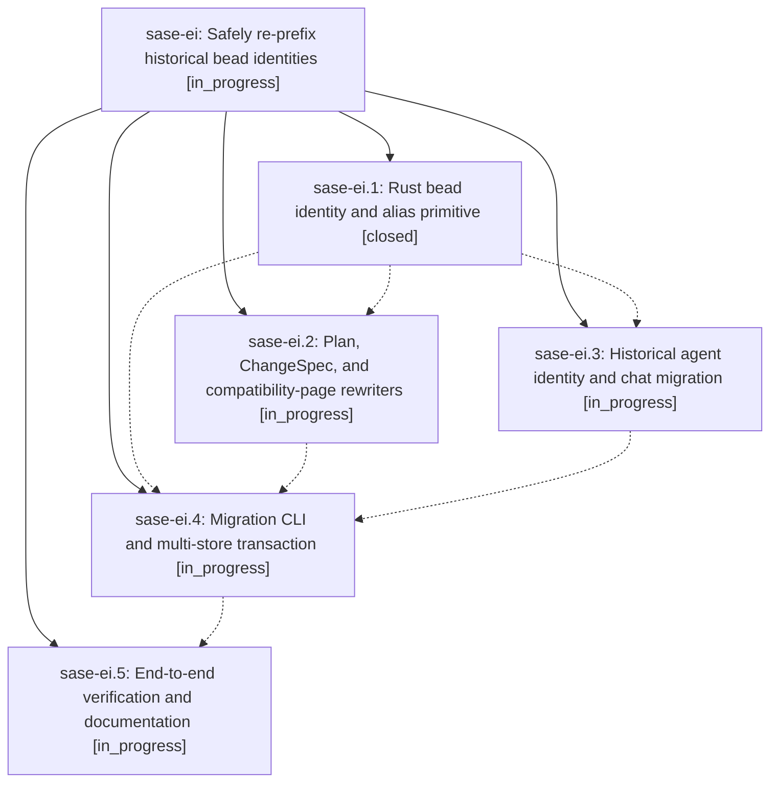

# Bead: sase-ei — Safely re-prefix historical bead identities

[Bead Pages](../README.md) / sase-ei

**Status:** ◐ in_progress · **Type:** ▸ plan · **Tier:** epic
**Owner:** `bryanbugyi34@gmail.com` · **Created by:** [bbugyi200.athena.sase-eh](https://github.com/sase-org/sase--agents/blob/main/agents/bbugyi200.athena.sase-eh/README.md) · **Assignee:** `sase-ei.land`
**Created:** 2026-08-03 08:47:53 UTC
**Plan:** [202608/historical\_bead\_reprefix.md](https://github.com/sase-org/sase--plans/blob/main/202608/historical_bead_reprefix.md)

## Description

Historical beads whose IDs leaked a ProjectSpec key can be migrated to the project's display-name prefix through a dry-run-first, restartable workflow that preserves lineage, rewrites owned references, and keeps old IDs and hosted URLs working as compatibility aliases without changing immutable commit history.

## Phases

| Bead | Title | Status | Size | Agents | Commits |
|---|---|---|---|---:|---:|
| [sase-ei.1](sase-ei.1.md) | Rust bead identity and alias primitive | ✓ closed | large | 1 | 2 |
| [sase-ei.2](sase-ei.2.md) | Plan, ChangeSpec, and compatibility-page rewriters | ◐ in_progress | medium | 1 | 0 |
| [sase-ei.3](sase-ei.3.md) | Historical agent identity and chat migration | ◐ in_progress | large | 1 | 0 |
| [sase-ei.4](sase-ei.4.md) | Migration CLI and multi-store transaction | ◐ in_progress | large | 1 | 0 |
| [sase-ei.5](sase-ei.5.md) | End-to-end verification and documentation | ◐ in_progress | medium | 1 | 0 |

## Lineage

## Agents

| Agent | Bead | Commits |
|---|---|---:|
| [bbugyi200.athena.sase-ei.1](https://github.com/sase-org/sase--agents/blob/main/families/bbugyi200.athena.sase-ei.1.md) | [sase-ei.1](sase-ei.1.md) | 2 |
| [bbugyi200.athena.sase-ei.2](https://github.com/sase-org/sase--agents/blob/main/agents/bbugyi200.athena.sase-ei.2/README.md) | [sase-ei.2](sase-ei.2.md) | 0 |
| [bbugyi200.athena.sase-ei.3](https://github.com/sase-org/sase--agents/blob/main/agents/bbugyi200.athena.sase-ei.3/README.md) | [sase-ei.3](sase-ei.3.md) | 0 |
| [bbugyi200.athena.sase-ei.4](https://github.com/sase-org/sase--agents/blob/main/agents/bbugyi200.athena.sase-ei.4/README.md) | [sase-ei.4](sase-ei.4.md) | 0 |
| [bbugyi200.athena.sase-ei.5](https://github.com/sase-org/sase--agents/blob/main/agents/bbugyi200.athena.sase-ei.5/README.md) | [sase-ei.5](sase-ei.5.md) | 0 |
| [bbugyi200.athena.sase-ei.land](https://github.com/sase-org/sase--agents/blob/main/agents/bbugyi200.athena.sase-ei.land/README.md) | [sase-ei](README.md) | 0 |

## Commits

| Repo | Commit | Subject | Bead | Committed (UTC) |
|---|---|---|---|---|
| sase-core | [`sase-core@0343b6f`](https://github.com/sase-org/sase-core/commit/0343b6f20a8210a631641d8764d8747037c24641) | feat(beads): add prefix migration primitives | [sase-ei.1](sase-ei.1.md) | 2026-08-03 11:56:36 |
| sase | [`b763878`](https://github.com/sase-org/sase/commit/b763878d3dc938672722d6053737f8e706cdc180) | feat(beads): expose prefix migration facade | [sase-ei.1](sase-ei.1.md) | 2026-08-03 11:59:00 |
