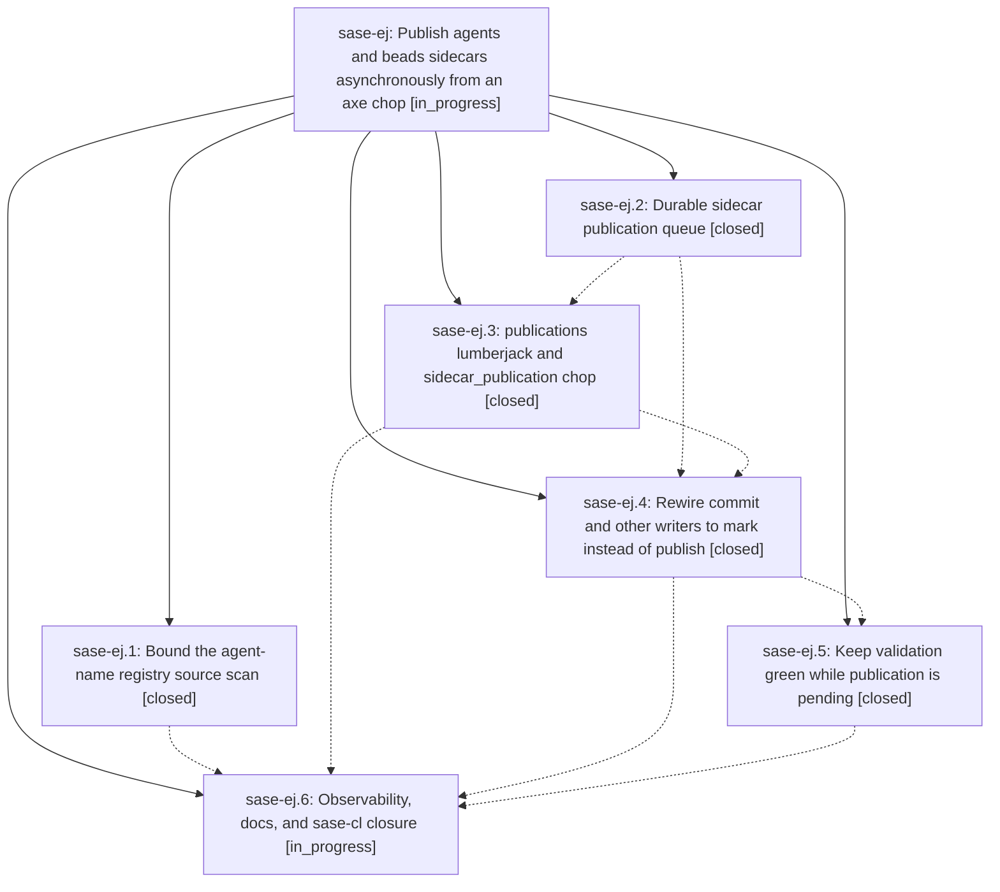

# Bead: sase-ej — Publish agents and beads sidecars asynchronously from an axe chop

[Bead Pages](../README.md) / sase-ej

**Status:** ◐ in_progress · **Type:** ▸ plan · **Tier:** epic
**Owner:** `bryanbugyi34@gmail.com` · **Created by:** [bbugyi200.athena.sh](https://github.com/sase-org/sase--agents/blob/main/agents/bbugyi200.athena.sh/README.md) · **Assignee:** `sase-ej.land`
**Created:** 2026-08-03 06:18:51 EDT
**Plan:** [202608/async\_sidecar\_publication.md](https://github.com/sase-org/sase--plans/blob/main/202608/async_sidecar_publication.md)

## Description

`sase commit` never blocks on agents/beads sidecar publication. It records durable publication requests and returns, while a dedicated axe lumberjack drains those requests, and `just check` stays green while requests are still pending.

## Notes

[2026-08-03T12:15:00Z · sl] DISCOVERED ISSUE: Independent reproduction of ready task sase-cl during post-completion finalizer for commit e257d6b1b. sase_git_commit printed create_commit completed successfully, skipped prompt archive publication because raw_xprompt.md was unavailable, and pushed HEAD to origin/master, then remained CPU-bound for over five minutes in post-commit tracking/publication until interrupted. Ctrl-C traceback showed run_agent_publication_step -> refresh_committed_plan_header -> build_plan_association_index -> resolve_agent_association_url -> get_reserved_family_names -> registry_file_is_stale -> _source_signature -> path.stat. git status stayed clean and HEAD matched origin/master.

[2026-08-03T13:34:05Z · su] DISCOVERED ISSUE: During unrelated family-hood name-collision verification on 2026-08-03, required 'just check' passed formatting, keep-sorted, Ruff, mypy, pyscripts, and changelog, then failed at lint (symvision). Symvision rejected four active-epic whitelist entries as unnecessary because the symbols are now properly used: sase-ej(enqueue_bead_pages_publication), sase-ej(enqueue_committed_agent_publication), sase-ej(enqueue_plan_header_publication), and sase-ej(enqueue_sidecar_push_publication). This blocks repository-wide just check until the stale --epic-symbol entries are removed or otherwise resolved in the owning active epic.

## Phases

| Bead | Title | Status | Size | Agents | Commits |
|---|---|---|---|---:|---:|
| [sase-ej.1](sase-ej.1.md) | Bound the agent-name registry source scan | ✓ closed | medium | 1 | 1 |
| [sase-ej.2](sase-ej.2.md) | Durable sidecar publication queue | ✓ closed | medium | 1 | 1 |
| [sase-ej.3](sase-ej.3.md) | publications lumberjack and sidecar\_publication chop | ✓ closed | medium | 1 | 1 |
| [sase-ej.4](sase-ej.4.md) | Rewire commit and other writers to mark instead of publish | ✓ closed | medium | 1 | 1 |
| [sase-ej.5](sase-ej.5.md) | Keep validation green while publication is pending | ✓ closed | small | 1 | 1 |
| [sase-ej.6](sase-ej.6.md) | Observability, docs, and sase-cl closure | ◐ in_progress | small | 0 | 0 |

## Lineage

## Agents

| Agent | Bead | Commits |
|---|---|---:|
| [bbugyi200.athena.sase-ej.1](https://github.com/sase-org/sase--agents/blob/main/agents/bbugyi200.athena.sase-ej.1/README.md) | [sase-ej.1](sase-ej.1.md) | 1 |
| [bbugyi200.athena.sase-ej.2](https://github.com/sase-org/sase--agents/blob/main/agents/bbugyi200.athena.sase-ej.2/README.md) | [sase-ej.2](sase-ej.2.md) | 1 |
| [bbugyi200.athena.sase-ej.3](https://github.com/sase-org/sase--agents/blob/main/agents/bbugyi200.athena.sase-ej.3/README.md) | [sase-ej.3](sase-ej.3.md) | 1 |
| [bbugyi200.athena.sase-ej.4](https://github.com/sase-org/sase--agents/blob/main/agents/bbugyi200.athena.sase-ej.4/README.md) | [sase-ej.4](sase-ej.4.md) | 1 |
| [bbugyi200.athena.sase-ej.5](https://github.com/sase-org/sase--agents/blob/main/agents/bbugyi200.athena.sase-ej.5/README.md) | [sase-ej.5](sase-ej.5.md) | 1 |

## Commits

| Repo | Commit | Subject | Bead | Committed |
|---|---|---|---|---|
| sase | [`6e39779`](https://github.com/sase-org/sase/commit/6e397794552c9e7e8e2feb593cb57f7382fd6b37) | feat: add durable sidecar publication queue | [sase-ej.2](sase-ej.2.md) | 2026-08-03 06:53:09 EDT |
| sase | [`0d6ed1a`](https://github.com/sase-org/sase/commit/0d6ed1a194b2cdb8c398399e82fcbcc903ee51f8) | feat(axe): drain queued sidecar publications | [sase-ej.3](sase-ej.3.md) | 2026-08-03 07:39:46 EDT |
| sase | [`3ac2b09`](https://github.com/sase-org/sase/commit/3ac2b097beac842dc02df1edf88704ff87cd351d) | feat: queue interactive sidecar publication | [sase-ej.4](sase-ej.4.md) | 2026-08-03 08:26:38 EDT |
| sase | [`c6bed82`](https://github.com/sase-org/sase/commit/c6bed82365b3fd316637c9bc68aa5ecc2479c7ad) | perf: bound agent registry scans during association builds | [sase-ej.1](sase-ej.1.md) | 2026-08-03 08:40:38 EDT |
| sase | [`1116bcc`](https://github.com/sase-org/sase/commit/1116bccb0a4390e748a4042b9e92bbcb50d991a2) | feat(sdd)!: keep validation green while sidecar publication is pending | [sase-ej.5](sase-ej.5.md) | 2026-08-03 09:18:45 EDT |
