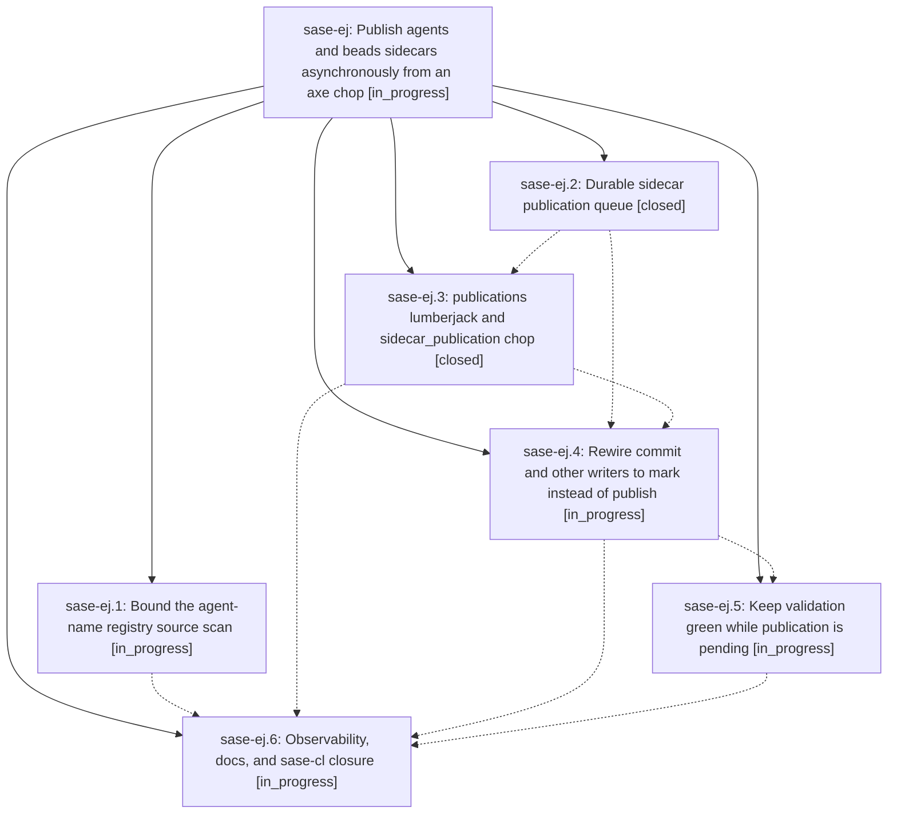

# Bead: sase-ej — Publish agents and beads sidecars asynchronously from an axe chop

[Bead Pages](../README.md) / sase-ej

**Status:** ◐ in_progress · **Type:** ▸ plan · **Tier:** epic
**Owner:** `bryanbugyi34@gmail.com` · **Created by:** [bbugyi200.athena.sh](https://github.com/sase-org/sase--agents/blob/main/agents/bbugyi200.athena.sh/README.md) · **Assignee:** `sase-ej.land`
**Created:** 2026-08-03 10:18:51 UTC
**Plan:** [202608/async\_sidecar\_publication.md](https://github.com/sase-org/sase--plans/blob/main/202608/async_sidecar_publication.md)

## Description

`sase commit` never blocks on agents/beads sidecar publication. It records durable publication requests and returns, while a dedicated axe lumberjack drains those requests, and `just check` stays green while requests are still pending.

## Phases

| Bead | Title | Status | Size | Agents | Commits |
|---|---|---|---|---:|---:|
| [sase-ej.1](sase-ej.1.md) | Bound the agent-name registry source scan | ◐ in_progress | medium | 1 | 0 |
| [sase-ej.2](sase-ej.2.md) | Durable sidecar publication queue | ✓ closed | medium | 1 | 1 |
| [sase-ej.3](sase-ej.3.md) | publications lumberjack and sidecar\_publication chop | ✓ closed | medium | 1 | 1 |
| [sase-ej.4](sase-ej.4.md) | Rewire commit and other writers to mark instead of publish | ◐ in_progress | medium | 1 | 0 |
| [sase-ej.5](sase-ej.5.md) | Keep validation green while publication is pending | ◐ in_progress | small | 1 | 0 |
| [sase-ej.6](sase-ej.6.md) | Observability, docs, and sase-cl closure | ◐ in_progress | small | 1 | 0 |

## Lineage

## Agents

| Agent | Bead | Commits |
|---|---|---:|
| [bbugyi200.athena.sase-ej.1](https://github.com/sase-org/sase--agents/blob/main/agents/bbugyi200.athena.sase-ej.1/README.md) | [sase-ej.1](sase-ej.1.md) | 0 |
| [bbugyi200.athena.sase-ej.2](https://github.com/sase-org/sase--agents/blob/main/agents/bbugyi200.athena.sase-ej.2/README.md) | [sase-ej.2](sase-ej.2.md) | 1 |
| [bbugyi200.athena.sase-ej.3](https://github.com/sase-org/sase--agents/blob/main/agents/bbugyi200.athena.sase-ej.3/README.md) | [sase-ej.3](sase-ej.3.md) | 1 |
| [bbugyi200.athena.sase-ej.4](https://github.com/sase-org/sase--agents/blob/main/agents/bbugyi200.athena.sase-ej.4/README.md) | [sase-ej.4](sase-ej.4.md) | 0 |
| [bbugyi200.athena.sase-ej.5](https://github.com/sase-org/sase--agents/blob/main/agents/bbugyi200.athena.sase-ej.5/README.md) | [sase-ej.5](sase-ej.5.md) | 0 |
| [bbugyi200.athena.sase-ej.6](https://github.com/sase-org/sase--agents/blob/main/agents/bbugyi200.athena.sase-ej.6/README.md) | [sase-ej.6](sase-ej.6.md) | 0 |
| [bbugyi200.athena.sase-ej.land](https://github.com/sase-org/sase--agents/blob/main/agents/bbugyi200.athena.sase-ej.land/README.md) | [sase-ej](README.md) | 0 |

## Commits

| Repo | Commit | Subject | Bead | Committed (UTC) |
|---|---|---|---|---|
| sase | [`6e39779`](https://github.com/sase-org/sase/commit/6e397794552c9e7e8e2feb593cb57f7382fd6b37) | feat: add durable sidecar publication queue | [sase-ej.2](sase-ej.2.md) | 2026-08-03 10:53:09 |
| sase | [`0d6ed1a`](https://github.com/sase-org/sase/commit/0d6ed1a194b2cdb8c398399e82fcbcc903ee51f8) | feat(axe): drain queued sidecar publications | [sase-ej.3](sase-ej.3.md) | 2026-08-03 11:39:46 |
