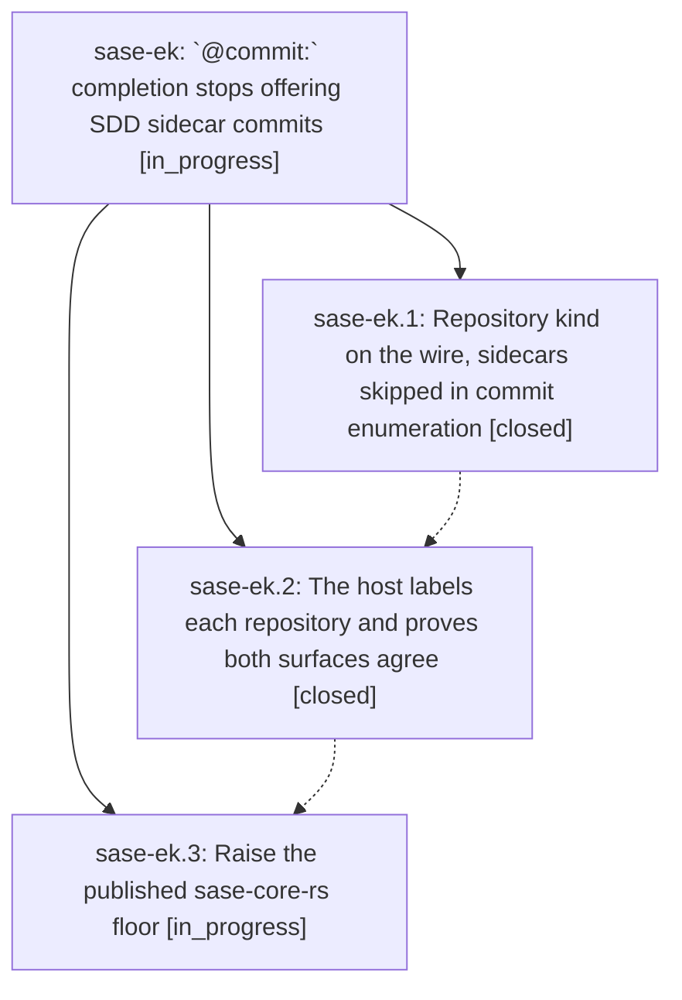

# Bead: sase-ek — \`@commit:\` completion stops offering SDD sidecar commits

[Bead Pages](../README.md) / sase-ek

**Status:** ◐ in_progress · **Type:** ▸ plan · **Tier:** epic
**Owner:** `bryanbugyi34@gmail.com` · **Created by:** [bbugyi200.athena.si](https://github.com/sase-org/sase--agents/blob/main/agents/bbugyi200.athena.si/README.md) · **Assignee:** `sase-ek.land`
**Created:** 2026-08-03 10:31:59 UTC
**Plan:** [202608/commit\_completion\_excludes\_sidecars.md](https://github.com/sase-org/sase--plans/blob/main/202608/commit_completion_excludes_sidecars.md)

## Description

`@commit:` completion — in the ACE prompt bar and in every LSP editor — offers only commits from repositories a human writes code in. SDD sidecar repositories (`plans`, `beads`, `agents`, `research`) contribute no completion rows, while a `@commit:<sidecar>@<sha>` reference typed in full still resolves at launch exactly as it does today.

## Phases

| Bead | Title | Status | Size | Agents | Commits |
|---|---|---|---|---:|---:|
| [sase-ek.1](sase-ek.1.md) | Repository kind on the wire, sidecars skipped in commit enumeration | ✓ closed | small | 1 | 1 |
| [sase-ek.2](sase-ek.2.md) | The host labels each repository and proves both surfaces agree | ✓ closed | small | 1 | 1 |
| [sase-ek.3](sase-ek.3.md) | Raise the published sase-core-rs floor | ◐ in_progress | small | 1 | 0 |

## Lineage

## Agents

| Agent | Bead | Commits |
|---|---|---:|
| [bbugyi200.athena.sase-ek.1](https://github.com/sase-org/sase--agents/blob/main/agents/bbugyi200.athena.sase-ek.1/README.md) | [sase-ek.1](sase-ek.1.md) | 1 |
| [bbugyi200.athena.sase-ek.2](https://github.com/sase-org/sase--agents/blob/main/agents/bbugyi200.athena.sase-ek.2/README.md) | [sase-ek.2](sase-ek.2.md) | 1 |
| [bbugyi200.athena.sase-ek.3](https://github.com/sase-org/sase--agents/blob/main/agents/bbugyi200.athena.sase-ek.3/README.md) | [sase-ek.3](sase-ek.3.md) | 0 |
| [bbugyi200.athena.sase-ek.land](https://github.com/sase-org/sase--agents/blob/main/agents/bbugyi200.athena.sase-ek.land/README.md) | [sase-ek](README.md) | 0 |

## Commits

| Repo | Commit | Subject | Bead | Committed (UTC) |
|---|---|---|---|---|
| sase-core | [`sase-core@3aa9d2a`](https://github.com/sase-org/sase-core/commit/3aa9d2a111b9cf0fe33fa1813b19491ce8bf8821) | fix(editor): exclude sidecar commits from artifact inventory | [sase-ek.1](sase-ek.1.md) | 2026-08-03 10:51:44 |
| sase | [`70410a0`](https://github.com/sase-org/sase/commit/70410a05b1a6250bbe6adb86c41a65cbef827e9b) | feat(artifact-refs): propagate repository kind into wire form and parity test | [sase-ek.2](sase-ek.2.md) | 2026-08-03 11:08:56 |
