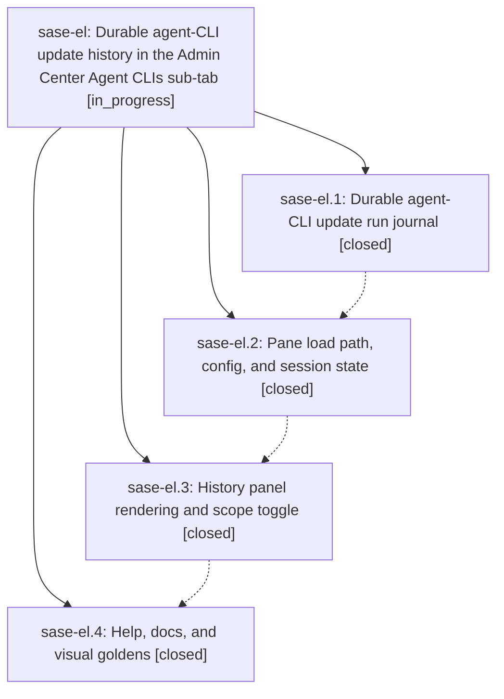

# Bead: sase-el — Durable agent-CLI update history in the Admin Center Agent CLIs sub-tab

[Bead Pages](../README.md) / sase-el

**Status:** ◐ in_progress · **Type:** ▸ plan · **Tier:** epic
**Owner:** `bryanbugyi34@gmail.com` · **Created by:** [bbugyi200.athena.sk](https://github.com/sase-org/sase--agents/blob/main/agents/bbugyi200.athena.sk/README.md) · **Assignee:** `sase-el.land`
**Created:** 2026-08-03 06:52:57 EDT
**Plan:** [202608/agent\_cli\_update\_history.md](https://github.com/sase-org/sase--plans/blob/main/202608/agent_cli_update_history.md)

## Description

Every sase-managed agent-CLI update run is recorded to a durable, bounded journal, and the Agent CLIs sub-tab renders that history beneath the selected CLI's detail panel — per-CLI by default, with a toggle to a run-grouped timeline across all CLIs — without any disk I/O on the keystroke path.

## Phases

| Bead | Title | Status | Size | Agents | Commits |
|---|---|---|---|---:|---:|
| [sase-el.1](sase-el.1.md) | Durable agent-CLI update run journal | ✓ closed | medium | 1 | 1 |
| [sase-el.2](sase-el.2.md) | Pane load path, config, and session state | ✓ closed | small | 1 | 1 |
| [sase-el.3](sase-el.3.md) | History panel rendering and scope toggle | ✓ closed | medium | 1 | 1 |
| [sase-el.4](sase-el.4.md) | Help, docs, and visual goldens | ✓ closed | small | 0 | 0 |

## Lineage

## Agents

| Agent | Bead | Commits |
|---|---|---:|
| [bbugyi200.athena.sase-el.1](https://github.com/sase-org/sase--agents/blob/main/agents/bbugyi200.athena.sase-el.1/README.md) | [sase-el.1](sase-el.1.md) | 1 |
| [bbugyi200.athena.sase-el.2](https://github.com/sase-org/sase--agents/blob/main/agents/bbugyi200.athena.sase-el.2/README.md) | [sase-el.2](sase-el.2.md) | 1 |
| [bbugyi200.athena.sase-el.3](https://github.com/sase-org/sase--agents/blob/main/agents/bbugyi200.athena.sase-el.3/README.md) | [sase-el.3](sase-el.3.md) | 1 |

## Commits

| Repo | Commit | Subject | Bead | Committed |
|---|---|---|---|---|
| sase | [`55eb243`](https://github.com/sase-org/sase/commit/55eb24331e77f758be540d45c9db4451cac84b5e) | feat(agent-clis): journal update runs | [sase-el.1](sase-el.1.md) | 2026-08-03 07:24:35 EDT |
| sase | [`e4ad939`](https://github.com/sase-org/sase/commit/e4ad939168acf54a963c5a404a39cbd059ef969e) | feat(agent-clis): wire update history into pane load, config, and session state | [sase-el.2](sase-el.2.md) | 2026-08-03 08:06:12 EDT |
| sase | [`a086b0f`](https://github.com/sase-org/sase/commit/a086b0f30ecef9cf0f66891695650fd165fd8f5d) | feat(agent-clis): render update history panel | [sase-el.3](sase-el.3.md) | 2026-08-03 08:43:52 EDT |
