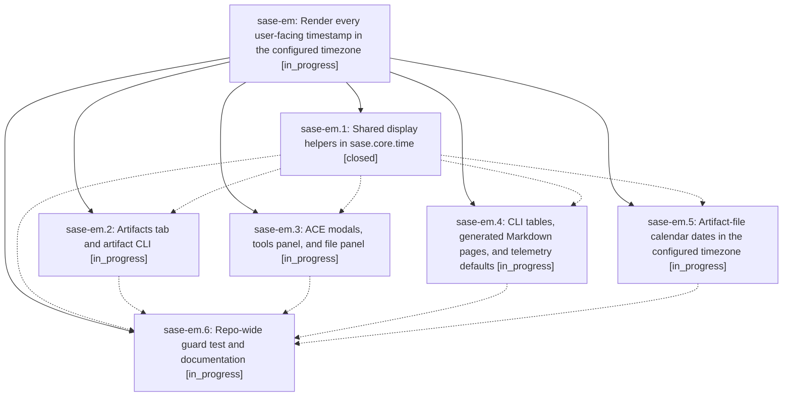

# Bead: sase-em — Render every user-facing timestamp in the configured timezone

[Bead Pages](../README.md) / sase-em

**Status:** ◐ in_progress · **Type:** ▸ plan · **Tier:** epic
**Owner:** `bryanbugyi34@gmail.com` · **Created by:** [bbugyi200.athena.sn](https://github.com/sase-org/sase--agents/blob/main/agents/bbugyi200.athena.sn/README.md) · **Assignee:** `sase-em.land`
**Created:** 2026-08-03 11:44:43 UTC
**Plan:** [202608/timezone\_display\_consistency.md](https://github.com/sase-org/sase--plans/blob/main/202608/timezone_display_consistency.md)

## Description

Every timestamp SASE shows a human — TUI panes, CLI tables, generated Markdown pages — is rendered in the configured `timezone`, never in UTC and never in the host system clock, and a repo-wide guard test keeps new UTC/system-clock display sites from landing.

## Phases

| Bead | Title | Status | Size | Agents | Commits |
|---|---|---|---|---:|---:|
| [sase-em.1](sase-em.1.md) | Shared display helpers in sase.core.time | ✓ closed | small | 0 | 0 |
| [sase-em.2](sase-em.2.md) | Artifacts tab and artifact CLI | ◐ in_progress | medium | 0 | 0 |
| [sase-em.3](sase-em.3.md) | ACE modals, tools panel, and file panel | ◐ in_progress | medium | 0 | 0 |
| [sase-em.4](sase-em.4.md) | CLI tables, generated Markdown pages, and telemetry defaults | ◐ in_progress | medium | 0 | 0 |
| [sase-em.5](sase-em.5.md) | Artifact-file calendar dates in the configured timezone | ◐ in_progress | medium | 0 | 0 |
| [sase-em.6](sase-em.6.md) | Repo-wide guard test and documentation | ◐ in_progress | small | 0 | 0 |

## Lineage

