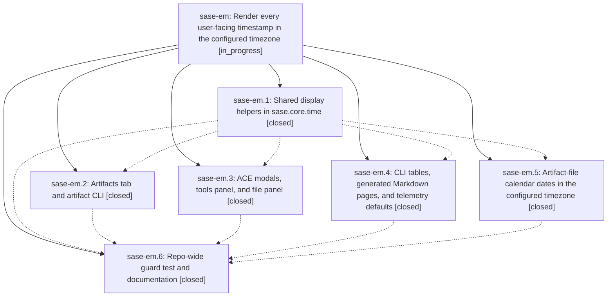

# Bead: sase-em — Render every user-facing timestamp in the configured timezone

[Bead Pages](../README.md) / sase-em

**Status:** ◐ in_progress · **Type:** ▸ plan · **Tier:** epic
**Owner:** `bryanbugyi34@gmail.com` · **Created by:** [bbugyi200.athena.sn](https://github.com/sase-org/sase--agents/blob/main/agents/bbugyi200.athena.sn/README.md) · **Assignee:** `sase-em.land`
**Created:** 2026-08-03 07:44:43 EDT
**Plan:** [202608/timezone\_display\_consistency.md](https://github.com/sase-org/sase--plans/blob/main/202608/timezone_display_consistency.md)

## Description

Every timestamp SASE shows a human — TUI panes, CLI tables, generated Markdown pages — is rendered in the configured `timezone`, never in UTC and never in the host system clock, and a repo-wide guard test keeps new UTC/system-clock display sites from landing.

## Phases

| Bead | Title | Status | Size | Agents | Commits |
|---|---|---|---|---:|---:|
| [sase-em.1](sase-em.1.md) | Shared display helpers in sase.core.time | ✓ closed | small | 1 | 1 |
| [sase-em.2](sase-em.2.md) | Artifacts tab and artifact CLI | ✓ closed | medium | 1 | 1 |
| [sase-em.3](sase-em.3.md) | ACE modals, tools panel, and file panel | ✓ closed | medium | 1 | 1 |
| [sase-em.4](sase-em.4.md) | CLI tables, generated Markdown pages, and telemetry defaults | ✓ closed | medium | 1 | 1 |
| [sase-em.5](sase-em.5.md) | Artifact-file calendar dates in the configured timezone | ✓ closed | medium | 1 | 2 |
| [sase-em.6](sase-em.6.md) | Repo-wide guard test and documentation | ✓ closed | small | 1 | 1 |

## Lineage

## Agents

| Agent | Bead | Commits |
|---|---|---:|
| [bbugyi200.athena.sase-em.1](https://github.com/sase-org/sase--agents/blob/main/agents/bbugyi200.athena.sase-em.1/README.md) | [sase-em.1](sase-em.1.md) | 1 |
| [bbugyi200.athena.sase-em.2](https://github.com/sase-org/sase--agents/blob/main/agents/bbugyi200.athena.sase-em.2/README.md) | [sase-em.2](sase-em.2.md) | 1 |
| [bbugyi200.athena.sase-em.3](https://github.com/sase-org/sase--agents/blob/main/agents/bbugyi200.athena.sase-em.3/README.md) | [sase-em.3](sase-em.3.md) | 1 |
| [bbugyi200.athena.sase-em.4](https://github.com/sase-org/sase--agents/blob/main/agents/bbugyi200.athena.sase-em.4/README.md) | [sase-em.4](sase-em.4.md) | 1 |
| [bbugyi200.athena.sase-em.5](https://github.com/sase-org/sase--agents/blob/main/agents/bbugyi200.athena.sase-em.5/README.md) | [sase-em.5](sase-em.5.md) | 2 |
| [bbugyi200.athena.sase-em.6](https://github.com/sase-org/sase--agents/blob/main/agents/bbugyi200.athena.sase-em.6/README.md) | [sase-em.6](sase-em.6.md) | 1 |

## Commits

| Repo | Commit | Subject | Bead | Committed |
|---|---|---|---|---|
| sase | [`2c70516`](https://github.com/sase-org/sase/commit/2c70516acaad31563eb4a07866a5a3f424204259) | feat(core-time): add parse\_local/format\_local display helpers | [sase-em.1](sase-em.1.md) | 2026-08-03 08:52:56 EDT |
| sase | [`d4be80d`](https://github.com/sase-org/sase/commit/d4be80d3f9a6c96890f6b83c8c4af0a20797f214) | fix(artifacts): render timestamps in configured timezone | [sase-em.2](sase-em.2.md) | 2026-08-03 09:39:09 EDT |
| sase-core | [`sase-core@e153a2e`](https://github.com/sase-org/sase-core/commit/e153a2ea40675cc6e3ab10ad966f9be875f26e4d) | fix(artifacts): honor embedded offsets for calendar dates | [sase-em.5](sase-em.5.md) | 2026-08-03 09:47:39 EDT |
| sase | [`eda7c15`](https://github.com/sase-org/sase/commit/eda7c1564387abf356e601dd32d86c68b4efedd8) | fix(artifacts): mint timestamps in the configured timezone | [sase-em.5](sase-em.5.md) | 2026-08-03 09:48:30 EDT |
| sase | [`c449ce2`](https://github.com/sase-org/sase/commit/c449ce27cf0cd18b0f5a78f80f8742963a7c97f3) | fix: render timestamps in configured timezone | [sase-em.4](sase-em.4.md) | 2026-08-03 09:50:08 EDT |
| sase | [`f0e562b`](https://github.com/sase-org/sase/commit/f0e562bda9965cf42ba6d8c9dbb152a5a4ed2fd7) | fix(tui): render panel timestamps in configured timezone | [sase-em.3](sase-em.3.md) | 2026-08-03 09:59:37 EDT |
| sase | [`6424082`](https://github.com/sase-org/sase/commit/6424082f968b220212dd3656413d076fd1ce9fb0) | fix: guard configured-timezone timestamp display | [sase-em.6](sase-em.6.md) | 2026-08-03 10:43:39 EDT |
