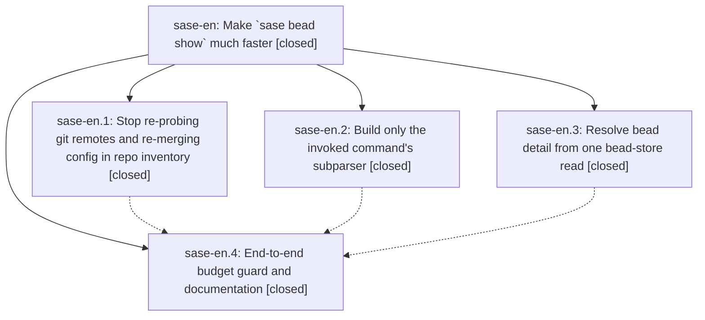

# Bead: sase-en — Make \`sase bead show\` much faster

[Bead Pages](../README.md) / sase-en

**Status:** ✓ closed · **Resolution:** done · **Type:** ▸ plan · **Tier:** epic
**Owner:** `bryanbugyi34@gmail.com` · **Created by:** [bbugyi200.athena.sl.f1](https://github.com/sase-org/sase--agents/blob/main/agents/bbugyi200.athena.sl.f1/README.md) · **Assignee:** `sase-en.land`
**Created:** 2026-08-03 08:39:41 EDT · **Closed:** 2026-08-03 11:37:12 EDT
**Plan:** [202608/bead\_show\_speed.md](https://github.com/sase-org/sase--plans/blob/main/202608/bead_show_speed.md)

## Description

`sase bead show` returns in well under a second instead of ~1.8 s (and ~3.2 s for beads that carry refs), with byte-identical output at every format, style, and wrap setting, by removing a 418-call subprocess storm, the full-CLI parser import, and two redundant full bead-store reductions.

## Notes

[2026-08-03T15:37:12Z · sase-en.land] Land audit complete. Primary commits reviewed: 25e706f76 (sase-en.1 inventory memoization), e5208ec97 (sase-en.2 lazy command parser), 7a66461b9 (sase-en.3 Python facade/detail resolver), and 18d438bc0 (sase-en.4 guards/docs). Linked core commit reviewed: 5f39c3dc2, released in sase-core-rs 0.17.15. Source, tests, and later primary/linked-core commits were reviewed; no output or semantic conflict remained. Packaging integration landed here: pyproject.toml now requires sase-core-rs>=0.17.15,<0.18.0, uv.lock resolves 0.17.15 artifacts, and the telemetry smoke test minimum now expects 0.17.15. just install rebuilt the editable binding as 0.17.15; the isolated published 0.17.15 wheel exposes bead_show_issue_detail; live sase bead show succeeded; git diff --check was clean. Focused Python verification passed 11 tests across telemetry smoke, core facade bead read, and bead show budgets. Rust verification passed cargo fmt --all -- --check and cargo test -p sase_core --test bead_read_parity (13 passed). Full-gate verification: initial default just check exposed a stale Agent CLI history visual-helper default, fixed by matching the production history-enabled config; the targeted marked/update-preview PNG rerun passed 2 tests. A default retry then failed only the metadata-search xdist flake, which passed immediately in isolation and was recorded as +1 evidence on existing task sase-dg. The required full gate passed with SASE_PYTEST_WORKERS=4 just check. Final benchmarks: sase bead show sase-bv --style plain averaged 777.0 ms versus 1.841 s baseline (2.37x faster), and ref-bearing sase-cl averaged 1.541 s versus 3.184 s baseline (2.07x faster). Follow-up accounting: existing contention task sase-e2 already carries sase-en evidence and its exact node passed in isolation here; sase-eq is ready for the five ambient ancestor-store path-resolution tests; duplicate Agent CLI PNG proposals from phases are resolved by the helper correction and passing visual rerun; stale sase-ej Symvision proposals are owned by active epic sase-ej and current Symvision is clean; deferred optimization tasks are ready as sase-er, sase-es, sase-eu, sase-ev, and sase-ew. Closing without force.

## Phases

| Bead | Title | Status | Size | Agents | Commits |
|---|---|---|---|---:|---:|
| [sase-en.1](sase-en.1.md) | Stop re-probing git remotes and re-merging config in repo inventory | ✓ closed | medium | 1 | 1 |
| [sase-en.2](sase-en.2.md) | Build only the invoked command's subparser | ✓ closed | medium | 1 | 1 |
| [sase-en.3](sase-en.3.md) | Resolve bead detail from one bead-store read | ✓ closed | medium | 1 | 2 |
| [sase-en.4](sase-en.4.md) | End-to-end budget guard and documentation | ✓ closed | small | 1 | 1 |

## Lineage

## Dependencies

- **Blocks:** [sase-ey](../sase-ey/README.md) ◇

## Agents

| Agent | Bead | Commits |
|---|---|---:|
| [bbugyi200.athena.sase-en.1](https://github.com/sase-org/sase--agents/blob/main/agents/bbugyi200.athena.sase-en.1/README.md) | [sase-en.1](sase-en.1.md) | 1 |
| [bbugyi200.athena.sase-en.2](https://github.com/sase-org/sase--agents/blob/main/agents/bbugyi200.athena.sase-en.2/README.md) | [sase-en.2](sase-en.2.md) | 1 |
| [bbugyi200.athena.sase-en.3](https://github.com/sase-org/sase--agents/blob/main/agents/bbugyi200.athena.sase-en.3/README.md) | [sase-en.3](sase-en.3.md) | 2 |
| [bbugyi200.athena.sase-en.4](https://github.com/sase-org/sase--agents/blob/main/agents/bbugyi200.athena.sase-en.4/README.md) | [sase-en.4](sase-en.4.md) | 1 |

## Commits

| Repo | Commit | Subject | Bead | Committed |
|---|---|---|---|---|
| sase | [`25e706f`](https://github.com/sase-org/sase/commit/25e706f76b593d8e3147c86fdd01cd3d457ae4b0) | perf(repo): cache inventory identity derivations | [sase-en.1](sase-en.1.md) | 2026-08-03 09:28:46 EDT |
| sase-core | [`sase-core@5f39c3d`](https://github.com/sase-org/sase-core/commit/5f39c3dc2a1a3680f66f98c8735990b6596ac781) | perf(bead): add single-pass detail read | [sase-en.3](sase-en.3.md) | 2026-08-03 09:37:44 EDT |
| sase | [`7a66461`](https://github.com/sase-org/sase/commit/7a66461b98890f66413bfbc67bc7a6d90b2c736f) | perf(bead): resolve detail from one core snapshot | [sase-en.3](sase-en.3.md) | 2026-08-03 09:38:10 EDT |
| sase | [`e5208ec`](https://github.com/sase-org/sase/commit/e5208ec977cbe6974ccfa32526f4197b697caf1e) | perf(cli): build only the invoked command parser | [sase-en.2](sase-en.2.md) | 2026-08-03 09:40:20 EDT |
| sase | [`18d438b`](https://github.com/sase-org/sase/commit/18d438bc066a15569c2f2faa393ffa4e1aa94f11) | test(bead): guard the show speedup's end-to-end budget | [sase-en.4](sase-en.4.md) | 2026-08-03 10:11:46 EDT |
