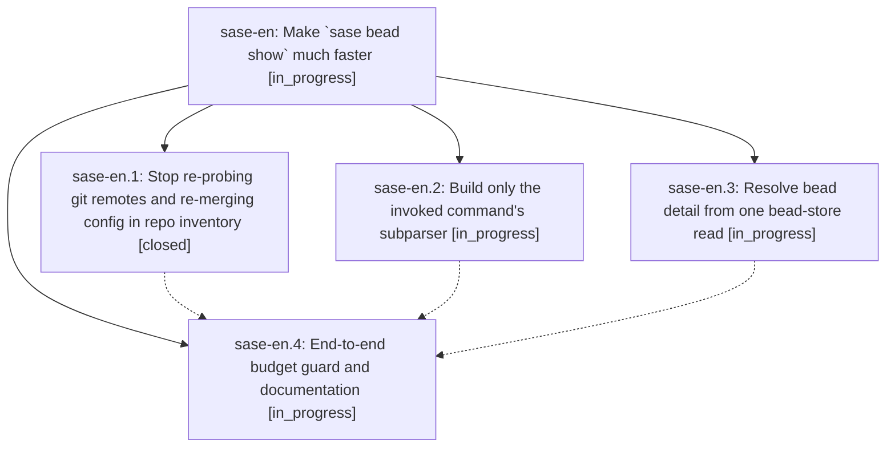

# Bead: sase-en — Make \`sase bead show\` much faster

[Bead Pages](../README.md) / sase-en

**Status:** ◐ in_progress · **Type:** ▸ plan · **Tier:** epic
**Owner:** `bryanbugyi34@gmail.com` · **Created by:** [bbugyi200.athena.sl.f1](https://github.com/sase-org/sase--agents/blob/main/agents/bbugyi200.athena.sl.f1/README.md) · **Assignee:** `sase-en.land`
**Created:** 2026-08-03 12:39:41 UTC
**Plan:** [202608/bead\_show\_speed.md](https://github.com/sase-org/sase--plans/blob/main/202608/bead_show_speed.md)

## Description

`sase bead show` returns in well under a second instead of ~1.8 s (and ~3.2 s for beads that carry refs), with byte-identical output at every format, style, and wrap setting, by removing a 418-call subprocess storm, the full-CLI parser import, and two redundant full bead-store reductions.

## Phases

| Bead | Title | Status | Size | Agents | Commits |
|---|---|---|---|---:|---:|
| [sase-en.1](sase-en.1.md) | Stop re-probing git remotes and re-merging config in repo inventory | ✓ closed | medium | 0 | 0 |
| [sase-en.2](sase-en.2.md) | Build only the invoked command's subparser | ◐ in_progress | medium | 0 | 0 |
| [sase-en.3](sase-en.3.md) | Resolve bead detail from one bead-store read | ◐ in_progress | medium | 0 | 0 |
| [sase-en.4](sase-en.4.md) | End-to-end budget guard and documentation | ◐ in_progress | small | 0 | 0 |

## Lineage

