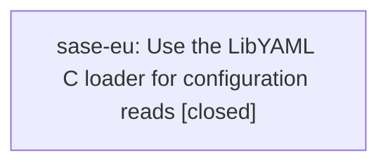

# Bead: sase-eu — Use the LibYAML C loader for configuration reads

[Bead Pages](../README.md) / sase-eu

**Status:** ✓ closed · **Resolution:** done · **Type:** ◆ task
**Owner:** `bryanbugyi34@gmail.com` · **Created by:** [bbugyi200.athena.sase-en.land](https://github.com/sase-org/sase--agents/blob/main/families/bbugyi200.athena.sase-en.land.md) · **Assignee:** `sase-eu` · **Size:** small
**Created:** 2026-08-03 10:49:08 EDT · **Closed:** 2026-08-05 15:52:06 EDT

## Description

Deferred by epic bead sase-en in plans:202608/bead_show_speed.md; not caused by that epic. PyYAML's C loader is available, but configuration paths still use yaml.safe_load and the pure-Python loader. On src/sase/default_config.yml, 100 integrated-tree parses average 40.683 ms with safe_load versus 3.162 ms with yaml.CSafeLoader (12.9x faster). Scope: inventory JSON-shaped trusted configuration reads, introduce a safe C-loader path with a portable fallback when LibYAML is unavailable, preserve parsing/error behavior, and add parity coverage before migrating eligible call sites.

## Notes

[2026-08-05T19:52:06Z · sase-eu] Added src/sase/_yaml_safe.py exposing yaml_safe_load(), which prefers yaml.CSafeLoader (falls back to SafeLoader when libyaml bindings are absent). Migrated all 11 trusted JSON-shaped config read call sites (config/layers.py, config/loading.py, config/mentor.py, config/xprompt_sources.py, _linked_repo_config.py, project_management.py, doctor/checks_config_sdd.py, amd/_shared.py, vcs_list/collect.py, ace/tui/keymaps/defaults.py, llm_provider/model_alias_policy.py) from yaml.safe_load to yaml_safe_load. Added tests/test_yaml_safe.py with 28 parity tests verifying identical output vs yaml.safe_load across JSON-shaped/unicode/nested samples, identical yaml.YAMLError subclass on malformed input, both with and without CSafeLoader available, plus a dedicated parity check against the bundled default_config.yml. Verified via full [setup] WARNING: bump the published sase-core-rs window in pyproject.toml; dev installs build from /home/bryan/.local/state/sase/workspaces/sase-org/sase/sase_13/sase/repos/linked/sase-core regardless.
✓ fmt (python)
✓ fmt (markdown)
✓ lint (keep-sorted)
✓ lint (ruff)
✓ lint (mypy)
✓ lint (pyscripts)
✓ lint (changelog)
✓ lint (symvision)
✓ lint (toobig)
✓ SASE validation
✓ committed plans
✗ test
[validate_sase_core_rs_version] sase-core checkout is ahead of sase's compatibility window: source version 0.18.0 from /home/bryan/.local/state/sase/workspaces/sase-org/sase/sase_13/sase/repos/linked/sase-core/Cargo.toml does not satisfy `sase`'s `sase-core-rs>=0.17.15,<0.18.0` dependency in pyproject.toml. Bump `sase`'s `sase-core-rs` constraint in `pyproject.toml` if the newer core is compatible, or check out a compatible `sase-core`.
[setup] WARNING: bump the published sase-core-rs window in pyproject.toml; dev installs build from /home/bryan/.local/state/sase/workspaces/sase-org/sase/sase_13/sase/repos/linked/sase-core regardless.

┌───────────────────────────────────────────────────────┐
│                RUNNING: just test                     │
└───────────────────────────────────────────────────────┘

---------- Running pytest (parallel, no coverage)... ----------
============================= test session starts ==============================
platform linux -- Python 3.14.3, pytest-9.1.1, pluggy-1.6.0
rootdir: /home/bryan/.local/state/sase/workspaces/sase-org/sase/sase_13
configfile: pyproject.toml
testpaths: tests
plugins: inline-snapshot-0.35.3, cov-7.1.0, asyncio-1.4.0, hypothesis-6.165.0, xdist-3.8.0, mock-3.15.1
asyncio: mode=Mode.AUTO, debug=False, asyncio_default_fixture_loop_scope=None, asyncio_default_test_loop_scope=function
created: 17/17 workers
17 workers [25828 items]

........................................................................ [  0%]
........................................................................ [  0%]
........................................................................ [  0%]
........................................................................ [  1%]
........................................................................ [  1%]
........................................................................ [  1%]
........................................................................ [  1%]
........................................................................ [  2%]
........................................................................ [  2%]
........................................................................ [  2%]
........................................................................ [  3%]
........................................................................ [  3%]
........................................................................ [  3%]
........................................................................ [  3%]
........................................................................ [  4%]
........................................................................ [  4%]
........................................................................ [  4%]
........................................................................ [  5%]
........................................................................ [  5%]
........................................................................ [  5%]
........................................................................ [  5%]
........................................................................ [  6%]
........................................................................ [  6%]
........................................................................ [  6%]
........................................................................ [  6%]
........................................................................ [  7%]
........................................................................ [  7%]
........................................................................ [  7%]
........................................................................ [  8%]
........................................................................ [  8%]
........................................................................ [  8%]
........................................................................ [  8%]
........................................................................ [  9%]
........................................................................ [  9%]
........................................................................ [  9%]
........................................................................ [ 10%]
........................................................................ [ 10%]
........................................................................ [ 10%]
........................................................................ [ 10%]
........................................................................ [ 11%]
........................................................................ [ 11%]
........................................................................ [ 11%]
........................................................................ [ 11%]
........................................................................ [ 12%]
........................................................................ [ 12%]
........................................................................ [ 12%]
........................................................................ [ 13%]
........................................................................ [ 13%]
........................................................................ [ 13%]
........................................................................ [ 13%]
........................................................................ [ 14%]
........................................................................ [ 14%]
...........s............................................................ [ 14%]
........................................................................ [ 15%]
........................................................................ [ 15%]
........................................................................ [ 15%]
........................................................................ [ 15%]
........................................................................ [ 16%]
........................................................................ [ 16%]
........................................................................ [ 16%]
........................................................................ [ 17%]
........................................................................ [ 17%]
........................................................................ [ 17%]
........................................................................ [ 17%]
........................................................................ [ 18%]
........................................................................ [ 18%]
........................................................................ [ 18%]
........................................................................ [ 18%]
........................................................................ [ 19%]
.................................................ssss................... [ 19%]
........................................................................ [ 19%]
........................................................................ [ 20%]
........................................................................ [ 20%]
........................................................................ [ 20%]
........................................................................ [ 20%]
........................................................................ [ 21%]
........................................................................ [ 21%]
........................................................................ [ 21%]
........................................................................ [ 22%]
........................................................................ [ 22%]
........................................................................ [ 22%]
........................................................................ [ 22%]
........................................................................ [ 23%]
........................................................................ [ 23%]
........................................................................ [ 23%]
........................................................................ [ 23%]
........................................................................ [ 24%]
........................................................................ [ 24%]
........................................................................ [ 24%]
........................................................................ [ 25%]
........................................................................ [ 25%]
..........................................

… and 58781 more characters

## Lineage

## Agents

| Agent | Bead | Commits |
|---|---|---:|
| [bbugyi200.athena.sase-eu](https://github.com/sase-org/sase--agents/blob/main/agents/bbugyi200.athena.sase-eu/README.md) | [sase-eu](README.md) | 1 |

## Commits

| Repo | Commit | Subject | Bead | Committed |
|---|---|---|---|---|
| sase | [`dc993cc`](https://github.com/sase-org/sase/commit/dc993ccd87657982f3f0213f8214dea2c43f26ac) | perf: prefer LibYAML C loader for trusted config YAML reads | [sase-eu](README.md) | 2026-08-05 15:53:19 EDT |
