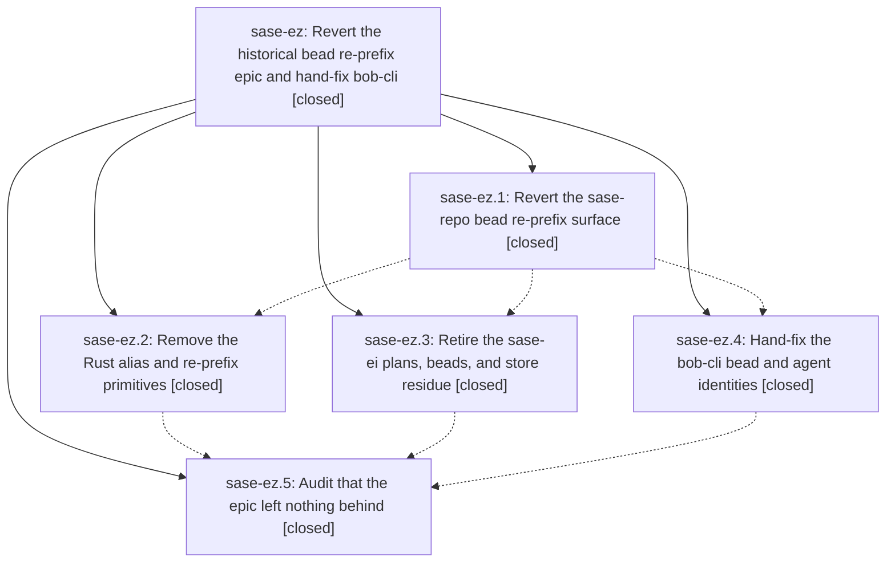

# Bead: sase-ez — Revert the historical bead re-prefix epic and hand-fix bob-cli

[Bead Pages](../README.md) / sase-ez

**Status:** ✓ closed · **Resolution:** done · **Type:** ▸ plan · **Tier:** epic
**Owner:** `bryanbugyi34@gmail.com` · **Created by:** [bbugyi200.athena.sy](https://github.com/sase-org/sase--agents/blob/main/agents/bbugyi200.athena.sy/README.md) · **Assignee:** `sase-ez.land`
**Created:** 2026-08-03 11:32:03 EDT · **Closed:** 2026-08-03 17:40:48 EDT
**Plan:** [202608/revert\_bead\_reprefix\_epic.md](https://github.com/sase-org/sase--plans/blob/main/202608/revert_bead_reprefix_epic.md)

## Description

Every code, data, and tracking artifact produced by the sase-ei epic is removed from the sase and sase-core repositories, and the single project that actually carries a leaked ProjectSpec-key bead prefix, bob-cli, is corrected by a one-off manual rename instead of by shipping a general migration feature.

## Notes

[2026-08-03T21:40:48Z · sase-ez.land] LAND AUDIT (sase-ez.land, 2026-08-03, sase HEAD 943ffd0d3).

VERIFIED — code. All three sase-ei commits are reverted (b763878d3 by e433d3885, f7e1fe216 by 850cb910e, b4db947d2 by f2cd75bc5). src/sase/core/bead_prefix_migration.py, src/sase/bead/reference_rewriters.py and the six src/sase/agent/names/_identity_migration*.py modules are gone. A repo-wide token audit for bead_prefix_migration, reference_rewriters, identity_migration, id_aliases, migrate-prefix and reprefix returns nothing outside .git and CHANGELOG.md. The forward mint guard 77ef3953e survived and tests/test_bead/test_prefix_mint_guard.py passes. In sase-core, crates/sase_core/src/bead/reprefix.rs and identity.rs are gone with a clean token audit across crates/, the revert shipped as 7de18f8 in tag v0.17.16, and the installed sase_core_rs exposes none of bead_validate_issue_prefix, bead_rewrite_id_tokens, bead_prefix_migration_preview, bead_prefix_migration_apply.

VERIFIED — data and tracking. The sase bead store config.json is {issue_prefix: sase, next_counter: 545, owner} with no id_aliases key. The retired sase-ei plan files are absent from both the plans sidecar and ~/.sase/plans/202608/, and sase bead doctor reports no plan reference to them. sase-ei is closed canceled with all five phases closed.

VERIFIED — bob-cli. config.json is {issue_prefix: bob-cli, next_counter: 15}; the five event streams are renamed a-e including the removed -d stream; the projection holds the same thirteen closed issues under bob-cli-a, bob-cli-b(.1-.4), bob-cli-c and bob-cli-e(.1-.5); pages/ is renamed. No gh_bobs-org__bob-cli-<counter> token survives in the beads sidecar, the plans sidecar (three plan frontmatter refs now name bob-cli-b and bob-cli-e), the agents sidecar, or ~/.sase/agent_name_registry.json. The only remaining occurrences are the intentional ones: immutable primary-repo commit footers, and free-form prose inside three sase chat transcripts that discuss the migration.

VERIFIED — gates. just install then just check: every static gate passed (fmt python/markdown, keep-sorted, ruff, mypy, pyscripts, changelog, symvision, toobig, SASE validation, committed plans). The test stage failed 3 of 25,774 with 7 skipped; all three passed on isolated rerun and are host-contention flakes in areas this epic never touched, corroborated onto existing tasks sase-eg (the two artifact_file_facade nodes) and sase-cb (the slow-tool fold PNG snapshot). Four other agent workspaces were running full suites concurrently.

INTEGRATED. Nine non-epic commits landed since the epic's first commit f2cd75bc5. File overlap is limited to the Justfile and the five src/sase/bead/_sync*.py modules; the epic's final commit 943ffd0d3 already lands on top of the sync split 15e4213cc, and nothing in the current tree references the removed surface. sase-ez.2's symvision follow-up needed no task: load_xprompt_source_records and render_prompt_sections, and the whole src/sase/history/chat_prompt_sections.py module, were deleted by the unrelated commits 1239c5f5c and 1a2040e73. sase-ez.1's PNG-golden follow-up needed no task either: the fifteen config-center plugin/agent-CLI visual snapshots, including the three agent_clis_history goldens, all pass now. The Justfile symvision invocation carries no --epic-symbol entries, so this close leaves none stale. Separately, sase-ei.1's retirement-audit note was written by sase-ez.3 before sase-ez.2 landed and said the sase-core revert had no SHA yet; I appended the completing note naming 7de18f8 and v0.17.16. Task sase-eh, which requested the general re-prefix migration feature and was left in_progress when its epic was abandoned, is now closed superseded, with the reason recording that bob-cli is fixed and that actstat self-heals through the mint guard.

FOLLOW-UPS. Corroborated as duplicates: sase-eg and sase-cb (the three flakes above) and sase-e0 (sase-ez.4 and .5 both hit 57 prompt-in-plans-store errors in bob-cli's plans store; the same defect and remediation as the original sase report, so it is now ready again). Recorded on active epic sase-ej rather than filed, because it is the publication queue that epic built: the bob-cli lane holds four unpublishable requests naming the foreign sase-ez hood, and the sase lane holds a larger backlog spanning sase-f1, sase-f2, toobig-1j, toobig-1k and a sase-ey rebase conflict. Filed ready: sase-f6 (a full sync re-synthesizes retired identities from immutable SASE_AGENT commit footers, medium, depends on sase-ej), sase-f7 (four corrupt artifact JSON files keep agent index verify false, small), sase-f8 (bob-cli generated memory shims and sidecar guide are stale, xsmall), sase-f9 (14 malformed design refs, 14 owner mismatches and 1 unresolvable artifact ref in sase bead doctor, medium). Nothing was declined.

DELIBERATELY LEFT. The bob-cli primary repository's commit subjects, bodies and SASE_BEAD/SASE_AGENT footers still name the old IDs and their hosted links will 404; that was the plan's accepted cost of dropping the alias machinery. sase-core v0.17.15 stays published. The bbugyi200.athena.sase-ei.* agent history stays. I did not clean the bob-cli publication-queue residue: the sanctioned cleanup 'sase agent sync --drop-retired' runs a full sync, and sase-ez.4 showed empirically that a full bob-cli sync re-synthesizes the retired leaked-prefix agent pages from those immutable footers, so clearing it safely depends on sase-f6 landing first.

## Phases

| Bead | Title | Status | Size | Agents | Commits |
|---|---|---|---|---:|---:|
| [sase-ez.1](sase-ez.1.md) | Revert the sase-repo bead re-prefix surface | ✓ closed | medium | 1 | 5 |
| [sase-ez.2](sase-ez.2.md) | Remove the Rust alias and re-prefix primitives | ✓ closed | large | 1 | 2 |
| [sase-ez.3](sase-ez.3.md) | Retire the sase-ei plans, beads, and store residue | ✓ closed | medium | 1 | 4 |
| [sase-ez.4](sase-ez.4.md) | Hand-fix the bob-cli bead and agent identities | ✓ closed | large | 0 | 0 |
| [sase-ez.5](sase-ez.5.md) | Audit that the epic left nothing behind | ✓ closed | medium | 1 | 1 |

## Lineage

## Agents

| Agent | Bead | Commits |
|---|---|---:|
| [bbugyi200.athena.sase-ez.1](https://github.com/sase-org/sase--agents/blob/main/agents/bbugyi200.athena.sase-ez.1/README.md) | [sase-ez.1](sase-ez.1.md) | 5 |
| [bbugyi200.athena.sase-ez.2](https://github.com/sase-org/sase--agents/blob/main/families/bbugyi200.athena.sase-ez.2.md) | [sase-ez.2](sase-ez.2.md) | 2 |
| [bbugyi200.athena.sase-ez.3](https://github.com/sase-org/sase--agents/blob/main/agents/bbugyi200.athena.sase-ez.3/README.md) | [sase-ez.3](sase-ez.3.md) | 4 |
| [bbugyi200.athena.sase-ez.5](https://github.com/sase-org/sase--agents/blob/main/agents/bbugyi200.athena.sase-ez.5/README.md) | [sase-ez.5](sase-ez.5.md) | 1 |
| [bbugyi200.athena.sase-ez.land](https://github.com/sase-org/sase--agents/blob/main/agents/bbugyi200.athena.sase-ez.land/README.md) | [sase-ez](README.md) | 1 |

## Commits

| Repo | Commit | Subject | Bead | Committed |
|---|---|---|---|---|
| sase | [`f2cd75b`](https://github.com/sase-org/sase/commit/f2cd75bc55a1c6c786961572f4703605ae6d91a5) | revert(agent-names): remove historical identity migration | [sase-ez.1](sase-ez.1.md) | 2026-08-03 14:52:59 EDT |
| sase | [`850cb91`](https://github.com/sase-org/sase/commit/850cb910ee9f944e6c5871187581758cdba9c9d3) | revert(beads): remove historical reference rewriting | [sase-ez.1](sase-ez.1.md) | 2026-08-03 14:54:41 EDT |
| sase | [`e433d38`](https://github.com/sase-org/sase/commit/e433d388575fa71423dd6c15b3264e8a9572636b) | revert(beads): remove prefix migration facade | [sase-ez.1](sase-ez.1.md) | 2026-08-03 14:56:34 EDT |
| sase | [`234e817`](https://github.com/sase-org/sase/commit/234e8175cd28e7a3f040510f0c68a0f5fba1494b) | fix(lint): remove stale symvision state | [sase-ez.1](sase-ez.1.md) | 2026-08-03 15:03:28 EDT |
| sase | [`a35846f`](https://github.com/sase-org/sase/commit/a35846f4cf60ac0da274370698d16340a6c61791) | fix(beads): restore pre-alias resolution tests | [sase-ez.1](sase-ez.1.md) | 2026-08-03 15:15:18 EDT |
| sase--plans | [`sase--plans@1c53086`](https://github.com/sase-org/sase--plans/commit/1c53086daba3b69152b91a7f5aa0308e13df4a3a) | chore(plans): retire abandoned bead reprefix plans | [sase-ez.3](sase-ez.3.md) | 2026-08-03 15:39:39 EDT |
| sase--beads | [`sase--beads@cd68935`](https://github.com/sase-org/sase--beads/commit/cd689358354dddacc778408143f2cd27816b05d4) | chore(beads): remove stale prefix alias config | [sase-ez.3](sase-ez.3.md) | 2026-08-03 15:40:26 EDT |
| sase--beads | [`sase--beads@88ac5cf`](https://github.com/sase-org/sase--beads/commit/88ac5cfbecde8128ef801950c315f13fe521d9f0) | chore(beads): remove stale prefix alias config | [sase-ez.3](sase-ez.3.md) | 2026-08-03 15:42:31 EDT |
| sase--beads | [`sase--beads@ccc919c`](https://github.com/sase-org/sase--beads/commit/ccc919cc8a9513e9d298f22e41fe9b3f50129538) | chore(beads): remove stale prefix alias config | [sase-ez.3](sase-ez.3.md) | 2026-08-03 15:44:15 EDT |
| sase-core | [`sase-core@7de18f8`](https://github.com/sase-org/sase-core/commit/7de18f854cb770b59140a5df6eddbb47b08f22cf) | fix(beads): remove abandoned prefix migration primitives | [sase-ez.2](sase-ez.2.md) | 2026-08-03 15:49:57 EDT |
| sase | [`a33aaa1`](https://github.com/sase-org/sase/commit/a33aaa1c22940db6db74d51049d4046f10ad4a9e) | test(beads): align dep rm missing-edge expectation | [sase-ez.2](sase-ez.2.md) | 2026-08-03 16:02:43 EDT |
| sase | [`943ffd0`](https://github.com/sase-org/sase/commit/943ffd0d3659298d16e29195da06d5d82dfeabea) | fix(bead): expose sync helper implementation symbols | [sase-ez.5](sase-ez.5.md) | 2026-08-03 17:10:12 EDT |
| sase--plans | [`sase--plans@60c7c91`](https://github.com/sase-org/sase--plans/commit/60c7c916de2741b92661658cb4065ef4cd93b19a) | chore(plans): mark the bead reprefix revert plan done | [sase-ez](README.md) | 2026-08-03 17:42:52 EDT |
