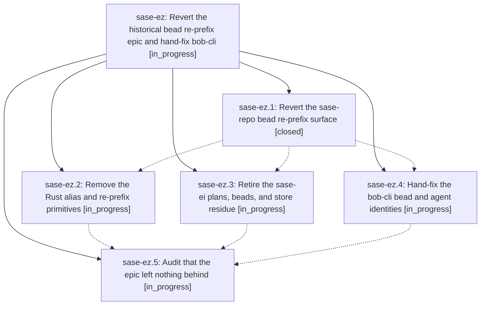

# Bead: sase-ez — Revert the historical bead re-prefix epic and hand-fix bob-cli

[Bead Pages](../README.md) / sase-ez

**Status:** ◐ in_progress · **Type:** ▸ plan · **Tier:** epic
**Owner:** `bryanbugyi34@gmail.com` · **Created by:** [bbugyi200.athena.sy](https://github.com/sase-org/sase--agents/blob/main/agents/bbugyi200.athena.sy/README.md) · **Assignee:** `sase-ez.land`
**Created:** 2026-08-03 11:32:03 EDT
**Plan:** [202608/revert\_bead\_reprefix\_epic.md](https://github.com/sase-org/sase--plans/blob/main/202608/revert_bead_reprefix_epic.md)

## Description

Every code, data, and tracking artifact produced by the sase-ei epic is removed from the sase and sase-core repositories, and the single project that actually carries a leaked ProjectSpec-key bead prefix, bob-cli, is corrected by a one-off manual rename instead of by shipping a general migration feature.

## Phases

| Bead | Title | Status | Size | Agents | Commits |
|---|---|---|---|---:|---:|
| [sase-ez.1](sase-ez.1.md) | Revert the sase-repo bead re-prefix surface | ✓ closed | medium | 0 | 0 |
| [sase-ez.2](sase-ez.2.md) | Remove the Rust alias and re-prefix primitives | ◐ in_progress | large | 0 | 0 |
| [sase-ez.3](sase-ez.3.md) | Retire the sase-ei plans, beads, and store residue | ◐ in_progress | medium | 0 | 0 |
| [sase-ez.4](sase-ez.4.md) | Hand-fix the bob-cli bead and agent identities | ◐ in_progress | large | 0 | 0 |
| [sase-ez.5](sase-ez.5.md) | Audit that the epic left nothing behind | ◐ in_progress | medium | 0 | 0 |

## Lineage

