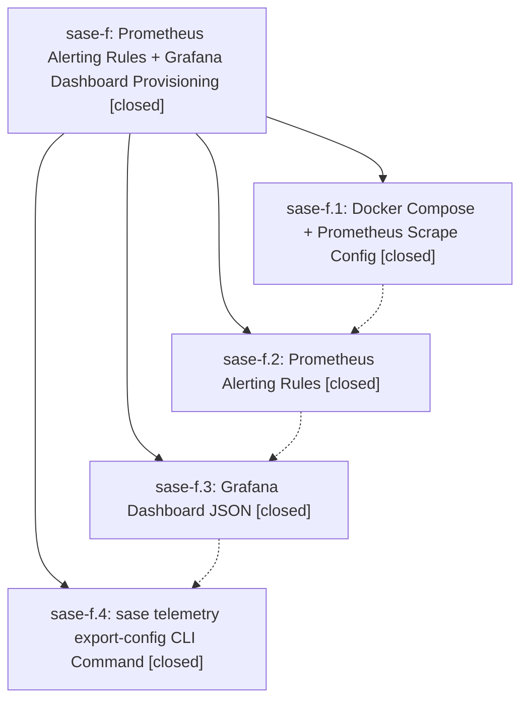

# Bead: sase-f — Prometheus Alerting Rules + Grafana Dashboard Provisioning

[Bead Pages](../README.md) / sase-f

**Status:** ✓ closed · **Resolution:** (unrecorded) · **Type:** plan · **Tier:** epic
**Owner:** `bryanbugyi34@gmail.com`
**Created:** 2026-04-08 05:05:34 UTC · **Closed:** 2026-04-08 05:38:23 UTC
**Plan:** [202604/grafana\_monitoring\_stack.md](https://github.com/sase-org/sase--plans/blob/main/202604/grafana_monitoring_stack.md)

## Phases

| Bead | Title | Status | Size | Agents | Commits |
|---|---|---|---|---:|---:|
| [sase-f.1](sase-f.1.md) | Docker Compose + Prometheus Scrape Config | ✓ closed | small | 0 | 1 |
| [sase-f.2](sase-f.2.md) | Prometheus Alerting Rules | ✓ closed | small | 0 | 1 |
| [sase-f.3](sase-f.3.md) | Grafana Dashboard JSON | ✓ closed | small | 0 | 1 |
| [sase-f.4](sase-f.4.md) | sase telemetry export-config CLI Command | ✓ closed | small | 0 | 1 |

## Lineage

## Commits

| Commit | Subject | Bead | Committed (UTC) |
|---|---|---|---|
| [`0754694`](https://github.com/sase-org/sase/commit/075469429da5b3765c137b0d788abd74dfb8c998) | feat: Add Docker Compose monitoring stack with Prometheus scrape config (sase-f.1) | [sase-f.1](sase-f.1.md) | 2026-04-08 05:12:14 |
| [`d462b62`](https://github.com/sase-org/sase/commit/d462b620a0b6c4902901796eb16a78a3ae23f636) | feat: Add Prometheus alerting rules for sase telemetry monitoring (sase-f.2) | [sase-f.2](sase-f.2.md) | 2026-04-08 05:16:34 |
| [`e996528`](https://github.com/sase-org/sase/commit/e9965286d64e9a20d9ac2efef02c84cd103b034f) | feat: Add comprehensive Grafana dashboard with panels for all telemetry subsystems (sase-f.3) | [sase-f.3](sase-f.3.md) | 2026-04-08 05:27:32 |
| [`26b5a9e`](https://github.com/sase-org/sase/commit/26b5a9e26cfbba0c609ac3bfa945cde3e41f9743) | feat: Add \`sase telemetry export-config\` CLI command (sase-f.4) | [sase-f.4](sase-f.4.md) | 2026-04-08 05:33:56 |
