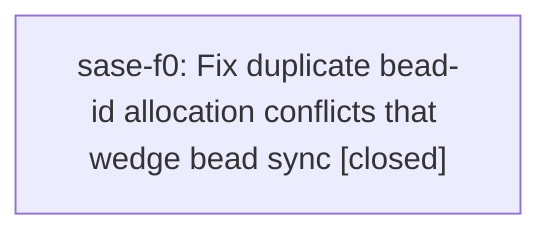

# Bead: sase-f0 — Fix duplicate bead-id allocation conflicts that wedge bead sync

[Bead Pages](../README.md) / sase-f0

**Status:** ✓ closed · **Resolution:** done · **Type:** ◆ task
**Owner:** `bryanbugyi34@gmail.com` · **Created by:** [bbugyi200.athena.t0](https://github.com/sase-org/sase--agents/blob/main/families/bbugyi200.athena.t0.md) · **Assignee:** `sase-f0` · **Size:** medium
**Created:** 2026-08-03 12:18:33 EDT · **Closed:** 2026-08-05 16:14:23 EDT

## Description

Approved plan plans:202608/epic_launch_sync_lock_skip.md documented a distinct out-of-scope defect: from 2026-08-03 11:00 to 11:31, managed bead-sync workers repeatedly failed with 'semantic bead conflict resolution failed: validation: duplicate issue_created event for sase-ey'. That indicates two clones allocated the same bead id and the semantic conflict resolver could not merge the duplicate issue_created events. Impact: the shared bead store was wedged for roughly 30 minutes, workers kept retrying while holding the sync lock, and launch-critical publication either collided with those workers or hid the real underlying error. Scope: reproduce the concurrent allocation/conflict case, fix bead ID allocation and/or conflict resolution so duplicate issue_created events cannot wedge the store, and add regression coverage for recovery.

## Notes

[2026-08-05T20:14:23Z · sase-f0] Fixed duplicate bead-id allocation wedging the shared store, in sase-core plus this repo's resolver. Rust: added BeadEventStreamMergeWire and merge_bead_event_streams_with_relocation, which track per-event provenance (base/ours/theirs) through the union merge, detect duplicate issue_created events, keep the base or older creation, and relocate the losing side - a colliding root moves to a caller-supplied free id as a new stream, a colliding child renumbers to the next free sibling in place - remapping issue_id, parent_id, dependencies, cascade/forced-descendant ids and re-minting every event_id. Winner selection is (timestamp, event_id), so it is independent of which side git calls ours. merge_bead_event_streams keeps its old signature and still errors on duplicates. Python: conflict_resolver allocates relocation ids from a store-wide _RelocationIds allocator (config next_counter and every known stream id), writes and stages the relocated stream, and reports 'relocated duplicate beads: <old> -> <new>' in the resolution message and sync log; the facade falls back to the legacy binding on older wheels. Verified: 5 new Rust unit tests in bead/events.rs cover root relocation, ours/theirs orientation independence, event-id re-minting, the no-relocation-id error path, and child renumbering; the new end-to-end test test_concurrently_minted_bead_id_relocates_instead_of_wedging_sync in tests/test_bead/test_sync_conflict_recovery.py has two clones mint the same id, then run_managed_sync_worker integrates and pushes with both beads surviving and a clean worktree. cargo test -p sase_core 1213 lib tests plus all integration targets pass, cargo fmt and cargo clippy -p sase_core --all-targets are clean, tests/test_bead is 1339 passed, and just check passes fmt/keep-sorted/ruff/mypy/pyscripts/changelog/symvision with a clean full suite of 25785 passed and 7 skipped. Two earlier failures (the slow-tools PNG snapshot and the bead lock-timeout contention test) were host-contention flakes: both pass in isolation, both pass in the clean full rerun, and the recurrence is corroborated on sase-cx.

## References

- [plans:202608/epic\_launch\_sync\_lock\_skip.md](https://github.com/sase-org/sase--plans/blob/main/202608/epic_launch_sync_lock_skip.md)

## Lineage

## Agents

| Agent | Bead | Commits |
|---|---|---:|
| [bbugyi200.athena.sase-f0](https://github.com/sase-org/sase--agents/blob/main/agents/bbugyi200.athena.sase-f0/README.md) | [sase-f0](README.md) | 2 |

## Commits

| Repo | Commit | Subject | Bead | Committed |
|---|---|---|---|---|
| sase-core | [`sase-core@1370830`](https://github.com/sase-org/sase-core/commit/13708306c223d686aebbb149b346b983e2a02f2c) | fix(bead): relocate duplicate bead ids instead of failing the merge | [sase-f0](README.md) | 2026-08-05 16:15:56 EDT |
| sase | [`6b3b46e`](https://github.com/sase-org/sase/commit/6b3b46e85b6df66d595e506609ebe322a2803eb3) | fix(bead): recover sync when two clones mint the same bead id | [sase-f0](README.md) | 2026-08-05 16:17:22 EDT |
