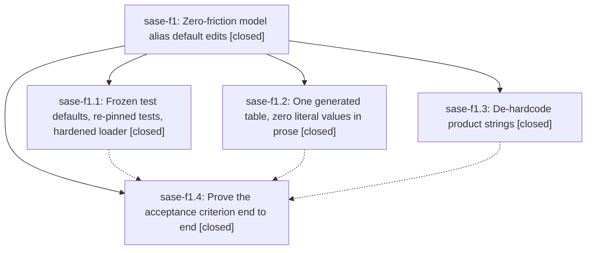

# Bead: sase-f1 — Zero-friction model alias default edits

[Bead Pages](../README.md) / sase-f1

**Status:** ✓ closed · **Resolution:** done · **Type:** ▸ plan · **Tier:** epic
**Owner:** `bryanbugyi34@gmail.com` · **Created by:** [bbugyi200.athena.sw.f1](https://github.com/sase-org/sase--agents/blob/main/agents/bbugyi200.athena.sw.f1/README.md) · **Assignee:** `sase-f1.land`
**Created:** 2026-08-03 14:46:45 EDT · **Closed:** 2026-08-03 17:38:15 EDT
**Plan:** [202608/zero\_friction\_model\_alias\_defaults.md](https://github.com/sase-org/sase--plans/blob/main/202608/zero_friction_model_alias_defaults.md)

## Description

Editing any value in src/sase/llm_provider/model_alias_defaults.yml requires no other change anywhere in the repo, and the full just check passes without the editor having to run it.

## Notes

[2026-08-03T21:38:15Z · sase-f1.land] Epic landed after integrated acceptance verification. The model-alias defaults YAML was perturbed across every shipped target and every description while preserving graph shape; full just check passed under the perturbation, dedicated just test-visual passed 407 with 1 skipped, just fmt healed the generated docs block and was idempotent, and loader negative paths for unknown fallback, fallback cycle, and malformed selector all failed loudly through doctor with model_alias_defaults.yml plus the offending alias or chain. The perturbation and generated docs were restored to committed content. Follow-ups were dispositioned: config-center visual failures no longer reproduce and were not added to sase-bl; pytest-clean temp leak did not recur and was declined as non-reproducible; lock-timeout evidence remains the existing duplicate on sase-e2 without another sw count; f1.4 Symvision names are gone via related sase-f2 work; an unrelated bead-sync Symvision private-import baseline blocker was fixed and noted on active epic sase-ej; a newly observed notification custom-gate full-suite flake was filed as ready task sase-f5. Final just check passed.

[2026-08-03T21:41:50Z · sase-f1.land] Implemented approved landing plan; verified focused baselines, perturbed alias checks, visual suite, docs fmt/idempotence, loader negative paths, restored-state just check, and post-close Symvision.

## Phases

| Bead | Title | Status | Size | Agents | Commits |
|---|---|---|---|---:|---:|
| [sase-f1.1](sase-f1.1.md) | Frozen test defaults, re-pinned tests, hardened loader | ✓ closed | medium | 1 | 1 |
| [sase-f1.2](sase-f1.2.md) | One generated table, zero literal values in prose | ✓ closed | medium | 1 | 1 |
| [sase-f1.3](sase-f1.3.md) | De-hardcode product strings | ✓ closed | small | 1 | 1 |
| [sase-f1.4](sase-f1.4.md) | Prove the acceptance criterion end to end | ✓ closed | small | 0 | 0 |

## Lineage

## Agents

| Agent | Bead | Commits |
|---|---|---:|
| [bbugyi200.athena.sase-f1.1](https://github.com/sase-org/sase--agents/blob/main/agents/bbugyi200.athena.sase-f1.1/README.md) | [sase-f1.1](sase-f1.1.md) | 1 |
| [bbugyi200.athena.sase-f1.2](https://github.com/sase-org/sase--agents/blob/main/agents/bbugyi200.athena.sase-f1.2/README.md) | [sase-f1.2](sase-f1.2.md) | 1 |
| [bbugyi200.athena.sase-f1.3](https://github.com/sase-org/sase--agents/blob/main/agents/bbugyi200.athena.sase-f1.3/README.md) | [sase-f1.3](sase-f1.3.md) | 1 |
| [bbugyi200.athena.sase-f1.land](https://github.com/sase-org/sase--agents/blob/main/families/bbugyi200.athena.sase-f1.land.md) | [sase-f1](README.md) | 1 |

## Commits

| Repo | Commit | Subject | Bead | Committed |
|---|---|---|---|---|
| sase | [`2d87ba5`](https://github.com/sase-org/sase/commit/2d87ba54442343070b2b84087f50c017b87699a0) | fix(doctor): de-hardcode shipped model default in phase\_worker migration warning | [sase-f1.3](sase-f1.3.md) | 2026-08-03 15:09:51 EDT |
| sase | [`5c76b3d`](https://github.com/sase-org/sase/commit/5c76b3d4b72c2626b1fd98267a1d00cb48981279) | refactor(llm): isolate model alias defaults parser | [sase-f1.1](sase-f1.1.md) | 2026-08-03 15:23:12 EDT |
| sase | [`568a965`](https://github.com/sase-org/sase/commit/568a9652403973d126b3e2f16136a7c811738b0e) | docs(llms): generate model alias defaults table | [sase-f1.2](sase-f1.2.md) | 2026-08-03 15:24:07 EDT |
| sase--plans | [`sase--plans@c775d35`](https://github.com/sase-org/sase--plans/commit/c775d351d195339e05433173c9619c2f6de499e8) | docs: mark sase-f1 landing complete | [sase-f1](README.md) | 2026-08-03 17:44:08 EDT |
