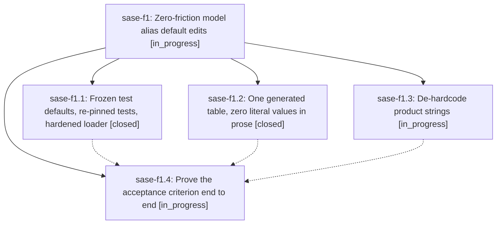

# Bead: sase-f1 — Zero-friction model alias default edits

[Bead Pages](../README.md) / sase-f1

**Status:** ◐ in_progress · **Type:** ▸ plan · **Tier:** epic
**Owner:** `bryanbugyi34@gmail.com` · **Created by:** [bbugyi200.athena.sw.f1](https://github.com/sase-org/sase--agents/blob/main/agents/bbugyi200.athena.sw.f1/README.md) · **Assignee:** `sase-f1.land`
**Created:** 2026-08-03 14:46:45 EDT
**Plan:** [202608/zero\_friction\_model\_alias\_defaults.md](https://github.com/sase-org/sase--plans/blob/main/202608/zero_friction_model_alias_defaults.md)

## Description

Editing any value in src/sase/llm_provider/model_alias_defaults.yml requires no other change anywhere in the repo, and the full just check passes without the editor having to run it.

## Phases

| Bead | Title | Status | Size | Agents | Commits |
|---|---|---|---|---:|---:|
| [sase-f1.1](sase-f1.1.md) | Frozen test defaults, re-pinned tests, hardened loader | ✓ closed | medium | 0 | 0 |
| [sase-f1.2](sase-f1.2.md) | One generated table, zero literal values in prose | ✓ closed | medium | 0 | 0 |
| [sase-f1.3](sase-f1.3.md) | De-hardcode product strings | ◐ in_progress | small | 0 | 0 |
| [sase-f1.4](sase-f1.4.md) | Prove the acceptance criterion end to end | ◐ in_progress | small | 0 | 0 |

## Lineage

