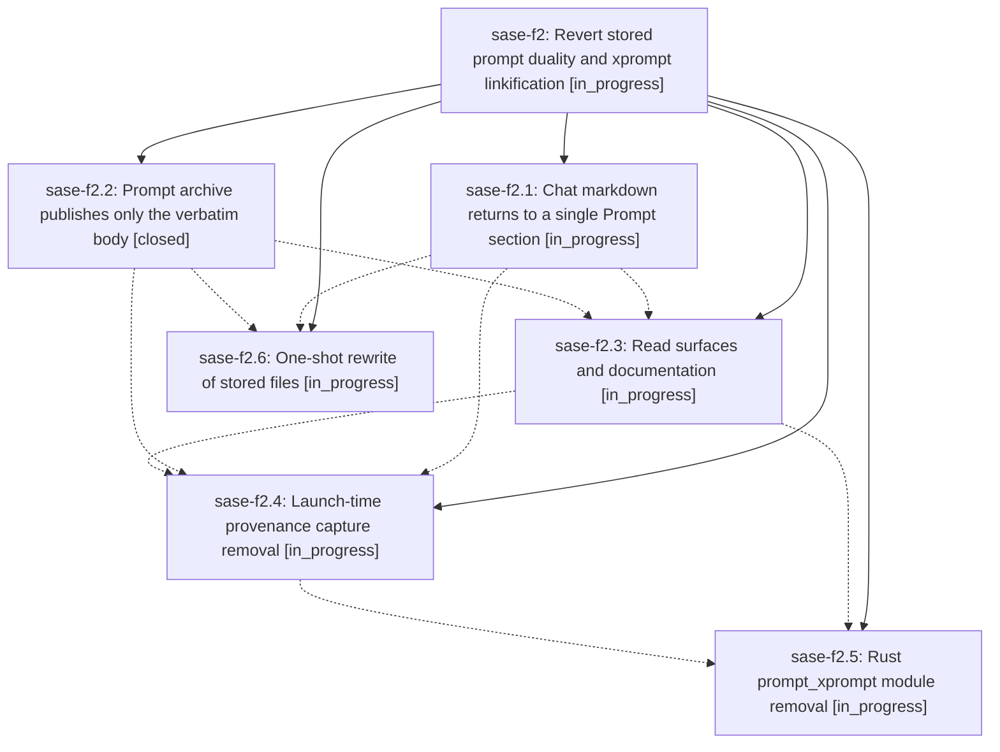

# Bead: sase-f2 — Revert stored prompt duality and xprompt linkification

[Bead Pages](../README.md) / sase-f2

**Status:** ◐ in_progress · **Type:** ▸ plan · **Tier:** epic
**Owner:** `bryanbugyi34@gmail.com` · **Created by:** [bbugyi200.athena.sase-ej.land.w2](https://github.com/sase-org/sase--agents/blob/main/agents/bbugyi200.athena.sase-ej.land.w2/README.md) · **Assignee:** `sase-f2.land`
**Created:** 2026-08-03 14:48:17 EDT
**Plan:** [202608/revert\_stored\_prompt\_duality.md](https://github.com/sase-org/sase--plans/blob/main/202608/revert_stored_prompt_duality.md)

## Description

Chat markdown and published prompt archive entries store exactly what they stored before sase-e6 — one `## Prompt` section in a chat, one verbatim body in an archive entry — every already-written file in the sase-e6 format is rewritten to the pre-sase-e6 format, and no code anywhere in sase or sase-core knows the sase-e6 format exists.

## Phases

| Bead | Title | Status | Size | Agents | Commits |
|---|---|---|---|---:|---:|
| [sase-f2.1](sase-f2.1.md) | Chat markdown returns to a single Prompt section | ◐ in_progress | medium | 0 | 0 |
| [sase-f2.2](sase-f2.2.md) | Prompt archive publishes only the verbatim body | ✓ closed | medium | 0 | 0 |
| [sase-f2.3](sase-f2.3.md) | Read surfaces and documentation | ◐ in_progress | medium | 0 | 0 |
| [sase-f2.4](sase-f2.4.md) | Launch-time provenance capture removal | ◐ in_progress | small | 0 | 0 |
| [sase-f2.5](sase-f2.5.md) | Rust prompt\_xprompt module removal | ◐ in_progress | small | 0 | 0 |
| [sase-f2.6](sase-f2.6.md) | One-shot rewrite of stored files | ◐ in_progress | medium | 0 | 0 |

## Lineage

