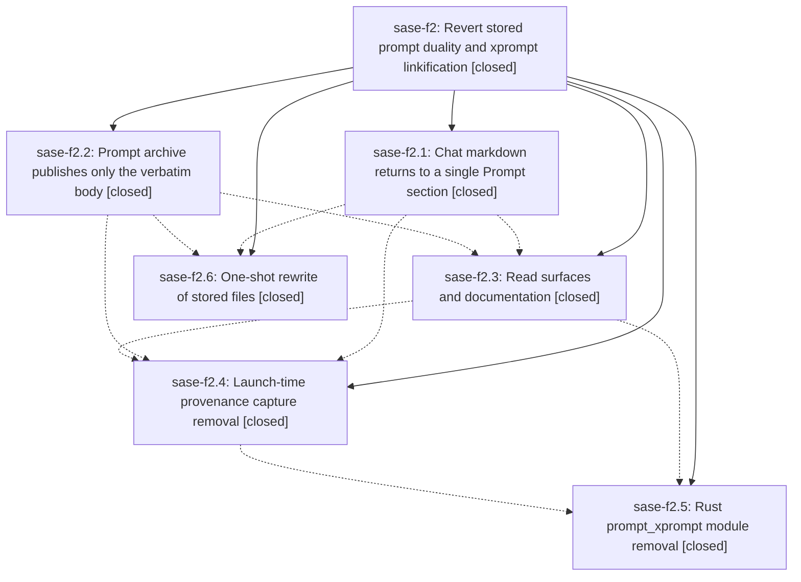

# Bead: sase-f2 — Revert stored prompt duality and xprompt linkification

[Bead Pages](../README.md) / sase-f2

**Status:** ✓ closed · **Resolution:** done · **Type:** ▸ plan · **Tier:** epic
**Owner:** `bryanbugyi34@gmail.com` · **Created by:** [bbugyi200.athena.sase-ej.land.w2](https://github.com/sase-org/sase--agents/blob/main/agents/bbugyi200.athena.sase-ej.land.w2/README.md) · **Assignee:** `sase-f2.land`
**Created:** 2026-08-03 14:48:17 EDT · **Closed:** 2026-08-03 17:06:01 EDT
**Plan:** [202608/revert\_stored\_prompt\_duality.md](https://github.com/sase-org/sase--plans/blob/main/202608/revert_stored_prompt_duality.md)

## Description

Chat markdown and published prompt archive entries store exactly what they stored before sase-e6 — one `## Prompt` section in a chat, one verbatim body in an archive entry — every already-written file in the sase-e6 format is rewritten to the pre-sase-e6 format, and no code anywhere in sase or sase-core knows the sase-e6 format exists.

## Notes

[2026-08-03T21:06:01Z · sase-f2.land] VERIFY (step 1). Reviewed the plan file and all six phase beads with every note. Read the source at master 15e4213cc and each epic commit: 92b31a1b4 (archive), 376a3b1bb (chat), 1239c5f5c (surfaces), 1a2040e73 (provenance), plus sase-core 08c5d93 (core). Confirmed by direct source reading, not by trusting phase reports: save_chat_history/write_chat_history carry no xprompt_prompt or rendered_prompt parameters and emit metadata + blank line + '## Prompt' exactly as before sase-e6; chat_prompt_sections.py and its test are deleted with no importer left; chat_history.rendered_prompt_max_bytes is gone from default_config.yml, sase.schema.json, config/core.py and config/__init__.py; render_prompt_document takes only prompt/records/artifact_target/agent_label/agent_target/plan_label/plan_target; validation.py retains no legacy_files counter, sentinel checks, fence balance check or link-target check, and cli_prompts.py prints no legacy summary; chat show is back to ('raw','resume','response') with no -r/-x, agent prompts show has no --rendered, chats_detail.py has no PROMPTS block or rendering fields, and prompt/search/sources.py is back to digest-based dedup with no section stripping; xprompt_sources.py exposes only collect_xprompt_sources/definition_file_for_source/definition_line_for and writes nothing at launch, run_agent_runner_setup.py no longer calls write_xprompt_sources, and xprompt_links.py keeps only XpromptSourceRecord/XpromptTargetResolver for sase xprompt show as the plan's scope boundary requires. A repo-wide grep for the sase-e6 vocabulary returns only unrelated symbols and intentional negative assertions in tests. Docs and CHANGELOG carry no stored-rendering, xprompt_sources.json, hosted-link or CLI-selector prose.

sase-f2.5 was still IN_PROGRESS with no notes: its phase worker landed sase-core 08c5d93 (deletes prompt_xprompt.rs and the three PyO3 bindings, keeps prompt_rewrite.rs which prompt_artifact.rs still imports) but exited before closing. I verified that commit is on origin/master, re-ran the phase's own gates green (cargo fmt clean, cargo clippy --workspace --all-targets -D warnings clean, cargo test --workspace all green), confirmed the freshly built sase_core_rs 0.17.16 exports zero prompt_xprompt symbols and that no require_rust_binding('prompt_xprompt_*') call site remains, then closed it with that evidence.

GAP FOUND AND FIXED. The sase-f2.6 migration swept at 15:46 while agents launched from pre-revert workspaces were still in flight; those agents wrote sase-e6-format files on completion between 15:51 and 16:43, after the sweep. The epic goal ('every already-written file in the sase-e6 format is rewritten') was therefore not met at the time I started: 21 chat transcripts still carried sentinel header sections and 5 xprompt_sources.json artifacts survived. I finished that work. Using the exact insertion point from the pre-revert writer (it appended '\n' + prompt_sections immediately before '\n## Prompt\n\n'), I deleted only the span between the first header sentinel and that heading, which restores the pre-sase-e6 bytes exactly and matches the diff shape of the original migration commit 49bdd7996. Each file was guarded: transformed only when the sentinel precedes the first '## Prompt', and accepted only when parse_chat_turns() returned identical turns before and after. All 21 passed and were rewritten; the 5 artifacts were deleted. Post-sweep: zero sentinels in any header region across 12,797 transcripts, zero xprompt_sources.json anywhere under ~/.sase, zero sentinels in any agents sidecar, and a re-run dry sweep reports nothing pending. Three transcripts still match a raw grep for 'sase:section:' and were deliberately left alone — the string appears only in the prompt/response bodies of the migration agents discussing it, which is genuine conversation content the store must preserve. sase chat show -f resume and -f response both render migrated transcripts correctly, and sase agent prompts validate passes for sase (3000), bob-cli (11) and actstat (0). The leak is closed, not merely cleaned: both agents still running were launched after the provenance commit and their workspaces contain it, and counts stayed flat while I worked. The residual sweep script was written outside the repo and deleted, so no format-aware code exists at HEAD.

INTEGRATE (step 2). Reviewed all 11 non-epic commits landed since the epic's plan was created. Only two touch files the epic also touched, and both predate the epic phase that edited those files, so neither was stranded: 568a96524 (docs/ace.md, configuration.md, sdd.md, xprompt.md at 15:23, before the surfaces phase at 16:01) and 2d87ba544 (sase.schema.json, default_config.yml at 15:09, before the chat phase at 15:30). The only commit after the epic's last, 15e4213cc, splits bead sync modules and has zero file overlap. Nothing landed since the epic started re-introduces, duplicates, or still depends on the reverted machinery, so no integration edits were required beyond the residual sweep above. Note for the owner: epic sase-e6, whose work this epic reverts, is still IN_PROGRESS and may want its own disposition.

FOLLOW-UPS (step 3). Collected two PROPOSED FOLLOW-UP entries and found one more myself. sase-f2.6's 'sase repo open ambiguous duplicate hidden sidecars' reproduced exactly (two sidecar rows sharing name AND slug 'sase--agents', so the ambiguity error names no selectable token) and became ready task sase-f3, size small. My own discovery, that just check is red at symvision on master because 15e4213cc left 15 private symbols crossing the new src/sase/bead/_sync_*.py module boundaries, became ready task sase-f4, size small; it is not caused by sase-f2 (clean tree, no shared files), is not a duplicate of the canceled sase-dm (different symbols and modules), and is not owned by sase-ej (whose symvision findings were stale --epic-symbol entries already fixed by 234e8175c). sase-f2.2's follow-up split in two: its stall-watchdog flake is a semantic duplicate of ready task sase-cg and I recorded a +1 there rather than filing a new bead, while its ACE Config Center PNG snapshot half was DECLINED because it no longer reproduces — just test-visual on master passes 407 tests with 1 skipped, including the Config Center snapshots, so the goldens were reconciled by later commits and there is no live defect to file.

Repo state at close: working tree clean, HEAD 15e4213cc matching origin/master, no sase-f2 --epic-symbol entries exist in the Justfile so none expire here.

## Phases

| Bead | Title | Status | Size | Agents | Commits |
|---|---|---|---|---:|---:|
| [sase-f2.1](sase-f2.1.md) | Chat markdown returns to a single Prompt section | ✓ closed | medium | 1 | 1 |
| [sase-f2.2](sase-f2.2.md) | Prompt archive publishes only the verbatim body | ✓ closed | medium | 1 | 1 |
| [sase-f2.3](sase-f2.3.md) | Read surfaces and documentation | ✓ closed | medium | 1 | 1 |
| [sase-f2.4](sase-f2.4.md) | Launch-time provenance capture removal | ✓ closed | small | 1 | 1 |
| [sase-f2.5](sase-f2.5.md) | Rust prompt\_xprompt module removal | ✓ closed | small | 1 | 1 |
| [sase-f2.6](sase-f2.6.md) | One-shot rewrite of stored files | ✓ closed | medium | 0 | 0 |

## Lineage

## Agents

| Agent | Bead | Commits |
|---|---|---:|
| [bbugyi200.athena.sase-f2.1](https://github.com/sase-org/sase--agents/blob/main/agents/bbugyi200.athena.sase-f2.1/README.md) | [sase-f2.1](sase-f2.1.md) | 1 |
| [bbugyi200.athena.sase-f2.2](https://github.com/sase-org/sase--agents/blob/main/agents/bbugyi200.athena.sase-f2.2/README.md) | [sase-f2.2](sase-f2.2.md) | 1 |
| [bbugyi200.athena.sase-f2.3](https://github.com/sase-org/sase--agents/blob/main/agents/bbugyi200.athena.sase-f2.3/README.md) | [sase-f2.3](sase-f2.3.md) | 1 |
| [bbugyi200.athena.sase-f2.4](https://github.com/sase-org/sase--agents/blob/main/agents/bbugyi200.athena.sase-f2.4/README.md) | [sase-f2.4](sase-f2.4.md) | 1 |
| [bbugyi200.athena.sase-f2.5](https://github.com/sase-org/sase--agents/blob/main/agents/bbugyi200.athena.sase-f2.5/README.md) | [sase-f2.5](sase-f2.5.md) | 1 |
| [bbugyi200.athena.sase-f2.land](https://github.com/sase-org/sase--agents/blob/main/agents/bbugyi200.athena.sase-f2.land/README.md) | [sase-f2](README.md) | 1 |

## Commits

| Repo | Commit | Subject | Bead | Committed |
|---|---|---|---|---|
| sase | [`92b31a1`](https://github.com/sase-org/sase/commit/92b31a1b444277ab1a8cb488a1ad4fd28ee0c09e) | fix(prompt-archive)!: publish archived prompt bodies verbatim | [sase-f2.2](sase-f2.2.md) | 2026-08-03 15:16:36 EDT |
| sase | [`376a3b1`](https://github.com/sase-org/sase/commit/376a3b1bbcb0dad5cccab0650611c7898aa49f3a) | feat(history)!: restore single-prompt chat markdown | [sase-f2.1](sase-f2.1.md) | 2026-08-03 15:30:11 EDT |
| sase | [`1239c5f`](https://github.com/sase-org/sase/commit/1239c5f5c834782fa5ef90f5d21e471a0402d22d) | feat(cli)!: remove stored prompt rendering surfaces | [sase-f2.3](sase-f2.3.md) | 2026-08-03 16:01:37 EDT |
| sase | [`1a2040e`](https://github.com/sase-org/sase/commit/1a2040e73d351ec7c1c280bdc4c4d16dbda10f7e) | feat(xprompt)!: stop writing launch-time provenance JSON | [sase-f2.4](sase-f2.4.md) | 2026-08-03 16:21:16 EDT |
| sase-core | [`sase-core@08c5d93`](https://github.com/sase-org/sase-core/commit/08c5d93c852423e4fb0fb6988f3c7a2db50a8593) | feat!: remove prompt xprompt core bindings | [sase-f2.5](sase-f2.5.md) | 2026-08-03 16:35:36 EDT |
| sase--plans | [`sase--plans@8cecdfc`](https://github.com/sase-org/sase--plans/commit/8cecdfc8ec2a53eaeacfc47812c367a84b8d93c6) | chore(plans): mark the stored prompt duality revert plan done | [sase-f2](README.md) | 2026-08-03 17:08:01 EDT |
