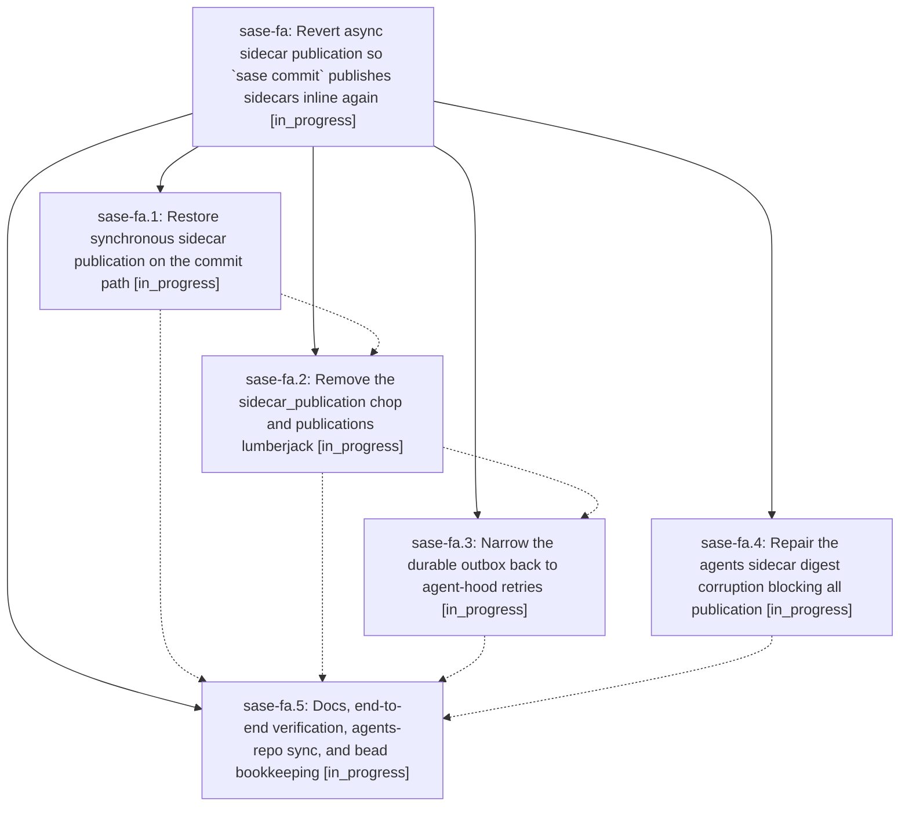

# Bead: sase-fa — Revert async sidecar publication so \`sase commit\` publishes sidecars inline again

[Bead Pages](../README.md) / sase-fa

**Status:** ◐ in_progress · **Type:** ▸ plan · **Tier:** epic
**Owner:** `bryanbugyi34@gmail.com` · **Created by:** [bbugyi200.athena.t4](https://github.com/sase-org/sase--agents/blob/main/agents/bbugyi200.athena.t4/README.md) · **Assignee:** `sase-fa.land`
**Created:** 2026-08-05 14:26:21 EDT
**Plan:** [202608/revert\_async\_sidecar\_publication.md](https://github.com/sase-org/sase--plans/blob/main/202608/revert_async_sidecar_publication.md)

## Description

`sase commit` once again publishes to every appropriate sidecar repo (agents, beads, plans) before it returns, so the `SASE_AGENT` footer URL resolves as soon as the commit lands. The `sidecar_publication` chop and the `publications` lumberjack are removed, the durable outbox is narrowed back to agent-hood retries, the agents sidecar corruption that is currently blocking all publication is repaired, and this project's agents repo is fully synced.

## Phases

| Bead | Title | Status | Size | Agents | Commits |
|---|---|---|---|---:|---:|
| [sase-fa.1](sase-fa.1.md) | Restore synchronous sidecar publication on the commit path | ◐ in_progress | medium | 0 | 0 |
| [sase-fa.2](sase-fa.2.md) | Remove the sidecar\_publication chop and publications lumberjack | ◐ in_progress | medium | 0 | 0 |
| [sase-fa.3](sase-fa.3.md) | Narrow the durable outbox back to agent-hood retries | ◐ in_progress | medium | 0 | 0 |
| [sase-fa.4](sase-fa.4.md) | Repair the agents sidecar digest corruption blocking all publication | ◐ in_progress | medium | 0 | 0 |
| [sase-fa.5](sase-fa.5.md) | Docs, end-to-end verification, agents-repo sync, and bead bookkeeping | ◐ in_progress | small | 0 | 0 |

## Lineage

