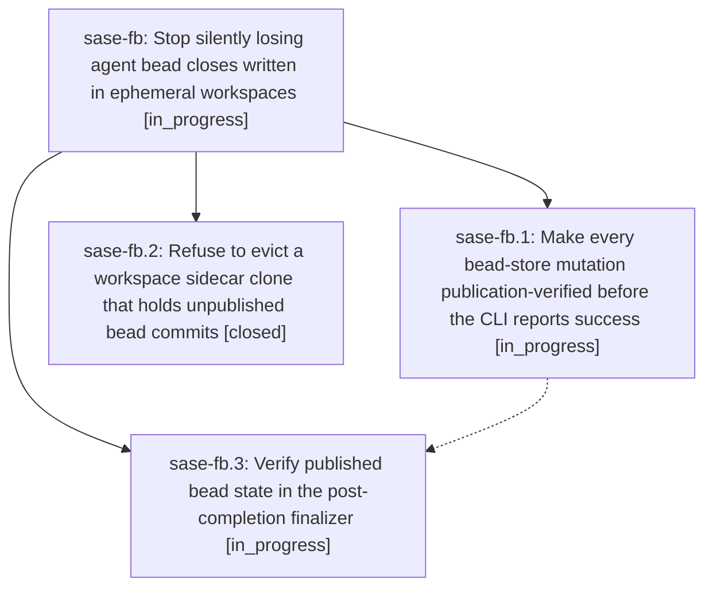

# Bead: sase-fb — Stop silently losing agent bead closes written in ephemeral workspaces

[Bead Pages](../README.md) / sase-fb

**Status:** ◐ in_progress · **Type:** ▸ plan · **Tier:** epic
**Owner:** `bryanbugyi34@gmail.com` · **Created by:** [bbugyi200.athena.t9](https://github.com/sase-org/sase--agents/blob/main/agents/bbugyi200.athena.t9/README.md) · **Assignee:** `sase-fb.land`
**Created:** 2026-08-05 15:45:38 EDT
**Plan:** [202608/bead\_close\_publication\_loss.md](https://github.com/sase-org/sase--plans/blob/main/202608/bead_close_publication_loss.md)

## Description

A `sase bead close` run by an agent inside a numbered workspace either reaches the canonical bead store or fails loudly. The CLI never prints `✓ Closed` for a mutation that exists only in a workspace-local sidecar clone, workspace eviction can never destroy unpublished canonical bead commits, and the post-completion finalizer verifies published state instead of the local projection.

## Phases

| Bead | Title | Status | Size | Agents | Commits |
|---|---|---|---|---:|---:|
| [sase-fb.1](sase-fb.1.md) | Make every bead-store mutation publication-verified before the CLI reports success | ◐ in_progress | medium | 1 | 0 |
| [sase-fb.2](sase-fb.2.md) | Refuse to evict a workspace sidecar clone that holds unpublished bead commits | ✓ closed | medium | 1 | 1 |
| [sase-fb.3](sase-fb.3.md) | Verify published bead state in the post-completion finalizer | ◐ in_progress | small | 1 | 0 |

## Lineage

## Agents

| Agent | Bead | Commits |
|---|---|---:|
| [bbugyi200.athena.sase-fb.1](https://github.com/sase-org/sase--agents/blob/main/agents/bbugyi200.athena.sase-fb.1/README.md) | [sase-fb.1](sase-fb.1.md) | 0 |
| [bbugyi200.athena.sase-fb.2](https://github.com/sase-org/sase--agents/blob/main/agents/bbugyi200.athena.sase-fb.2/README.md) | [sase-fb.2](sase-fb.2.md) | 1 |
| [bbugyi200.athena.sase-fb.3](https://github.com/sase-org/sase--agents/blob/main/agents/bbugyi200.athena.sase-fb.3/README.md) | [sase-fb.3](sase-fb.3.md) | 0 |
| [bbugyi200.athena.sase-fb.land](https://github.com/sase-org/sase--agents/blob/main/agents/bbugyi200.athena.sase-fb.land/README.md) | [sase-fb](README.md) | 0 |

## Commits

| Repo | Commit | Subject | Bead | Committed |
|---|---|---|---|---|
| sase | [`d1b6f01`](https://github.com/sase-org/sase/commit/d1b6f01a9e1ae04bb912cb17f360aaafd6b9df25) | fix(axe): refuse to evict workspace sidecar clones holding unpublished bead commits | [sase-fb.2](sase-fb.2.md) | 2026-08-05 16:25:27 EDT |
