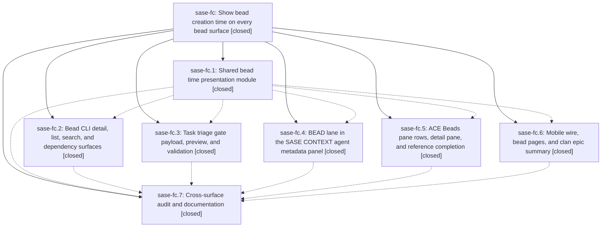

# Bead: sase-fc — Show bead creation time on every bead surface

[Bead Pages](../README.md) / sase-fc

**Status:** ✓ closed · **Resolution:** done · **Type:** ▸ plan · **Tier:** epic
**Owner:** `bryanbugyi34@gmail.com` · **Created by:** [bbugyi200.athena.tc](https://github.com/sase-org/sase--agents/blob/main/agents/bbugyi200.athena.tc/README.md) · **Assignee:** `sase-fc.land`
**Created:** 2026-08-05 16:28:24 EDT · **Closed:** 2026-08-05 19:44:34 EDT
**Plan:** [202608/bead\_create\_time.md](https://github.com/sase-org/sase--plans/blob/main/202608/bead_create_time.md)

## Description

Every SASE surface that displays a bead also displays when that bead was created, rendered through one shared presentation module so the glyph, color, wording, and timezone are identical everywhere, and so persisted or content-validated surfaces stay byte-stable.

## Notes

[2026-08-05T23:33:15Z · sase-fl.land] DISCOVERED ISSUE: tests/ace/tui/visual/test_ace_png_snapshots_artifacts_beads.py::test_artifacts_beads_populated_png_snapshot is flaky at current HEAD (b5c78f972) — reproduced by epic sase-fl's land agent running 'just test-visual' three times in a row: pass, fail, fail (~2.96% pixel diff each failure). This bead's own phase sase-fc.7 already flagged the same failure as PROPOSED FOLLOW-UP on 2026-08-05T22:59:53Z, pre-existing on a clean checkout and unrelated to sase-fc.7's own changes, but naming this epic's bead-creation-time display feature (commit 256da2887 'feat(tui): show bead creation time in context lane') as the likely cause: the golden's details pane renders a scrollbar and wraps the Created "5d ago" line. Independent corroboration from epic sase-fl (unrelated epic, different files) confirms the flake reproduces identically post-sase-fl (three consecutive runs: 1 pass, 2 fail) with no sase-fl changes touching this surface, and that it is exactly as time-dependent as sase-fc.7 suspected — the relative-age text driving the mismatch is the sase-fc feature itself. This epic's land agent should decide whether to pin a deterministic clock in the visual fixture or refresh the golden before closing sase-fc.

[2026-08-05T23:44:34Z · sase-fc.land] Verified all 7 phases against the source, the epic's 7 commits, and a full suite run; integrated with everything that landed since 53fc8d9f8; fixed one epic-caused regression the phases had misdiagnosed.

VERIFIED (step 1). Every child is closed resolution=done and every child note is addressed in the tree. src/sase/bead_time_presentation.py exports the full specified API (glyphs ⧖/✎, #5FAFAF accent, Rich + ANSI styles, bead_instant_label/bead_date_label/bead_age_label/bead_created_label/bead_created_chip/bead_updated_chip/bead_created_cli/suppress_duplicate_updated) and resolves 'now' through the sase.core.time module object, so the visual clock pin reaches it. Confirmed each surface really renders creation time: CLI CREATED section (cli_detail.py:110-116, additive-ANSI invariant kept) and one shared cli_common.created_cell fed by list, search, dep list, and dep tree, with the edge's 'added <ts> by <who>' lines left distinct; gate payload/preview/note/fingerprint plus strict validation in kind_validation.py (created_at threaded into all three preview reconstruction calls, absolute-only); BEAD lane Created row last in both the task and phase branches, with created_at populated on BeadSummary and both PhaseBeadSummary builders; ACE row chips with suppress_duplicate_updated (the private _compact_relative_age is gone from beads_rendering), beads_detail Created property + History line, and ArtifactRefBeadCandidate; mobile wire raw ISO; bead pages identity block, phase/dependency tables, and roster; clan epic summary header and phase lines; docs/beads.md#creation-time-presentation; and tests/test_bead_time_surface_coverage.py enumerating 18 surfaces plus 3 documented exceptions. sase-fc.1's proposed follow-up (the unparseable-value branch) was correctly reconciled by sase-fc.6: bead_pages._render_instant still falls back to md_escape(value) when the label is 'unknown', so page bytes are unchanged.

INTEGRATED (step 2). Reviewed all 9 non-epic commits between 53fc8d9f8 and 4330fd0d5 (ccf4d77a9, 99eedf749, b3ac417f3, 02dcea68b, 840cdff10, 980bdd337, 02dee2182, 75a1ffc10, 4895b8f32). None adds a bead-rendering surface and none duplicates or conflicts with bead_time_presentation; the two that touch src/sase/bead/cli_common.py add publication verification, not rendering. A repo-wide sweep for direct created_at rendering found no site outside the shared module except the documented exceptions.

FIXED. sase-fc.7 recorded tests/ace/tui/visual/test_ace_png_snapshots_artifacts_beads.py::test_artifacts_beads_populated_png_snapshot as a pre-existing failure unrelated to this epic. That diagnosis was wrong: it is caused by sase-fc.5. Lengthening the ACE detail Created value from format_local(...) to bead_created_label(...) made it exactly fill the details-pane content width (32 cols), which gave one bead two stable layouts -- with no scrollbar the value fits on one line, with an auto scrollbar it wraps, and that extra line is what keeps the scrollbar. Measured flaky at roughly 2 failures in 5 isolated runs (2.96% pixel diff, a one-row vertical shift of everything below Created). Fixed by reserving the gutter on #beads-detail-scroll (scrollbar-gutter: stable, already the idiom used by #beads-list and #plans-list), regenerated artifacts_beads_populated_120x40.png and artifacts_beads_empty_120x40.png, and added a regression test in tests/ace/tui/test_artifacts_beads_navigation.py asserting the reserved gutter and that the content width does not change when the scrollbar toggles; the test fails with 'auto' == 'stable' when the CSS is reverted. 8/8 deterministic passes after the fix, and the full visual suite is 406 passed / 1 skipped with no other drift.

GATES. fmt (python/markdown), keep-sorted, ruff, mypy, pyscripts, changelog, toobig, SASE validation, and committed plans all pass. just test: 25955 passed, 7 skipped in 180s, including the PNG visual suite. The only red gate is lint (symvision), which reports progress_fingerprint in src/sase/llm_provider/commit_finalizer_git.py from master commit 840cdff10 and is already tracked as ready task sase-fj.

FOLLOW-UPS. All 8 PROPOSED FOLLOW-UP entries across the children were resolved and none warranted a new task. sase-fc.1's unparseable-value item was already handled by sase-fc.6 (verified in code). The four duplicate reports of test_concurrent_bead_mutations_wait_past_the_old_lock_timeout (sase-fc.2, .3, .5, .6) went to sase-e2 as one consolidated +1, now +22, including this land agent's own reproduction. sase-fc.2's tests/ace/tui/util/test_stall_watchdog.py flakes went to sase-ct as a +1, now +8, with the sharpened wall-clock-threshold diagnosis. sase-fc.7's symvision report went to sase-fj as a +1, now +3. sase-fc.7's visual-snapshot report was declined as a new task because it is not a distinct follow-up: it is epic-caused and is fixed above.

[2026-08-05T23:46:08Z · sase-fc.land] Land verification: all 7 phases closed done; confirmed in source that CLI CREATED section + shared created_cell (list/search/dep-list/dep-tree), gate payload/preview/strict-validation/chop-fingerprint, BEAD lane trailing Created row (task + phase), ACE row chips and detail/preview, mobile wire, bead pages identity/tables/roster, clan epic summary, docs/beads.md, and the 18-surface coverage test all render creation time through the shared bead_time_presentation module. sase-fc.1's unparseable-value concern was reconciled by sase-fc.6 (_render_instant still falls back to md_escape(value)). Integration: reviewed all 9 non-epic commits since 53fc8d9f8; none adds a bead-rendering surface or conflicts with bead_time_presentation. Found and fixed one real epic-caused regression that sase-fc.7 had misdiagnosed as pre-existing: lengthening the ACE detail Created value made it fill the 32-column content width exactly, giving one bead two stable layouts depending on the auto scrollbar (~2-in-5 PNG snapshot failures); fixed with scrollbar-gutter: stable on #beads-detail-scroll, regenerated the two goldens, added regression coverage. Follow-ups: 8 PROPOSED FOLLOW-UP entries resolved, corroborating sase-e2, sase-ct, and sase-fj; no new task warranted.

## Phases

| Bead | Title | Status | Size | Created | Agents | Commits |
|---|---|---|---|---|---:|---:|
| [sase-fc.1](sase-fc.1.md) | Shared bead time presentation module | ✓ closed | medium | 2026-08-05 | 1 | 1 |
| [sase-fc.2](sase-fc.2.md) | Bead CLI detail, list, search, and dependency surfaces | ✓ closed | medium | 2026-08-05 | 1 | 1 |
| [sase-fc.3](sase-fc.3.md) | Task triage gate payload, preview, and validation | ✓ closed | medium | 2026-08-05 | 1 | 1 |
| [sase-fc.4](sase-fc.4.md) | BEAD lane in the SASE CONTEXT agent metadata panel | ✓ closed | medium | 2026-08-05 | 1 | 1 |
| [sase-fc.5](sase-fc.5.md) | ACE Beads pane rows, detail pane, and reference completion | ✓ closed | medium | 2026-08-05 | 1 | 1 |
| [sase-fc.6](sase-fc.6.md) | Mobile wire, bead pages, and clan epic summary | ✓ closed | medium | 2026-08-05 | 1 | 1 |
| [sase-fc.7](sase-fc.7.md) | Cross-surface audit and documentation | ✓ closed | small | 2026-08-05 | 1 | 1 |

## Lineage

## Agents

| Agent | Bead | Commits |
|---|---|---:|
| [bbugyi200.athena.sase-fc.1](https://github.com/sase-org/sase--agents/blob/main/agents/bbugyi200.athena.sase-fc.1/README.md) | [sase-fc.1](sase-fc.1.md) | 1 |
| [bbugyi200.athena.sase-fc.2](https://github.com/sase-org/sase--agents/blob/main/agents/bbugyi200.athena.sase-fc.2/README.md) | [sase-fc.2](sase-fc.2.md) | 1 |
| [bbugyi200.athena.sase-fc.3](https://github.com/sase-org/sase--agents/blob/main/agents/bbugyi200.athena.sase-fc.3/README.md) | [sase-fc.3](sase-fc.3.md) | 1 |
| [bbugyi200.athena.sase-fc.4](https://github.com/sase-org/sase--agents/blob/main/agents/bbugyi200.athena.sase-fc.4/README.md) | [sase-fc.4](sase-fc.4.md) | 1 |
| [bbugyi200.athena.sase-fc.5](https://github.com/sase-org/sase--agents/blob/main/agents/bbugyi200.athena.sase-fc.5/README.md) | [sase-fc.5](sase-fc.5.md) | 1 |
| [bbugyi200.athena.sase-fc.6](https://github.com/sase-org/sase--agents/blob/main/agents/bbugyi200.athena.sase-fc.6/README.md) | [sase-fc.6](sase-fc.6.md) | 1 |
| [bbugyi200.athena.sase-fc.7](https://github.com/sase-org/sase--agents/blob/main/agents/bbugyi200.athena.sase-fc.7/README.md) | [sase-fc.7](sase-fc.7.md) | 1 |
| [bbugyi200.athena.sase-fc.land](https://github.com/sase-org/sase--agents/blob/main/agents/bbugyi200.athena.sase-fc.land/README.md) | [sase-fc](README.md) | 1 |

## Commits

| Repo | Commit | Subject | Bead | Committed |
|---|---|---|---|---|
| sase | [`53fc8d9`](https://github.com/sase-org/sase/commit/53fc8d9f89160af121517827803d134f41102252) | feat(bead): add shared bead time presentation module | [sase-fc.1](sase-fc.1.md) | 2026-08-05 16:49:19 EDT |
| sase | [`734d2e0`](https://github.com/sase-org/sase/commit/734d2e0c261834051c4c2c7bd139e7f848a8f071) | feat(bead): surface bead creation time on mobile, page tables, and clan summaries | [sase-fc.6](sase-fc.6.md) | 2026-08-05 17:25:40 EDT |
| sase | [`865281b`](https://github.com/sase-org/sase/commit/865281be4146ee9475a820e345c8b4930b701d17) | feat(ace): show explicit created and updated ages on bead surfaces | [sase-fc.5](sase-fc.5.md) | 2026-08-05 17:36:50 EDT |
| sase | [`8065b58`](https://github.com/sase-org/sase/commit/8065b58c411b2ec5bd7bbb2caa54c718d22c74c1) | feat(bead): show bead creation time on task triage gates | [sase-fc.3](sase-fc.3.md) | 2026-08-05 17:37:15 EDT |
| sase | [`e4fce05`](https://github.com/sase-org/sase/commit/e4fce05b61985d8f28e8f6dc44008526ce2d89c4) | feat(bead): surface bead creation time across CLI detail, list, and dependency views | [sase-fc.2](sase-fc.2.md) | 2026-08-05 17:42:27 EDT |
| sase | [`256da28`](https://github.com/sase-org/sase/commit/256da2887127cbe390cfd55d9ac5387b830ec25c) | feat(tui): show bead creation time in context lane | [sase-fc.4](sase-fc.4.md) | 2026-08-05 18:21:43 EDT |
| sase | [`4330fd0`](https://github.com/sase-org/sase/commit/4330fd0d5a6f2e36a84e8142d902faaf282a37c0) | feat(bead): add roster creation-time column and regression coverage | [sase-fc.7](sase-fc.7.md) | 2026-08-05 19:00:42 EDT |
| sase | [`01398f5`](https://github.com/sase-org/sase/commit/01398f5afc1061812388696daf82c78441665987) | fix(ace): stop the beads detail pane from oscillating between two layouts | [sase-fc](README.md) | 2026-08-05 19:48:06 EDT |
