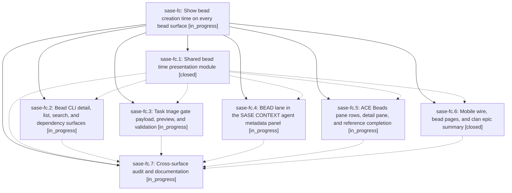

# Bead: sase-fc — Show bead creation time on every bead surface

[Bead Pages](../README.md) / sase-fc

**Status:** ◐ in_progress · **Type:** ▸ plan · **Tier:** epic
**Owner:** `bryanbugyi34@gmail.com` · **Created by:** [bbugyi200.athena.tc](https://github.com/sase-org/sase--agents/blob/main/agents/bbugyi200.athena.tc/README.md) · **Assignee:** `sase-fc.land`
**Created:** 2026-08-05 16:28:24 EDT
**Plan:** [202608/bead\_create\_time.md](https://github.com/sase-org/sase--plans/blob/main/202608/bead_create_time.md)

## Description

Every SASE surface that displays a bead also displays when that bead was created, rendered through one shared presentation module so the glyph, color, wording, and timezone are identical everywhere, and so persisted or content-validated surfaces stay byte-stable.

## Phases

| Bead | Title | Status | Size | Agents | Commits |
|---|---|---|---|---:|---:|
| [sase-fc.1](sase-fc.1.md) | Shared bead time presentation module | ✓ closed | medium | 1 | 1 |
| [sase-fc.2](sase-fc.2.md) | Bead CLI detail, list, search, and dependency surfaces | ◐ in_progress | medium | 1 | 0 |
| [sase-fc.3](sase-fc.3.md) | Task triage gate payload, preview, and validation | ◐ in_progress | medium | 1 | 0 |
| [sase-fc.4](sase-fc.4.md) | BEAD lane in the SASE CONTEXT agent metadata panel | ◐ in_progress | medium | 1 | 0 |
| [sase-fc.5](sase-fc.5.md) | ACE Beads pane rows, detail pane, and reference completion | ◐ in_progress | medium | 1 | 0 |
| [sase-fc.6](sase-fc.6.md) | Mobile wire, bead pages, and clan epic summary | ✓ closed | medium | 1 | 1 |
| [sase-fc.7](sase-fc.7.md) | Cross-surface audit and documentation | ◐ in_progress | small | 1 | 0 |

## Lineage

## Agents

| Agent | Bead | Commits |
|---|---|---:|
| [bbugyi200.athena.sase-fc.1](https://github.com/sase-org/sase--agents/blob/main/agents/bbugyi200.athena.sase-fc.1/README.md) | [sase-fc.1](sase-fc.1.md) | 1 |
| [bbugyi200.athena.sase-fc.2](https://github.com/sase-org/sase--agents/blob/main/agents/bbugyi200.athena.sase-fc.2/README.md) | [sase-fc.2](sase-fc.2.md) | 0 |
| [bbugyi200.athena.sase-fc.3](https://github.com/sase-org/sase--agents/blob/main/agents/bbugyi200.athena.sase-fc.3/README.md) | [sase-fc.3](sase-fc.3.md) | 0 |
| [bbugyi200.athena.sase-fc.4](https://github.com/sase-org/sase--agents/blob/main/agents/bbugyi200.athena.sase-fc.4/README.md) | [sase-fc.4](sase-fc.4.md) | 0 |
| [bbugyi200.athena.sase-fc.5](https://github.com/sase-org/sase--agents/blob/main/agents/bbugyi200.athena.sase-fc.5/README.md) | [sase-fc.5](sase-fc.5.md) | 0 |
| [bbugyi200.athena.sase-fc.6](https://github.com/sase-org/sase--agents/blob/main/agents/bbugyi200.athena.sase-fc.6/README.md) | [sase-fc.6](sase-fc.6.md) | 1 |
| [bbugyi200.athena.sase-fc.7](https://github.com/sase-org/sase--agents/blob/main/agents/bbugyi200.athena.sase-fc.7/README.md) | [sase-fc.7](sase-fc.7.md) | 0 |
| [bbugyi200.athena.sase-fc.land](https://github.com/sase-org/sase--agents/blob/main/agents/bbugyi200.athena.sase-fc.land/README.md) | [sase-fc](README.md) | 0 |

## Commits

| Repo | Commit | Subject | Bead | Committed |
|---|---|---|---|---|
| sase | [`53fc8d9`](https://github.com/sase-org/sase/commit/53fc8d9f89160af121517827803d134f41102252) | feat(bead): add shared bead time presentation module | [sase-fc.1](sase-fc.1.md) | 2026-08-05 16:49:19 EDT |
| sase | [`734d2e0`](https://github.com/sase-org/sase/commit/734d2e0c261834051c4c2c7bd139e7f848a8f071) | feat(bead): surface bead creation time on mobile, page tables, and clan summaries | [sase-fc.6](sase-fc.6.md) | 2026-08-05 17:25:40 EDT |
