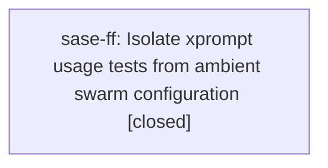

# Bead: sase-ff — Isolate xprompt usage tests from ambient swarm configuration

[Bead Pages](../README.md) / sase-ff

**Status:** ✓ closed · **Resolution:** done · **Type:** ◆ task
**Owner:** `bryanbugyi34@gmail.com` · **Created by:** [bbugyi200.athena.research.y.cdx](https://github.com/sase-org/sase--agents/blob/main/agents/bbugyi200.athena.research.y.cdx/README.md) · **Assignee:** `sase-ff` · **Size:** small
**Created:** 2026-08-05 18:17:13 EDT · **Closed:** 2026-08-05 18:32:02 EDT

## Description

Controlled full-suite benchmarking on 2026-08-05 found two deterministic baseline failures: tests/test_run_agent_runner_setup.py::test_preprocess_prompt_xprompts_captures_launch_boundary_usage and ::test_deferred_launch_xprompts_preserve_original_usage_metadata. Both also fail in a focused serial rerun because the live research_swarm xprompt is prepended to xprompts.json even though the tests patch their expected part/workflow catalogs; expected [plan] becomes [research_swarm, plan], and expected [gh, fork, beau, plan] gains research_swarm. No existing task or active epic covers this ambient swarm-catalog leak. Scope: isolate these tests from every ambient xprompt kind or inject a complete catalog dependency so assertions are independent of user configuration, while preserving coverage that pre-expansion usage metadata is captured.

## Notes

[2026-08-05T22:32:02Z · sase-ff] Fixed both tests by adding monkeypatch.delenv(used_xprompts.SASE_LAUNCH_SWARM_XPROMPTS, raising=False) so they no longer pick up the ambient SASE_LAUNCH_SWARM_XPROMPTS env var a swarm-launched agent process may have set. Verified: (1) with the fix, reproduced the ambient env var (SASE_LAUNCH_SWARM_XPROMPTS='["research_swarm"]') and confirmed both tests still pass; (2) via git stash, confirmed both tests fail exactly as described in the bead (expected [plan] becomes [research_swarm, plan]; expected [gh, fork, beau, plan] gains research_swarm) without the fix under that same ambient env var, and pass without it set; (3) full tests/test_run_agent_runner_setup.py suite (10 tests) passes both with and without the ambient env var set; (4) ruff/mypy clean on the changed file; (5) ran just check — only pre-existing unrelated failure was lint (symvision) on progress_fingerprint in commit_finalizer_git.py, confirmed via git stash to predate this change and already tracked as a PROPOSED FOLLOW-UP on sase-fb.3 (corroborated with a DISCOVERED ISSUE note on active epic sase-fb rather than filing a duplicate task).

## References

- file:explicit:93f0fff0d91c393a140e217d

## Lineage

## Agents

| Agent | Bead | Commits |
|---|---|---:|
| [bbugyi200.athena.sase-ff](https://github.com/sase-org/sase--agents/blob/main/agents/bbugyi200.athena.sase-ff/README.md) | [sase-ff](README.md) | 1 |

## Commits

| Repo | Commit | Subject | Bead | Committed |
|---|---|---|---|---|
| sase | [`02dee21`](https://github.com/sase-org/sase/commit/02dee218264828a6d4359623434ed3eed6c433c7) | fix(tests): isolate xprompt usage tests from ambient swarm env var | [sase-ff](README.md) | 2026-08-05 18:33:10 EDT |
